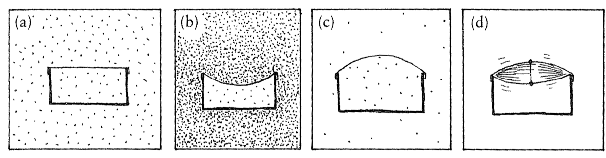
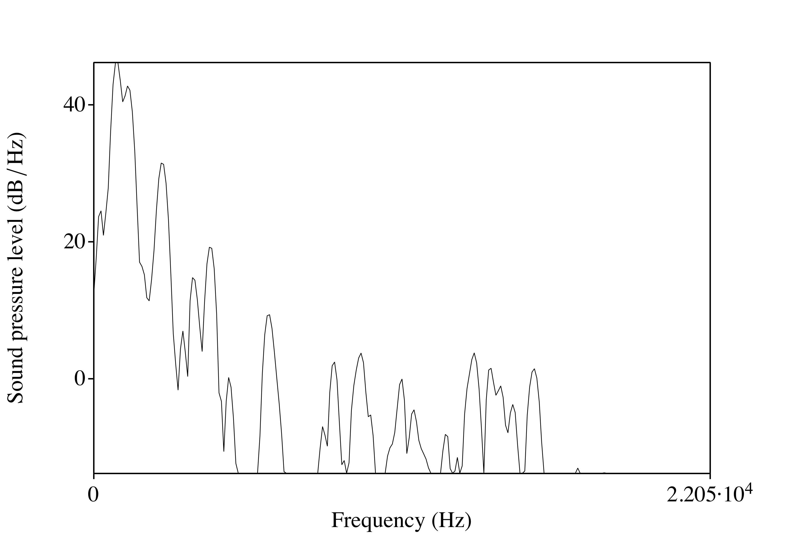
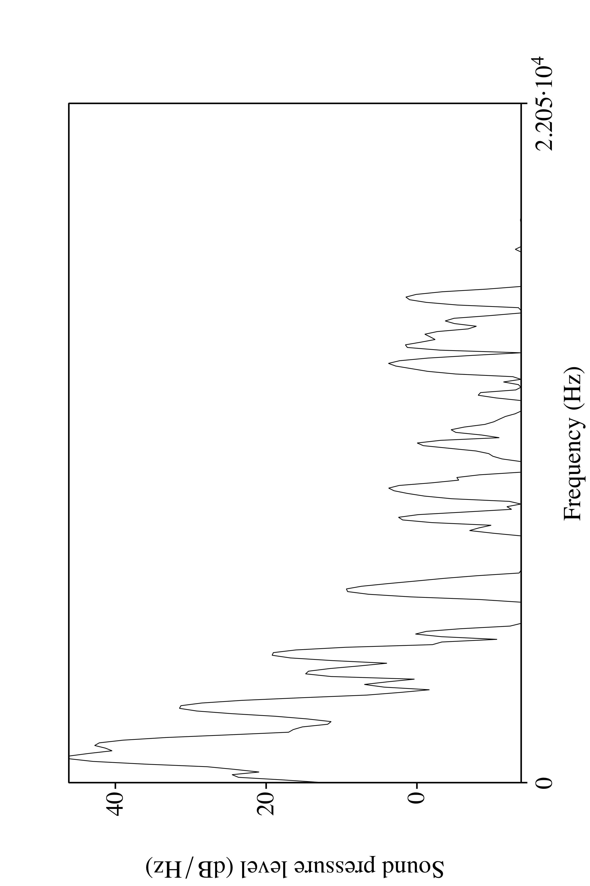

```{r setup, include=FALSE}
options(htmltools.dir.version = FALSE)
```

```{r xaringan-extra-all-the-things, echo=FALSE}
xaringanExtra::use_xaringan_extra(
  c("tile_view", "panelset", "editable", 
    "animate", "tachyons")
)
```

background-image: url("./assets/img/science.jpg")
background-size: 325px
background-position: 100% 50%
class: inverse, middle

# Metodología 1:

## La onda sonora y Praat

---
background-image: url("./assets/img/cadena_hablada.png")
background-size: contain

---
background-image: url("./assets/img/cadena_hablada2.png")
background-size: contain

---

# La señal acústica

- Utilizamos **los articuladores** (activos, pasivos) para manipular el aire 
que expiramos 
- Estas manipulaciones afectan la estructura de **la onda sonora**
  - la energía 
  - la frecuencia (la frecuencia fundamental, F0) 
  - los formantes 
  
- Podemos estudiar la estructura de la onda sonora en el ordenador con programas como Praat.

---

# Praat

http://www.fon.hum.uva.nl/praat/

<div align="center">
  
</div>

---
background-image: url("./assets/img/dospatas1.png")
background-size: contain

---
background-image: url("./assets/img/dospatas2.png")
background-size: contain

---
background-image: url("./assets/img/dospatas3.png")
background-size: contain

---
background-image: url("./assets/img/dospatas4.png")
background-size: contain

---
background-image: url("./assets/img/dospatas1.png")
background-size: 550px
background-position: 70% 70%

# Conceptos básicos

.left-column[
- **tiempo**:
- **sonido**:
- **onda sonora**:
- **presión/amplitud**:
- **frecuencia**:
- **formante**:
]

.right-column[
- Existen algunos conceptos que debemos conocer.
]

---
background-image: url("./assets/img/iii.png")
background-size: 550px
background-position: 70% 70%

# Conceptos básicos

.left-column[
- **tiempo**:
- sonido:
- onda sonora:
- presión/amplitud:
- frecuencia:
- formante:
]

.right-column[
- Magnitud física que permite ordenar la secuencia de los sucesos (y medirlos).
]

---

# Conceptos básicos

.left-column[
- tiempo:
- **sonido**:
- onda sonora:
- presión/amplitud:
- frecuencia:
- formante:
]

.right-column[
- Se refiere a la energía que pasa por el aire (u otro medio) que puede oírse.
- Físicamente es una onda longitudinal que vibra, causando compresión y 
rarefacción de las partículas del aire (moléculas).
]

---

# Conceptos básicos

.left-column[
- tiempo:
- sonido:
- **onda sonora**:
- presión/amplitud:
- frecuencia:
- formante:
]

.right-column[
- Energía acústica compuesta por rápidos cambios en la presión del aire.
- Estos cambios se propagan como olas en un estanque y se transmiten entre una 
fuente de sonido y un receptor.
]

---
background-image: url("./assets/img/pressure1.png")
background-size: contain

---
background-image: url("./assets/img/pressure2.png")
background-size: contain

---
background-image: url("./assets/img/pressure3.png")
background-size: contain

---
background-image: url("./assets/img/pressure4.png")
background-size: contain

---
background-image: url("./assets/img/pressure5.gif")
background-size: contain

---
background-image: url("./assets/img/pressure6.gif")
background-size: contain

---
background-image: url("./assets/img/pressure7.gif")
background-size: contain

---
class: title-slide-section-grey, middle

# .white[Practiquemos]

---

# Praat

1. Abrid Praat

2. Haced una grabación

3. Analizad el espectrograma

### Observaciones

- ¿Qué notáis? ¿Es fácil/difícil reconocer los sonidos?

- ¿Qué características tienen las consonantes? ¿Y las vocales?

- ¿Dónde empieza y termina cada segmento?

---

# Grabación 1

### Lista de palabras

- Lee cada palabra dentro de su frase portadora
- No tengas prisa
- Habla naturalmente

### Párrafo corto

- Revisa el párrafo antes
- Si te equivocas, no te preocupes. Puedes empezar la palabra/frase de nuevo

### Guardar

- Guarda el objeto de sonido como archivo .wav con un nombre informativo  
Ej. 'joseph_casillas_grabacion1'
- Sube el archivo a tu dropbox en sakai

---
class: inverse, middle

# Metodología 2:

## Más sobre la onda sonora

---

# Conceptos básicos

.left-column[
- tiempo:
- sonido: 
- onda sonora:
- **presión**/**amplitud**:
- frecuencia:
- formante:
]

.right-column[

<div align="center">
  
</div>
- La onda sonora percibida por el oido humano consiste en fluctuaciones en la 
presión atmosférica.
- Muestra la cantidad de energía o intensidad a cada momento.

]

---
background-image: url("./assets/img/amplitude1.png")
background-size: contain
background-position: 50% 20%
class: bottom

- La amplitud es el desplazamiento vertical de la onda sonora con respecto a la 
presión normal del aire (la línea 0). 
- Un aumento de presión se corresponde con un aumento de energía/intensidad (por 
encima de la línea 0).
- Una disminución de presión se corresponde con una disminución de energía/intensidad 
(por debajo de la línea 0).

---
background-image: url("./assets/img/amplitude3.gif")
background-size: contain

---
class: center, middle

<iframe width="560" height="315" src="https://www.youtube.com/embed/INqfM1kdfUc" frameborder="0" allowfullscreen></iframe>

---

# Conceptos básicos

.left-column[
- tiempo:
- sonido: 
- onda sonora:
- presión/amplitud:
- **frecuencia**:
- formante:
]

.right-column[
<div align="center">
  
</div>
- El número de repeticiones o ciclos por unidad de tiempo de una onda periódica.
- Se mide en ciclos por segundo (*hertz*, hercios, Hz). 
]

---
background-image: url("./assets/img/frequency2.png")
background-size: contain

---
class: middle

.pull-left[
- <BLUE>La frecuencia fundamental</BLUE> (F0, tono) representa la frecuencia 
básica a la que vibran las cuerdas vocales en la producción de los sonidos sonoros. 

- Es la frecuencia más baja con que se repite una onda periódica. 

- El valor de F0 determina el tono percibido de una sílaba.
]

.pull-right[

<iframe width="560" height="315" src="https://www.youtube.com/embed/YUcW1s2GTmM" frameborder="0" allowfullscreen></iframe>

]
---

# Conceptos básicos

.left-column[
- tiempo:
- sonido: 
- onda sonora:
- presión/amplitud:
- frequencia:
- **formante**:
]

.right-column[
- La concentración de energía en ciertas frecuencias.
- Cada formante es un haz de armónicos.

]

---
background-image: url("./assets/img/dospatas1.png")
background-size: 900px
background-position: 50% 10%
class: bottom

- Esta concentración se ve en un espectrograma como una banda más oscura.

---
background-image: url("./assets/img/sourceFilter.png")
background-size: contain

---
background-image: url("./assets/img/spectrum.png")
background-size: contain

---
class: middle

<div align="center">
  
</div>

---
background-image: url("./assets/img/formants1.png")
background-size: 700px
background-position: 15% 80%
class: middle

<div align="right">
  
</div>

---
class: middle

.pull-left[

- Los dos primeros formantes (F1, F2) sirven para ubicar las vocales en cuanto a 
la anterioridad (F2, el eje horizontal) y la altura (F1, el eje vertical).

- Cuanto mayor el valor de F2, más anterior la vocal

- Cuanto mayor el valor de F1, más baja la vocal
]

.pull-right[

```{r, echo=FALSE, output='hide', fig.retina=2, fig.width=8, fig.height=6, warning=F, message=F}
library("tidyverse")
library("untidydata")
library("lingStuff")
data("spanish_vowels")
spanish_vowels %>% 
  separate(label, into = c("id", "gender", "vowel")) %>% 
  vowel_plot(data = ., vowel = 'vowel', f1 = 'f1', f2 = 'f2')
```

]

---

<iframe width="100%" height="100%" src="http://dood.al/pinktrombone/" style="border:none;"></iframe>

---

# Practiquemos

### En grupos de tres

1. Abrid praat
2. Grabaos diciendo...
	- pipi
	- papa
	- pupu
3. Medid F1 y F2 de la primera vocal de las tres palabras
4. Hazlo para cada miembro del grupo y apuntad estos valores
5. Cuando los tengáis, dádmelos

---
