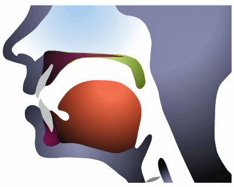
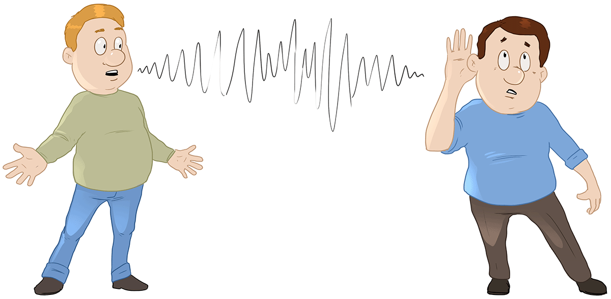
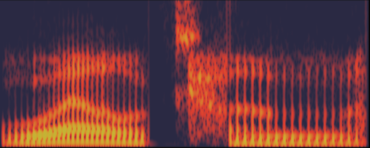

```{r setup, include=FALSE}
options(htmltools.dir.version = FALSE)
```

```{r xaringan-extra-all-the-things, echo=FALSE}
xaringanExtra::use_xaringan_extra(
  c("tile_view", "panelset", "editable", 
    "animate", "tachyons")
)
```

class: title-slide-section-grey, middle

# .white[¿Qué es la lingüística?]

---
layout: true

# ¿Qué es la lingüística?

---

- La morfología

- La sintaxis

- La semántica

- La pragmática

- La sociolingüística

- La fonética (articulatoria, perceptual o acústica)

- La fonología

---
background-image: url("./assets/img/morfologia.jpg")
background-position: 90% 50%
background-size: 600px

### **La morfología**: el estudio de la estructura de las palabras

- ej. morfología
	- morph- : “forma” (del griego)
	- -logía : “tratado”, “ciencia” = ciencia de la forma

---
background-image: url("./assets/img/sintaxis.png")
background-position: 50% 60%
background-size: 600px

### **La sintaxis**: el estudio de la formación de oraciones

---
background-image: url("./assets/img/semantica.jpg")
background-position: 50% 80%
background-size: 400px

### **La semántica**: el estudio del significado de las palabras, frases y oraciones. 

---
background-image: url("./assets/img/semantica.jpg")
background-position: 50% 80%
background-size: 400px

### **La pragmática**: el estudio del lenguaje en su relación con los usuarios y las circunstancias de la comunicación.

---
background-image: url("./assets/img/sociolinguistics.gif")
background-position: 50% 70%
background-size: 800px

### **La sociolingüística**: la lengua en la sociedad y cómo varía según diferentes factores sociales (la edad, la clase social, el nivel de educación, etc.)

---

<div align="center">
  <iframe width="420" height="315" src="https://www.youtube.com/embed/_x4OpMoDADI" frameborder="0" allowfullscreen></iframe>
</div>

.footnote[https://youtu.be/_x4OpMoDADI]

---

### **La fonética**: la ciencia que estudia la producción, transmisión y percepción de los sonidos. 

#### Los sonidos se tienen como fenómenos puramente físicos.

.pull-left[

- **fonética articulatoria**: cómo se producen los sonidos

]

.pull-right[

<div align="center">
  
</div>

]

---

### **La fonética**: la ciencia que estudia la producción, transmisión y percepción de los sonidos. 

#### Los sonidos se tienen como fenómenos puramente físicos.

.pull-left[

- fonética articulatoria: cómo se producen los sonidos
- **fonética perceptual**: cómo se perciben los sonidos

]

.pull-right[

<div align="center">
  
</div>

]

---

### **La fonética**: la ciencia que estudia la producción, transmisión y percepción de los sonidos. 

#### Los sonidos se tienen como fenómenos puramente físicos.

.pull-left[

- fonética articulatoria: cómo se producen los sonidos
- fonética perceptual: cómo se perciben los sonidos
- **fonética acústica**: las propiedades físicas de los sonidos

]

.pull-right[

<div align="center">
  
</div>

]

---
background-image: url("./assets/img/fonologia.png")
background-position: 50% 80%
background-size: 400px

### **La fonología** estudia cómo los sonidos se comportan en una lengua, cómo se usan para distinguir significados, su distribución en la lengua y sus relaciones. 

- ej. bata/pata
- ej. casa/caza

---
layout: false

# ¿Por qué nos importa?

<div align="center">
  <iframe width="560" height="315" src="https://www.youtube.com/embed/0MUsVcYhERY?list=PLI4OB8ApJgKLjLwqd3wr-Jaqkor7K-Kgi" frameborder="0" allowfullscreen></iframe>
</div>

.footnote[

[German coast guard](https://youtu.be/0MUsVcYhERY?list=PLI4OB8ApJgKLjLwqd3wr-Jaqkor7K-Kgi)

]

