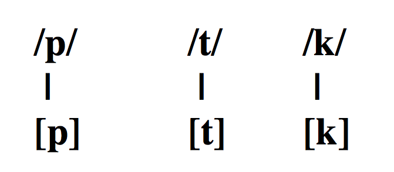
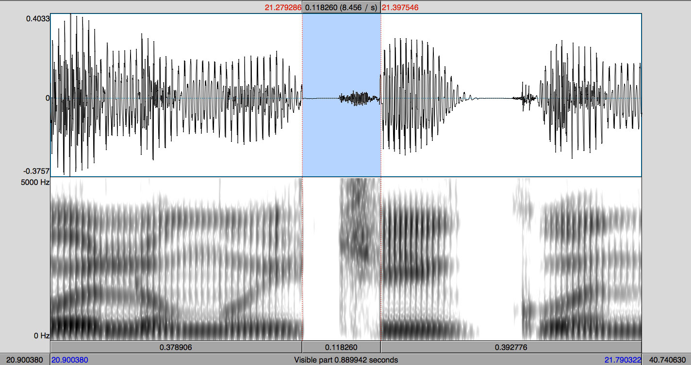
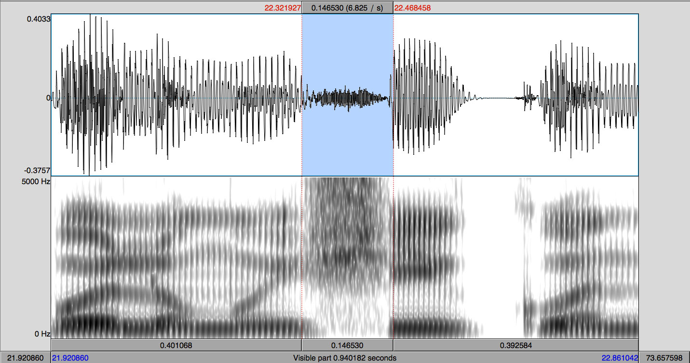

```{r setup, include=FALSE}
options(htmltools.dir.version = FALSE)
```

```{r xaringan-extra-all-the-things, echo=FALSE}
xaringanExtra::use_xaringan_extra(
  c("tile_view", "panelset", "editable", 
    "webcam", "animate", "tachyons")
)
```

class: middle, center

.large[
|           |            |                 |          |          |            |
| :-------- | :--------- | :-------------- | :------- | :------- | :--------- |
| Media     | Lateral    | Oclusiva        | Media    | Nasal    | Media      |
| Anterior  | Fricativa  | Velar           | Anterior | Alveolar | Posterior  |
| Estirada  | Alveolar   | Sorda           | Estirada | Sonora   | Redondeada |
| .white[.] |            |                 |          |          |            |
| Fricativa | Media      | Vibrante simple | Baja     | Nasal    | Media      |
| Palatal   | Posterior  | Alveolar        | Central  | Alveolar | Posterior  |
| Sonora    | Redondeada | Sonora          |          | Sonora   | Redondeada |
| .white[.] |            |                 |          |          |            |
| Nasal     | Baja       | Nasal           | Baja     |          |            |
| Bilabial  | Central    | Bilabial        | Central  |          |            |
| Sonora    |            | Sonora          |          |          |            |
]

--

.footnote[
.big[/el.ke.no.ˈʝo.ɾa.no.ˈma.ma/]
]

---
class: title-slide-section-grey, middle

# Las oclusivas sordas

---
background-image: url(./assets/img/aparatofonador.png)
background-position: 90% 50%

# Los fonemas oclusivos sordos

### /p, t, k/

.Large[
- /p/: oclusivo, **bilabial**, sordo

- /t/: oclusivo, **dental**, sordo

- /k/: oclusivo, **velar**, sordo
]

---

# Los fonemas oclusivos sordos

.Large[

- Representan tres fonemas distintos

- ¿Cómo lo sabemos? Podemos formar pares mínimos

</br>

| Principio de palabra |              |     | Interior de palabra |              |
| :------------------- | :----------- | :-- | :------------------ | :----------- |
| **p**asa             | /ˈ**p**a.sa/ |     | se**p**a            | /ˈse**.p**a/ |
| **t**aza             | /ˈ**t**a.sa/ |     | ze**t**a            | /ˈse**.t**a/ |
| **c**asa             | /ˈ**k**a.sa/ |     | se**c**a            | /ˈse**.k**a/ |

]

---

# Los fonemas oclusivos sordos

### Cada fonema cuenta con un alófono

<div align="center">
  
</div>

---
background-image: url(../assets/img/cry.png)
background-size: 350px
background-position: 93% 40%

# Los fonemas oclusivos sordos

### ¿Qué dificultades puede tener <br>el hablante de inglés? 
### ¿Qué tiene que hacer para no tener <br>un acento extranjero en español?

<p></p>

.large[
- En inglés los oclusivos sordos se aspiran
  - Tiene que aprender a **evitar la aspiracion**
]

<p></p>

.large[
- La /t/ es un sonido **alveolar** en inglés, mientras que es .blue[dental] en 
español
  - Tiene que aprender a realizar un sonido que existe fonémicamente en su L1 
  de una manera distinta, eso es con un punto de articulación ***dental***
]

---

# Los fonemas oclusivos sordos

### Ortografía

.Large[

| Fonema |     Grafemas     |              Ejemplos              |
| :----- | :--------------- | :--------------------------------- |
| /p/    | 'p'              | '**P**aco'                         |
| /t/    | 't'              | '**t**aco'                         |
| /k/    | 'c' (-a, -o, -u) | '**c**asa', '**c**osa', '**c**upo' |
|        | 'qu' (-e, -i)    | '**qu**e', '**qu**iso'             |
|        | 'k'              | '**k**ilo'                         |
|        | 'x'              | 'e**x**amen'                       |

]

---

# Los fonemas oclusivos sordos

### Contexto fónico

.large[
- Posición inicial de sílaba
	- 'paco' → [ˈ**p**a.ko], 'mapa' → [ˈma.**p**a]
	- 'taco' → [ˈ**t**a.ko], 'pata' → [ˈpa.**t**a]
	- 'caco' → [ˈ**k**a.ko], 'poca' → [ˈpo.**k**a]
]

--

<p></p>

.large[
- Posición final de sílaba (coda) (comunmente eledidas)
	- 'apto' → [a**p**.to]
	- 'atlas' → [a**t**.las]
	- 'examen' → [e**k**.ˈsa.men] o [e.ˈsa.men]
]

--

<p></p>

.large[
- No aparecen (con mucha frecuencia) en posicón final de palabra (comunmente eledidas)
	- 'kétchu**p**', 'argo**t**', 'biste**c**'
]

---
class: middle
background-color: black

# Enemigo \#2

### Ejercicios

---
background-image: url(./assets/img/wind.png)
background-size: contain 
background-color: black

---

# Análisis acústico

### En Praat...

.large[

- Con un/a compañer@ graba las siguientes palabras:

|    | Español | Inglés |
| :- | :-      | :-     |
| 1. | papa    | paper  |
| 2. | tata    | table  |
| 3. | caca    | kill   |
| 4. | chica   | church |
| 5. | mucho   | bunch  |

- ¿Qué diferencias notáis?
- ¿Cómo podemos dar cuenta de estas diferencias? ¿Alguna medida?

]

---

# Análisis acústico

### Las oclusivas sordas

.large[

- Si medimos el intervalo de tiempo entre la explosión y el comienzo de la 
fonación de la siguiente vocal, podemos dar cuenta de las diferencias entre 
el inglés y el español

- Esta medida se llama *voice-onset time* (VOT) o *tiempo de inicio de sonoridad*

- Las oclusivas sordas del español tiene VOT corto

- Las oclusivas sordas del inglés tiene VOT largo

- Suena diferente una [p] con VOT corto con respecto a una [p] con VOT largo? 
¿Qué es lo que se oye?

- **Medid el VOT de vuestras [p] (español e inglés) y apuntad el valor en 
milisegundos**. Cuando hayáis terminado, decidme los valores. 

]

---
exclude: true

```{r}
#| label: vot-setup
#| echo: false
#| out.width: 100%
#| fig.align: 'center'
#| message: false
#| dpi: 300
#| fig-asp: .56

library("tidyverse")

vot_data <- tribble(
  ~'participante', ~'phon', ~'vot_es', ~'vot_in', 
   'gabriel',       'p',      19,        61, 
   'gabriel',       't',      22,        60, 
   'gabriel',       'k',      21,        57, 
   'odenis',        'p',      11,        50, 
   'odenis',        't',      29,        29, 
   'odenis',        'k',      46,        67, 
   'carolina',      'p',      13,        48, 
   'carolina',      't',      26,        79, 
   'carolina',      'k',      33,        83, 
   'joseph',        'p',      10,        61,
   'joseph',        't',      17,        68, 
   'joseph',        'k',      27,        77, 
   'Joseph',        'p',       8,        27,
   'Joseph',        't',      10,        39,
   'Joseph',        'k',      13,        70,
   'karin',         'p',      16,        46, 
   'karin',         't',      23,        41, 
   'karin',         'k',      31,        80, 
   'alexandra',     'p',      18,        27, 
   'alexandra',     't',      15,        69, 
   'alexandra',     'k',      33,        81, 
   'jason',         'p',      13,        62, 
   'jason',         't',      10,        20, 
   'jason',         'k',       5,        19, 
   'jillian',       'p',      14,        15, 
   'jillian',       't',      14,        98, 
   'jillian',       'k',      28,        77, 
   'gessica',       'p',      12,        26, 
   'gessica',       't',      13,        39, 
   'gessica',       'k',      19,        78, 
   'andrea',        'p',      17,        48, 
   'andrea',        't',      20,        50, 
   'andrea',        'k',      33,        81, 
   'gabriela',      'p',      10,        64, 
   'gabriela',      't',      16,        81, 
   'gabriela',      'k',      27,        81, 
   'amanda',        'p',      12,        43, 
   'amanda',        't',      16,        78, 
   'amanda',        'k',      30,        80, 
   'gabrielle',     'p',      13,        72, 
   'gabrielle',     't',      12,        66, 
   'gabrielle',     'k',      16,        80, 
   'sophie',        'p',      28,        80, 
   'sophie',        't',      21,        83, 
   'sophie',        'k',      18,        78, 
   'enriqueta',     'p',      82,        91, 
   'enriqueta',     't',      66,        22, 
   'enriqueta',     'k',      86,        70, 
   'jarol',         'p',      17,        21, 
   'jarol',         't',      22,        73, 
   'jarol',         'k',      49,        80, 
   'lester',        'p',      39,        70, 
   'lester',        't',      24,        85, 
   'lester',        'k',      39,       109, 
   'julie',         'p',       8,        23, 
   'julie',         't',      23,       105, 
   'julie',         'k',      36,       129, 
   'alyson',        'p',       9,        17, 
   'alyson',        't',      20,        50, 
   'alyson',        'k',      28,        52, 
   'courtney',      'p',      10,        29, 
   'courtney',      't',      15,        58, 
   'courtney',      'k',      20,        88, 
   'ashley',        'p',       8,        25, 
   'ashley',        't',      10,        57, 
   'ashley',        'k',      45,        88, 
   'robert',        'p',      10,        38, 
   'robert',        't',      17,        59, 
   'robert',        'k',      19,        81, 
   'elizabeth',     'p',       8,        27, 
   'elizabeth',     't',      28,        84, 
   'elizabeth',     'k',      16,        83, 
   'viviana',       'p',      56,        98, 
   'viviana',       't',       8,        15, 
   'viviana',       'k',      18,       100, 
   'mariel',        'p',       9,        48, 
   'mariel',        't',       8,        67, 
   'mariel',        'k',      17,        53, 
   'briana',        'p',      19,        46, 
   'briana',        't',      15,        57, 
   'briana',        'k',      25,        68, 
   'maya',          'p',      12,        89, 
   'maya',          't',      14,        77, 
   'maya',          'k',      23,       121, 
  
  
  
   'esther',        'p',       ,          , 
   'esther',        't',       ,          , 
   'esther',        'k',       ,          , 
   'dunia',         'p',       ,          , 
   'dunia',         't',       ,          , 
   'dunia',         'k',       ,          , 
   'bella',         'p',       ,          , 
   'bella',         't',       ,          , 
   'bella',         'k',       ,          , 
   'erin',          'p',       ,          , 
   'erin',          't',       ,          , 
   'erin',          'k',       ,          , 
   'charlie',       'p',       ,          , 
   'charlie',       't',       ,          , 
   'charlie',       'k',       ,          , 
   'alexandria',    'p',       ,          , 
   'alexandria',    't',       ,          , 
   'alexandria',    'k',       ,          , 
   'gabriella',     'p',       ,          , 
   'gabriella',     't',       ,          , 
   'gabriella',     'k',       ,          , 
   'jasia',         'p',       ,          , 
   'jasia',         't',       ,          , 
   'jasia',         'k',       ,          , 
   'sydney',        'p',       ,          , 
   'sydney',        't',       ,          , 
   'sydney',        'k',       ,          , 
   'laura',         'p',       ,          , 
   'laura',         't',       ,          , 
   'laura',         'k',       ,          , 
   'giuliano',      'p',       ,          , 
   'giuliano',      't',       ,          , 
   'giuliano',      'k',       ,          , 

   ) |> 
  pivot_longer(
    cols = c("vot_es", "vot_in"), 
    names_to = "lang", 
    values_to = "vot"
  )

```

---
class: middle

```{r}
#| label: vot-p
#| echo: false
#| out.width: 100%
#| fig.align: 'center'
#| message: false
#| dpi: 300
#| fig-asp: .56

vot_data |> 
  filter(phon == "p") %>% 
  ggplot() + 
  aes(x = vot, y = lang, fill = lang) + 
  geom_point(size = 3, pch = 21, show.legend = F) + 
  #ggrepel::geom_text_repel(aes(label = participante), size = 6, 
  #                         position = position_nudge(y = -0.1)) + 
  stat_summary(
    fun.data = mean_cl_boot, geom = "pointrange", pch = 21, 
    size = 2, stroke = 1, position = position_nudge(y = 0.15), 
    show.legend = F
  ) + 
  scale_fill_viridis_d(name = NULL, begin = 0.2, end = 0.8) + 
  scale_y_discrete(labels = c("Español", "Inglés")) + 
  labs(title = "Oclusivas sordas", 
    subtitle = "VOT de /p/ en inglés y español", 
    x = "VOT (ms)", y = NULL) + 
  ds4ling::ds4ling_bw_theme(base_size = 16, base_family = 'Palatino')

```


---
class: middle

```{r}
#| label: vot-t
#| echo: false
#| out.width: 100%
#| fig.align: 'center'
#| message: false
#| dpi: 300
#| fig-asp: .56

vot_data |> 
  filter(phon == "t") %>% 
  ggplot() + 
  aes(x = vot, y = lang, fill = lang) + 
  geom_point(size = 3, pch = 21, show.legend = F) + 
  #ggrepel::geom_text_repel(aes(label = participante), size = 6, 
  #                         position = position_nudge(y = -0.1)) + 
  stat_summary(
    fun.data = mean_cl_boot, geom = "pointrange", pch = 21, 
    size = 2, stroke = 1, position = position_nudge(y = 0.15), 
    show.legend = F
  ) + 
  scale_fill_viridis_d(name = NULL, begin = 0.2, end = 0.8) + 
  scale_y_discrete(labels = c("Español", "Inglés")) + 
  labs(title = "Oclusivas sordas", 
    subtitle = "VOT de /p/ en inglés y español", 
    x = "VOT (ms)", y = NULL) + 
  ds4ling::ds4ling_bw_theme(base_size = 16, base_family = 'Palatino')

```

---
class: middle

```{r}
#| label: vot-k
#| echo: false
#| out.width: 100%
#| fig.align: 'center'
#| message: false
#| dpi: 300
#| fig-asp: .56

vot_data |> 
  filter(phon == "k") %>% 
  ggplot() + 
  aes(x = vot, y = lang, fill = lang) + 
  geom_point(size = 3, pch = 21, show.legend = F) + 
  #ggrepel::geom_text_repel(aes(label = participante), size = 6, 
  #                         position = position_nudge(y = -0.1)) + 
  stat_summary(
    fun.data = mean_cl_boot, geom = "pointrange", pch = 21, 
    size = 2, stroke = 1, position = position_nudge(y = 0.15), 
    show.legend = F
  ) + 
  scale_fill_viridis_d(name = NULL, begin = 0.2, end = 0.8) + 
  scale_y_discrete(labels = c("Español", "Inglés")) + 
  labs(title = "Oclusivas sordas", 
    subtitle = "VOT de /p/ en inglés y español", 
    x = "VOT (ms)", y = NULL) + 
  ds4ling::ds4ling_bw_theme(base_size = 16, base_family = 'Palatino')

```

---
class: middle

```{r}
#| label: vot-ptk
#| echo: false
#| out.width: 100%
#| fig.align: 'center'
#| message: false
#| dpi: 300
#| fig-asp: .56

vot_data |> 
  mutate(phon = forcats::fct_relevel(phon, "p", "t")) |> 
  ggplot() + 
  aes(x = phon, y = vot, fill = lang) + 
  geom_boxplot() + 
  scale_fill_viridis_d(
    name = NULL, begin = 0.2, end = 0.8, 
    labels = c("Español", "Inglés")
  ) + 
  labs(title = "Oclusivas sordas", 
   subtitle = "VOT de /p, t, k/ en inglés y español", 
   y = "VOT (ms)", x = NULL) + 
  ds4ling::ds4ling_bw_theme(base_size = 16, base_family = 'Palatino')
```

---
background-image: url(./assets/img/sp_en_stops.png)
background-size: contain 

---

background-image: url(./assets/img/sp_en_stops.png)
background-size: 760px
background-position: 52% 3%
class: bottom

--

<br><br>

```{r}
#| label: vot-density
#| echo: false
#| out.width: 75%
#| fig-height: 3
#| fig-align: 'center'
#| message: false
#| dpi: 300

vot_means <- vot_data |> group_by(lang) |> summarize(vot = mean(vot))

sigmoid_text <- tibble(
  vot = c(pull(vot_means[1, 2]),pull(vot_means[2, 2])),
  y = c(-0.03, 0.03), 
  lang = c("Español", "Inglés")
)

vot_data |> 
  ggplot() +
  aes(x = vot, fill = lang, color = lang) + 
  geom_vline(xintercept = 0, lty = 3, color = "grey70") + 
  geom_hline(yintercept = 0, lty = 3) + 
  geom_density(
    data = filter(vot_data, lang == "vot_in"), 
    show.legend = F, color = "black", 
  ) + 
  geom_density(
    data = filter(vot_data, lang == "vot_es"), 
    show.legend = F, color = "black", 
    aes(x = vot, y = -after_stat(density))
  ) + 
  coord_cartesian(xlim = c(-140, 140), ylim = c(-0.07, 0.05)) + 
  labs(x = "VOT (ms)", y = NULL) + 
  scale_y_continuous(labels = NULL) + 
  scale_x_continuous(
    breaks = seq(-140, 140, 10), 
    labels = c(
      "-140", " ", " ", " ", " ", " ", " ", " ", " ", " ", " ", 
      " ", " ", " ", "0", " ", " ", " ", " ", " ", " ", " ", " ", 
      " ", " ", " ", " ", " ", "140")
  ) + 
  geom_text(
    data = sigmoid_text, 
    aes(x = vot + 5, y = y, label = lang), color = "black", 
    hjust = 0, show.legend = F, size = 5, family = "Palatino"
  ) +
  scale_fill_viridis_d(name = NULL, begin = 0.2, end = 0.8) + 
  theme_minimal(base_size = 16, base_family = 'Palatino') + 
  theme(
    panel.grid.major = element_line(colour = 'grey90', linewidth = 0.15),
    panel.grid.minor = element_blank()
  )
```

---


class: title-slide-section-grey, middle

# Las africadas

---

# El fonema africado 

### /ʧ/ 

.Large[

- Este fonema tiene un solo alofono: /ʧ/ → [ʧ] 
  - Aunque hay variacion dialectal
  - Ej. "corchetes" --> [koɾ.ˈʧe.tes]

]

---

# El fonema africado 

### [ʧ] vs. [ʃ] 

<div align="center">
  
  
</div>

</br>

<audio controls>
  <source src="./assets/img/audiosh.ogg" type="audio/ogg">
  <source src="./assets/img/audiosh.wav" type="audio/mpeg">
Your browser does not support the audio element.
</audio>

---

# El fonema africado 

### /ʧ/ 

.Large[
- ¿Qué dificultades tendría el hablante del inglés?
]


---
class: title-slide-section-grey, middle
exclude: false

# A practicar

---
exclude: false

# Del examen...

1. Voy a ir a la tienda hindú del barrio italiano a comprar un vestido.

2. A Juana la eligieron reina del concurso de belleza internacional.

3. Juan Andrés es dueño de una huerta grande en la ciudad de Medellín.

4. Raquel estuvo esperando todo el día en frente del mismo banco.

5. Al oír esos gritos uno se da cuenta de que el corazón de toda la hinchada ha 
entrado en el juego.

---
exclude: false

# Del examen...

1. Voyairalatiendahindúdelbarrioitalianoacomprarunvestido.

2. AJuanalaeligieronreinadelconcursodebellezainternacional.

3. JuanAndrésesdueñodeunahuertagrandeenlaciudaddeMedellín.

4. Raquelestuvoesperandotodoeldíaenfrentedelmismobanco.

5. Aloíresosgritosunosedacuentadequeelcorazóndetodalahinchadahaentradoeneljuego.

---
exclude: false

# Del examen...

1. Vo.ya.i.ra.la.tien.dahin.dú.del.ba.rrioi.ta.lia.no.a.com.pra.run.ves.ti.do

2. A.Jua.na.la.e.li.gie.ron.rei.na.del.con.cur.so.de.be.lle.zain.ter.na.cio.nal

3. Jua.nAn.dré.ses.due.ño.deu.na.huer.ta.gran.de.en.la.ciu.da.dde.Me.de.llín

4. Ra.que.les.tu.vo.es.pe.ran.do.to.do.el.dí.a.en.fren.te.del.mis.mo.ban.co

5. A.lo.í.re.sos.gri.to.su.no.se.da.cuen.ta.de.que.el.co.ra.zón.de.to.da.lahin.  
cha.da.ha.en.tra.do.e.nel.jue.go

---
exclude: false

# Del examen...

1. /ˈbo.ʝa.ˈi.ɾa.la.ˈtien.dain.ˈdu.del.ba.rioi.ta.ˈlia.no.a.kom.ˈpɾa.ɾun.bes.ˈti.do/  
   /ˈboi.a.ˈi.ɾa/

2. /a.ˈxua.na.la.e.li.ˈxie.ɾon.ˈrei.na.del.kon.ˈkuɾ.so.de.be.ˈʝe.θain.teɾ.na.θio.ˈnal/

3. /ˈxua.nan.ˈdɾe.ses.ˈdue.ɲo.deu.na.ˈweɾ.ta.ˈgɾan.deːn.la.θiu.ˈda.de.me.de.ˈʝin/

4. /ra.ˈke.les.ˈtu.bo.es.pe.ˈɾan.do.to.do.el.ˈdi.a.en.ˈfɾen.te.del.ˈmis.mo.ˈban.ko/

5. /a.lo.ˈi.ɾe.sos.ˈgɾi.to.su.no.se.da.ˈkuen.ta.de.keːl.ko.ɾa.ˈθon.de.to.da.lain.ˈʧa.  
daː.en.tɾa.do.e.nel.xue.go/

---
class: title-slide-section-grey, middle

# Más práctica

---

# Transcripción fonémica

1. No me digas ahora eso porque no lo entiendo

1. Los dos hermanos salieron a pasear al parque

1. Cuando Inés vino a cenar, le regalé dos flores

1. La pared azul antes era blanca

1. No te pongas esos pantalones porque están húmedos

1. Justino, Antonio y Juan no son mis novios

1. No voy al concierto contigo

1. Los triptongos me asustan mucho de vez en cuando

1. No contestes el teléfono si es para mí

1. Al final sí encontré lo que me dijiste

1. La cámara de gas no fue un buen invento de la humanidad

---

# Transcripción fonémica

1. Nomedigasahoraesoporquenoloentiendo

1. Losdoshermanossalieronapasearalparque

1. CuandoInésvinoacenar leregalédosflores

1. Laparedazulanteserablanca

1. Notepongasesospantalonesporqueestánhúmedos

1. Justino, AntonioyJuannosonmisnovios

1. Novoyalconciertocontigo

1. Lostriptongosmeasustanmuchodevezencuando

1. Nocontesteselteléfonosiesparamí

1. Alfinalsíencontréloquemedijiste

1. Lacámaradegasnofueunbueninventodelahumanidad

---

# Transcripción fonémica

1. /no.me.ˈdi.ga.sa.ˈo.ɾa.e.so.poɾ.ke.no.lo.en.ˈtien.do/

2. /los.do.seɾ.ˈma.no.sa.lie.ˈɾo.na.pa.se.ˈa.ɾal.ˈpaɾ.ke/

3. /kuan.doi.ˈnes.ˈbi.no.a.θe.ˈnaɾ.le.re.ga.ˈle.dos.ˈflo.ɾes/

4. /la.pa.ˈɾe.da.ˈθu.lan.te.ˈse.ɾa.ˈblan.ka/

5. /no.te.ˈpon.ga.se.sos.pan.ta.ˈlo.nes.poɾ.ke:s.ˈta.ˈnu.me.dos/

6. /xus.ˈti.no.an.ˈto.nioi.ˈxua.no.son.mis.ˈno.bios/

7. /no.boi.al.kon.ˈθieɾ.to.kon.ˈti.go/

8. /los.tɾip.ˈton.gos.me.a.ˈsus.tan.ˈmu.ʧo.de.be.θen.kuan.do/

9. /no.kon.ˈtes.te.sel.te.ˈle.fo.no.sies.pa.ɾa.mi/

10. /al.fi.nal.si // en.kon.ˈtɾe.lo.ke.me.di.ˈxis.te/  

11. /la.ˈka.ma.ɾa.de.gas.no.fueun.bue.nin.ˈben.to.de.lau.ma.ni.ˈdad/

---
class: title-slide-final, left

# References

- Barrutia, Richard & Armin Schwegler (eds.) 1994. Fonética y fonología españolas: teoría y práctica.  New York: Wiley. [2nd edition] 

- Teschner, Richard V. 1996. Camino oral: fonética, fonología y práctica de los sonidos del español.  New York: McGraw-Hill. [Libro de texto y cassettes]. 

- Hualde, J.I. (2013). *Los sonidos del español*. Cambridge University Press.

