```{r setup, include=FALSE}
options(htmltools.dir.version = FALSE)
```

```{r xaringan-extra-all-the-things, echo=FALSE}
xaringanExtra::use_xaringan_extra(
  c("tile_view", "panelset", "editable", 
    "webcam", "animate", "tachyons")
)
```

exclude: false
class: title-slide-section-grey, middle

# Repaso

---
exclude: false
background-image: url(https://raw.githubusercontent.com/jvcasillas/media/master/teaching/gifs/partner.gif)
background-position: 95% 50%

# En grupos...

.pull-left[

- Definid **fonema** y aportad un ejemplo.

- Definid **alófono** y aportad un ejemplo.

- ¿Cómo sabemos si dos sonidos son fonemas o alófonos? ¿Qué prueba podemos 
usar?

- ¿Cuáles son las diferencias entre las oclusivas sordas del inglés con 
respecto a las del español?

]

---
exclude: false
class: title-slide-section-grey, middle

# Práctica 

---
exclude: false
# A transcribir

1. No me digas ahora eso porque no lo entiendo
1. Los dos hermanos salieron a pasear al parque
1. Cuando Inés vino a cenar, le regalé dos flores
1. La pared azul antes era blanca
1. No te pongas esos pantalones porque están húmedos
1. Justino, Antonio y Juan no son mis novios
1. No voy al concierto contigo
1. Los triptongos me asustan mucho de vez en cuando
1. No contestes el teléfono si es para mí
1. Al final sí encontré lo que me dijiste
1. La cámara de gas no fue un buen invento de la humanidad


---
exclude: false

# A transcribir

1. Nomedigasahoraesoporquenoloentiendo
1. Losdoshermanossalieronapasearalparque
1. CuandoInésvinoacenar leregalédosflores
1. Laparedazulanteserablanca
1. Notepongasesospantalonesporqueestánhúmedos
1. Justino, AntonioyJuannosonmisnovios
1. Novoyalconciertocontigo
1. Lostriptongosmeasustanmuchodevezencuando
1. Nocontesteselteléfonosiesparamí
1. Alfinalsíencontréloquemedijiste
1. Lacámaradegasnofueunbueninventodelahumanidad

---
exclude: false

# Transcripción fonémica

1. /no.me.ˈdi.ga.sa.ˈo.ɾa.e.so.poɾ.ke.no.lo.en.ˈtien.do/
2. /los.do.seɾ.ˈma.no.sa.lie.ˈɾo.na.pa.se.ˈa.ɾal.ˈpaɾ.ke/
3. /kuan.doi.ˈnes.ˈbi.no.a.θe.ˈnaɾ.le.re.ga.ˈle.dos.ˈflo.ɾes/
4. /la.pa.ˈɾe.da.ˈθu.lan.te.ˈse.ɾa.ˈblan.ka/

---
exclude: false

# Transcribid las siguientes oraciones

- Juan y Ernesto fueron de viaje.
- Marta hizo la tarea. 

---
exclude: false

# Juntamos todo...

- JuanyErnestofuerondeviaje.
- Martahizolatarea.

---
exclude: false

# Cuidado con las deslizadas

- /ˈxua.nieɾ.ˈnes.to.ˈfue.ɾon.de.ˈbi.a.xe/

---
exclude: false

# ...y los antidiptongos

- /ˈmaɾ.ta.ˈi.θo.la.ta.ˈɾe.a/

---
exclude: false

# Los triptongos

- **Triptongo**: Cualquier combinación monosilábica que empieza con una deslizada, tiene por núcleo una vocal media o baja y termina con otra deslizada. 

</br>

<div align="center">
  deslizada → vocal → deslizada
</div>

---
exclude: false

# Los triptongos

### Se dan entre palabras...

|     |       Secuencia        | Transcripción fonológica |
| :-- | :--------------------- | :----------------------- |
|     | ciencia humana:        |                          |
|     | anuncio irresponsable: |                          |
|     | fue imposible:         |                          |
|     | antiguo irlandés:      |                          |

---
exclude: false

# Los triptongos

### Se dan entre palabras...

|     |       Secuencia        |      Transcripción fonológica     | Triptongo |
| :-- | :--------------------- | :-------------------------------- | :-------: |
|     | ciencia humana:        | /ˈθien.**θiau**.ˈma.na/           |  [i̯au̯]    |
|     | anuncio irresponsable: | /a.ˈnun.**θioi**.res.pon.ˈsa.ble/ |  [i̯oi̯]    |
|     | fue imposible:         | /ˈ**fueim**.po.ˈsi.ble/           |  [u̯ei̯]    |
|     | antiguo irlandés:      | /an.ˈti.**guoiɾ**.lan.ˈdes/       |  [u̯oi̯]    |

---
exclude: false

# Los triptongos

### ...y también en la forma vosotros.
  
- cambiáis: /kam.ˈ**biais**/ - [i̯ai̯]

- continuáis: /kon.ti.ˈ**nuais**/ - [u̯ai̯]

---
class: title-slide-section-grey, middle


# Las obstruyentes sonoras

---

# Los fonemas oclusivos sonoros: /b, d, g/

</br>

- /b/: **bilabial**, oclusivo, sonoro

- /d/: **dental**, oclusivo, sonoro

- /g/: **velar**, oclusivo, sonoro

<!-- <div align="center">
  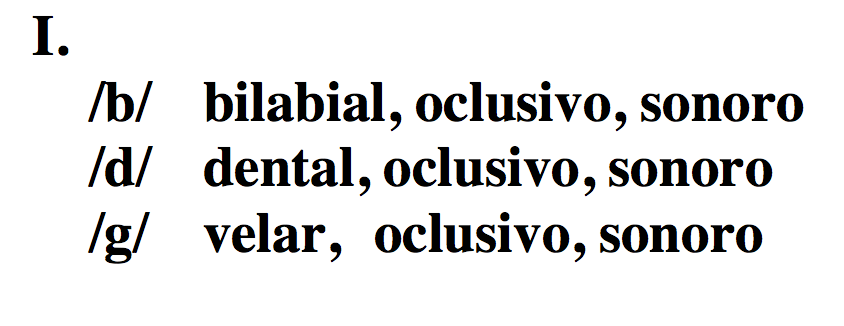
</div> -->

<!-- \includegraphics[scale=.25]{bdg1.png} -->

---

# Los fonemas oclusivos sonoros: /b, d, g/

### Son fonemas, hay pares mínimos

</br>

| Principio de palabra |                           |     | Interior de palabra |                           |
| :------------------- | :------------------------ | :-- | :------------------ | :------------------------ |
| **b**ala/**m**ala    | /ˈ**b**a.la/ /ˈ**m**a.la/ |     | be**b**a/be**s**a   | /ˈbe.**b**a/ /ˈbe.**s**a/ |
| **d**ato/**g**ato    | /ˈ**d**a.to/ /ˈ**g**a.to/ |     | se**d**a/se**c**a   | /ˈse.**d**a/ /ˈse.**k**a/ |
| **g**ato/**p**ato    | /ˈ**g**a.to/ /ˈ**p**a.to/ |     | me**g**a/me**s**a   | /ˈme.**g**a/ /ˈme.**s**a/ |

<!-- <div align="center">
  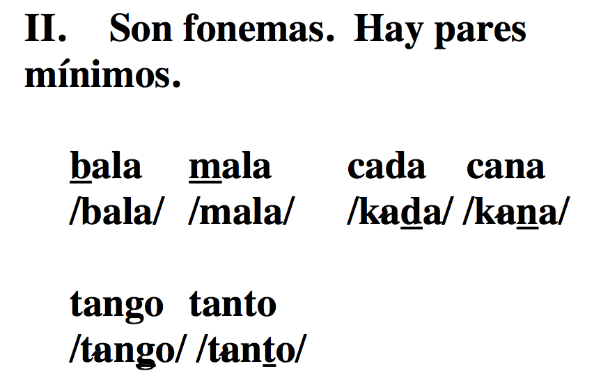
</div> -->

<!-- \includegraphics[scale=.25]{bdg2.png} -->

---

# Los fonemas oclusivos sonoros: /b, d, g/

### Cada fonema tiene dos alófonos...

</br>

<div align="center">
  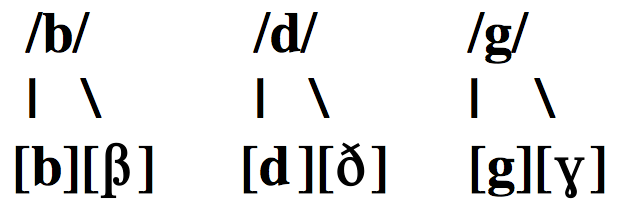
</div>

<!-- \includegraphics[scale=.25]{bdg3.png} -->

---

# Los fonemas oclusivos sonoros: /b, d, g/

### En inglés las oclusivas sonoras sólo tienen un alófono (oclusivo)

</br>

<div align="center">
  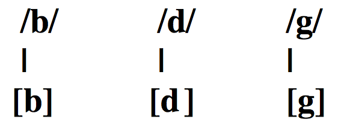
</div>

<!-- \includegraphics[scale=.25]{bdg4.png} -->

---

# Los fonemas oclusivos sonoros: /b, d, g/

### La pronunciación

- El inglés no tiene [β] ni [ɣ]

- [ð] es un fonema en inglés, pero es un alófono de /d/ en español

- [ð] es interdental en inglés, pero dental en español

<!-- <div align="center">
  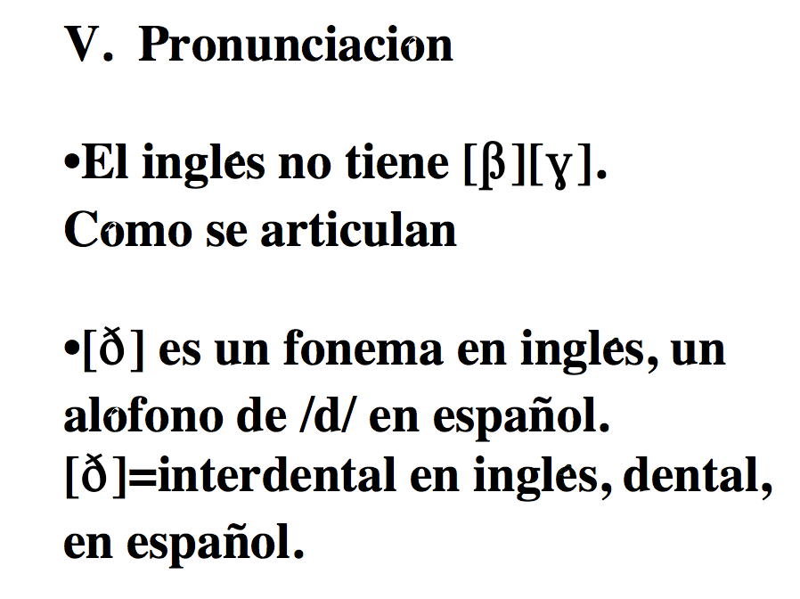
</div> -->

---

### ¿Cómo se articulan?

<iframe width="1000" height="500" src="http://soundsofspeech.uiowa.edu/index.html#spanish" frameborder="0" allowfullscreen></iframe>

---

# Los fonemas oclusivos sonoros: /b, d, g/

- El español no tiene como fonema el sonido labiodental [v]

- Los grafemas 'b' y 'v' siempre son bilabiales

</br>

|  Lengua | Palabra  | Transcripción fonética |
| :------ | :------- | :--------------------- |
| inglés  | 'visit'  | [ˈ**v**ɪ.zɪt]          |
| español | 'visita' | [**b**i.ˈsi.ta]        |

<!-- <div align="center">
  
</div> -->

<!-- \includegraphics[scale=.25]{bdg6.png} -->

---

# Los fonemas oclusivos sonoros: /b, d, g/

.pull-left[

### El fonema /b/:

#### [b]: modo oclusivo

- [ˈam.bos]
- [ˈbe.to]

#### [β]: modo fricativo

- [ˈu.βo]
- [ˈal.βa]

]

--

.pull-right[

### ¿En qué contextos se encuentran?

- [b] → después de una nasal o una pausa
- [β] → en el resto de los contextos e incluso entre palabras

]

---

# Distribución complementaria

<div align="center">
  
</div>

---

# Distribución complementaria

<div style="float:right">
  
  
</div>

- Es una situación lingüística en la cual un sonido "A" aparece en determinados contextos y "B" aparece en el resto de los contextos en los cuales "A" no 
aparece.

---

# Las oclusivas sonoras /b/, /d/ y /g/

.pull-left[

### El fonema /d/:

#### [d]: modo oclusivo

- [ˈan.do]
- [al.ˈde.a]

#### [ð]: modo fricativo

- [ˈla.ðo]

]

.pull-right[

### El fonema /g/:

#### [g]: modo oclusivo

- [ˈtaŋ.go]

#### [ɣ]: modo fricativo

- [ˈma.ɣo]

]

---

<div align="center">
  
</div>

<!-- \includegraphics[scale=.25]{b.pdf} -->

---

<div align="center">
  
</div>

<!-- \includegraphics[scale=.25]{g.pdf} -->

---

<div align="center">
  
</div>

<!-- \includegraphics[scale=.25]{d.pdf} -->

---

<div align="center">
  
</div>

<!-- \includegraphics[scale=.25]{d2.pdf} -->

---

# Distribución complementaria

|     |           |     |                                                                     |
| :-: | :-------- | :-: | :------------------------------------------------------------------ |
|  -  | [b, d, g] |  →  | Después de una nasal o una pausa; después de [l] en el caso de [d]. |
|     |           |     |                                                                     |
|     |           |     |                                                                     |

---

# Distribución complementaria


|     |           |     |                                                                     |
| :-: | :-------- | :-: | :------------------------------------------------------------------ |
|  -  | [b, d, g] |  →  | Después de una nasal o una pausa; después de [l] en el caso de [d]. |
|     |           |     |                                                                     |
|  -  | [β, ð, ɣ] |  →  | En el resto de los contextos e incluso entre palabras               |

---

# Distribución complementaria

### \*Esta regla se aplica incluso entre palabras, dentro de un mismo grupo fónico, como en:

|             |                    |
| :---------- | :----------------- |
| En Guadiana | [eŋ.gu̯a.ˈði̯a.na] |
| A Guadiana  | [a.ɣu̯a.ði̯a.na]   |

---

# Distribución complementaria

### \*Esta regla se aplica incluso entre palabras, dentro de un mismo grupo fónico, como en:

|          |                |
| :------- | :------------- |
| El dueño | [el.ˈdu̯e.ɲo]  |
| A Damián | [a.ða.ˈmi̯an] |

---

# La fricativización

### /b, d, g/ → [β, ð, ɣ]

- Este proceso ocurre cuando los sonidos oclusivos sonoros (en español /b, d, g/) se pronuncian con fricción.  Este proceso convierte los oclusivos en fricativos [β, ð, ɣ]

- Supone un cambio de modo

- El sonido afectado aparece en posición inicial de sílaba 

- El único proceso en el cual el sonido que aparece *anteriormente* dicta el cambio del sonido

---
exclude: false

# Transcribid

1. No me digas ahora eso porque no lo entiendo
1. Los dos hermanos salieron a pasear al parque
1. Cuando Inés vino a cenar, le regalé dos flores
1. La pared azul antes era blanca

---
exclude: false
# Transcripción fonémica

1. /no.me.ˈ**d**i.**g**a.sa.ˈo.ɾa.e.so.poɾ.ke.no.lo.en.ˈtien.**d**o/
2. /los.**d**o.seɾ.ˈma.no.sa.lie.ˈɾo.na.pa.se.ˈa.ɾal.ˈpaɾ.ke/
3. /kuan.**d**oi.ˈnes.ˈ**b**i.no.a.θe.ˈnaɾ.le.re.**g**a.ˈle.**d**os.ˈflo.ɾes/
4. /la.pa.ˈɾe.**d**a.ˈθu.lan.te.ˈse.ɾa.ˈ**b**lan.ka/

---
exclude: false
# Transcripción fonética

1. /no.me.ˈdi.ga.sa.ˈo.ɾa.e.so.poɾ.ke.no.lo.en.ˈtien.do/  
   [no.me.ˈ**ð**i.**ɣ**a.sa.ˈo.ɾa.e.so.poɾ.ke.no.lo.en̪.ˈti̯en̪.**d**o]
2. /los.do.seɾ.ˈma.no.sa.lie.ˈɾo.na.pa.se.ˈa.ɾal.ˈpaɾ.ke/  
   [loz.**ð**o.seɾ.ˈma.no.sa.li̯e.ˈɾo.na.pa.se.ˈa.ɾal.ˈpaɾ.ke]
3. /kuan.doi.ˈnes.ˈbi.no.a.θe.ˈnaɾ.le.re.ga.ˈle.dos.ˈflo.ɾes/  
   [ku̯an̪.**d**oi̯.ˈnez.ˈ**β**i.no.a.θe.ˈnaɾ.le.re.**ɣ**a.ˈle.**ð**os.ˈflo.ɾes]
4. /la.pa.ˈɾe.da.ˈθu.lan.te.ˈse.ɾa.ˈblan.ka/  
   [la.pa.ˈɾe.**ð**a.ˈθu.lan̪.te.ˈse.ɾa.ˈ**β**laŋ.ka]

---


exclude: false
background-image: url(https://raw.githubusercontent.com/jvcasillas/media/master/teaching/img/confused.png)
background-position: 95% 50%

# Repaso

.pull-left[

- ¿Cuáles son las obstruyentes sordas del español? ¿Cómo se diferencian de 
las del inglés? (Recordad el enemigo \#2)

- ¿Cuáles son las obstruyentes sonoras del español? ¿Cómo se diferencian de 
las del inglés?

- Las obstruyentes sonoras se someten a un proceso fonológico en ciertos 
contextos fónicos. ¿Cuál es el proceso (cómo se llama) y en qué contextos 
ocurre?

]

---

# La fricativización

### /b, d, g/ → [β, ð, ɣ]

<ru-blockquote>
Este proceso ocurre cuando los sonidos oclusivos sonoros 
(en español /b, d, g/) se pronuncian con fricción. Este proceso convierte 
los oclusivos en fricativos [β, ð, ɣ]
</ru-blockquote>

- Supone un cambio de modo

- El sonido afectado aparece en posición inicial de sílaba 

- El único proceso en el cual el sonido que aparece *anteriormente* dicta el 
cambio del sonido

---
exclude: false

# Más sobre las oclusivas - VOT

### Taller de Praat

- Grabad las siguientes palabras en praat
  - "bull" (ing.)
  - "pull" (ing.)
  - "bata" (es.)
  - "pata" (es.)
  - "data"
  - "gata"

<p></p>

- Estudiad los espectrogramas y apuntad vuestras observaciones

---
exclude: false
background-image: url(./assets/img/sp_en_stops.png)
background-size: contain
background-position: 50% 50%

---
exclude: false
background-image: url(./assets/img/vot_oscillograms.png)
background-size: contain
background-position: 50% 50%

---
exclude: false
background-image: url(./assets/img/bull.png), url(./assets/img/pull.png)
background-size: 575px, 575px
background-position: 5% 65%, 100% 65%

# VOT positivo

---
exclude: false
background-image: url(./assets/img/bull.png), url(./assets/img/pull.png), url(./assets/img/boom.png), url(./assets/img/plus.png), url(./assets/img/vf.gif)
background-size: 375px, 375px, 300px, 50px, 270px
background-position: 25% 30%, 75% 30%, 26% 90%, 50% 85%, 73% 90%

# VOT positivo

---
exclude: false
background-image: url(./assets/img/boom.png), url(./assets/img/plus.png), url(./assets/img/vf.gif)
background-size: 300px, 50px, 270px
background-position: 26% 90%, 50% 85%, 73% 90%

# VOT positivo

- Short-lag: 
  - español sordo (/p, t, k/)
  - inglés sonoro (/b, d, g/)

<p></p>

- Long-lag: 
  - inglés sordo (/p, t, k/ > [ p<sup>h</sup>, t<sup>h</sup>, k<sup>h</sup> ])

---
exclude: false
background-image: url(./assets/img/bata.png)
background-size: contain
background-position: 65% 50%

# VOT negativo

---
exclude: false
background-image: url(./assets/img/bata.png), url(./assets/img/vf.gif), url(./assets/img/plus.png), url(./assets/img/boom.png)
background-size: 450px, 300px, 50px, 270px
background-position: 50% 10%, 26% 90%, 50% 85%, 73% 90%

# VOT negativo

---
exclude: false
background-image: url(./assets/img/vf.gif), url(./assets/img/plus.png), url(./assets/img/boom.png)
background-size: 300px, 50px, 270px
background-position: 26% 90%, 50% 85%, 73% 90%

# VOT negativo

- lead VOT: 
  - español sonoro (/b, d, g/)

---
exclude: false
# Trabajo práctico #1

- Ver handout
- Más ayuda
  - [Taller 1](https://www.jvcasillas.com/praat/slides/00_intro/index.html)
  - [Taller 2](https://www.jvcasillas.com/praat/slides/01_vot/index.html)


---
exclude: true
class: title-slide-section-grey, middle

# Práctica

---
exclude: true
# Fito y fitipaldis "Soldadito marinero"

<iframe width="560" height="315" src="https://www.youtube.com/embed/RGimnBDtNQI" frameborder="0" allow="accelerometer; autoplay; encrypted-media; gyroscope; picture-in-picture" allowfullscreen></iframe>

.footnote[https://youtu.be/RGimnBDtNQI]

---
exclude: false
# Fito y fitipaldis "Soldadito marinero"

.Large[
Él camina **d**espacito que las prisas no son **b**uenas,  
en su **b**razo **d**o**b**la**d**ita con cui**d**a**d**o la chaqueta.  
Lue**g**o pasa por la calle **d**on**d**e los cha**v**ales jue**g**an,  
él tam**b**ién quiso ser niño pero le pilló la **g**uerra.  

Sol**d**a**d**ito marinero conociste a una sirena  
**d**e esas que **d**icen te quiero si **v**en la cartera llena.  
Esco**g**iste a la mas **g**uapa y a la menos **b**uena,  
sin sa**b**er como ha **v**eni**d**o te ha co**g**i**d**o la tormenta  
]

---
exclude: false
# Fito y fitipaldis "Soldadito marinero"

.Large[
Él camina **ð**espacito que las prisas no son **b**uenas,  
en su **β**razo **ð**o**β**la**ð**ita con cui**ð**a**ð**o la chaqueta.  
Lue**ɣ**o pasa por la calle **ð**on**d**e los cha**β**ales jue**ɣ**an,  
él tam**b**ién quiso ser niño pero le pilló la **ɣ**uerra.  

Sol**d**a**ð**ito marinero conociste a una sirena  
**d**e esas que **ð**icen te quiero si **β**en la cartera llena.  
Esco**x**iste a la mas **ɣ**uapa y a la menos **β**uena,  
sin sa**β**er como ha **β**eni**ð**o te ha co**x**i**ð**o la tormenta  

]

---
exclude: false
# Fito y fitipaldis "Soldadito marinero"

.Large[
Él quería cruzar los mares y ol**v**i**d**ar a su sirena,  
la **v**er**d**a**d** no fue **d**ificil cuan**d**o conoció a Mariela,  
que tenia los ojos **v**er**d**es y el ne**g**ocio entre las piernas.  
¡Hay que **v**er que puntería no te arrimas a una **b**uena!  

Sol**d**a**d**ito marinero conociste a una sirena  
**d**e esas que **d**icen te quiero si **v**en la cartera llena  
Esco**g**iste a las mas **g**uapa y a la menos **b**uena,  
sin sa**b**er como ha **v**eni**d**o te ha co**g**i**d**o la tormenta.  

**D**espués **d**e un in**v**ierno malo, una mala prima**v**era,  
**d**ime porqué estas **b**uscan**d**o una lá**g**rima en la arena.  
]

---
exclude: false
# Fito y fitipaldis "Soldadito marinero"

.Large[
Él quería cruzar los mares y ol**β**i**ð**ar a su sirena,  
la **β**er**ð**a**ð** no fue **ð**ificil cuan**d**o conoció a Mariela,  
que tenia los ojos **β**er**ð**es y el ne**ɣ**ocio entre las piernas.  
¡Hay que **β**er que puntería no te arrimas a una **β**uena!  

Sol**d**a**ð**ito marinero conociste a una sirena  
**d**e esas que **ð**icen te quiero si **β**en la cartera llena  
Esco**x**iste a las mas **ɣ**uapa y a la menos **β**uena,  
sin sa**β**er como ha **β**eni**ð**o te ha co**x**i**ð**o la tormenta.  

**D**espués **ð**e un in**b**ierno malo, una mala prima**β**era,  
**d**ime por qué estas **β**uscan**d**o una lá**ɣ**rima en la arena.  
]

---
exclude: false
# Transcribid

- Juan fue inmediatamente a la tienda a comprar pan.

---

exclude: false

# Transcripción fonémica

- /ˈxuan.ˈfuein.me.dia.ta.men.te.a.la.ˈtien.daː.kom.pɾaɾ.pan/

---
exclude: false

# Transcripción fonética

- /ˈxuan.ˈfuein.me.dia.ta.men.te.a.la.ˈtien.daː.kom.pɾaɾ.pan/  
  [ˈxu̯aɱ.ˈfu̯ei̯m.me.**ð**i̯a.ta.men̪.te.a.la.ˈti̯en̪.**d**aː.kom.pɾaɾ.pan]

---
exclude: false

# Describid

|     |       Modo       |      Punto       |    Sonoridad     |
| :-- | :--------------- | :--------------- | :--------------- |
| [b] | \_\_\_\_\_\_\_\_ | \_\_\_\_\_\_\_\_ | \_\_\_\_\_\_\_\_ |
| [g] | \_\_\_\_\_\_\_\_ | \_\_\_\_\_\_\_\_ | \_\_\_\_\_\_\_\_ |
| [ɣ] | \_\_\_\_\_\_\_\_ | \_\_\_\_\_\_\_\_ | \_\_\_\_\_\_\_\_ |
| [d] | \_\_\_\_\_\_\_\_ | \_\_\_\_\_\_\_\_ | \_\_\_\_\_\_\_\_ |
| [ð] | \_\_\_\_\_\_\_\_ | \_\_\_\_\_\_\_\_ | \_\_\_\_\_\_\_\_ |
| [f] | \_\_\_\_\_\_\_\_ | \_\_\_\_\_\_\_\_ | \_\_\_\_\_\_\_\_ |
| [x] | \_\_\_\_\_\_\_\_ | \_\_\_\_\_\_\_\_ | \_\_\_\_\_\_\_\_ |
| [β] | \_\_\_\_\_\_\_\_ | \_\_\_\_\_\_\_\_ | \_\_\_\_\_\_\_\_ |

---

exclude: false

# Describid

|     |    Modo   |    Punto    | Sonoridad |
| :-- | :-------- | :---------- | :-------- |
| [b] | oclusivo  | bilabial    | sonoro    |
| [g] | oclusivo  | velar       | sonoro    |
| [ɣ] | fricativo | velar       | sonoro    |
| [d] | oclusivo  | dental      | sonoro    |
| [ð] | fricativo | dental      | sonoro    |
| [f] | fricativo | labiodental | sordo     |
| [x] | fricativo | velar       | sordo     |
| [β] | fricativo | bilabial    | sonoro    |

---
exclude: false
class: title-slide-section-grey, middle

# Enemigo \#3

## .RUred[Ejercicios]

---
exclude: false
background-color: black

<div>
  
</div>

## .RUred[La asimilación]

---
class: title-slide-section-grey, middle

<div align="right">
  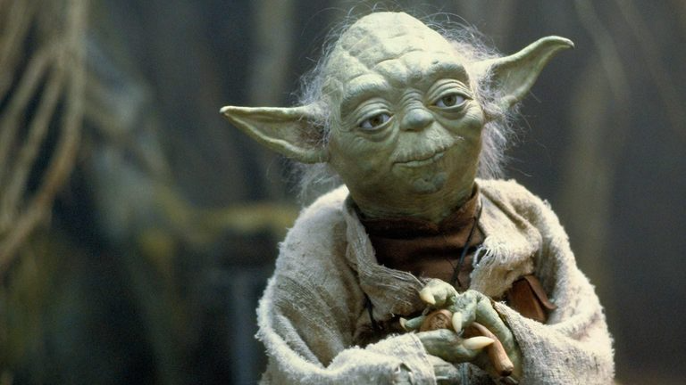
</div>

</br>

# La yod(a) [ˈdʒo.ða]

---

# La yod

<div style="float:right">
  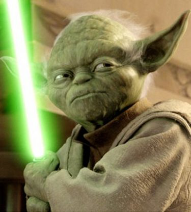
</div>

- /ʝ/: fricativa, palatal, sonora

<!-- <div align="center">
  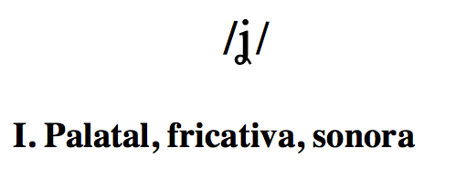
</div> -->

<!-- \includegraphics[scale=.4]{yod1.png} -->

---

# La yod

<div style="float:right">
  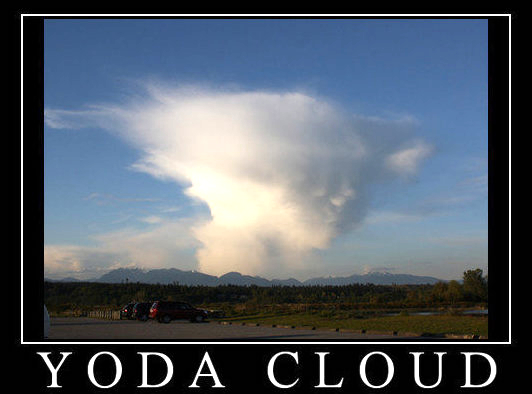
</div>

### Es un fonema, hay pares mínimos

</br></br></br></br></br></br>

| Principio de palabra |                           |     | Interior de palabra |                           |
| :------------------- | :------------------------ | :-- | :------------------ | :------------------------ |
| **ll**oro/**l**oro   | /ˈ**ʝ**o.ro/ /ˈ**l**o.ɾo/ |     | be**ll**a/be**s**a  | /ˈbe.**ʝ**a/ /ˈbe.**s**a/ |

<!-- <div align="center">
  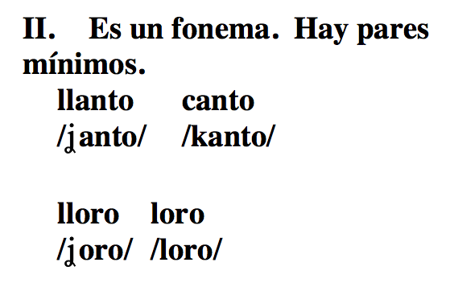
</div> -->

<!-- \includegraphics[scale=.4]{yod2.png} -->

---

# La yod

### Tiene dos alófonos

<div align="center">
  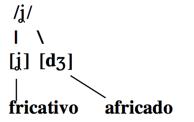
</div>

<!-- \includegraphics[scale=.4]{yod3.png} -->

---

# La yod

### Distribución de alófonos

- Africado después de nasal o pausa
- Fricativo en el resto de los contextos

</br>

<div align="center">
  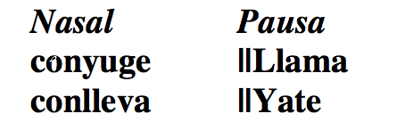
</div>

<!-- \includegraphics[scale=.4]{yod4.png} -->

---

# La yod

### Distribución de alófonos

- Africado después de nasal o pausa
- Fricativo en el resto de los contextos

</br>

<div align="center">
  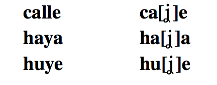
</div>

- Las mismas reglas se aplican entre palabras
  - el yogur: [el.ʝo.ˈɣuɾ]
  - un yogur: [un.dʒo.ˈɣuɾ]

<!-- \includegraphics[scale=.4]{yod5.png} -->

---

# La yod

### Ortografía

| Fonema | Grafemas |   Ejemplos   |
| :----- | :------- | :----------- |
| /ʝ/    | 'll'     | '**ll**anto' |
|        | 'y'      | '**y**o'     |
|        | 'hi-'    | '**hi**erba' |

<!-- <div align="center">
  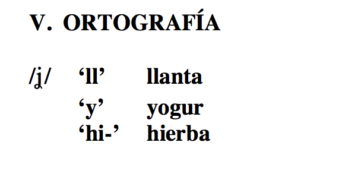
</div> -->

<!-- \includegraphics[scale=.4]{yod6.png} -->

---

# La yod

### Pronunciación

- [ʝ]
  - Más fuerte que 'y' en inglés en
      - '**y**ellow'
- [dʒ]
  - Parecido a la pronunciación de 'j' y 'dg' en inglés en 
      - '**j**ungle'
      - 'ju**dg**e'

<!-- <div align="center">
  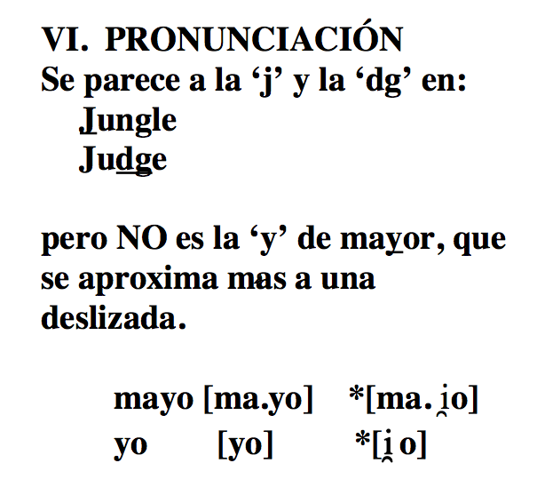
</div>
 -->
<!-- \includegraphics[scale=.4]{yod7.png} -->

---

# La yod

<iframe width="1000" height="500" src="https://soundsofspeech.uiowa.edu/spanish" frameborder="0" allowfullscreen></iframe>

---
exclude: false
class: title-slide-section-grey, middle

# Práctica

---
exclude: false
# Práctica

- Voy a ir a la tienda hindú del barrio italiano a comprar unos zapatos.
- A Juana la eligieron reina del concurso de belleza internacional.
- Juan Andrés es dueño de una huerta grande en la ciudad de Medellín.

---
exclude: false
# Práctica

- Voyairalatiendahindúdelbarrioitalianoacomprarunoszapatos.
- AJuanalaeligieronreinadelconcursodebellezainternacional.
- JuanAndrésesdueñodeunahuertagrandeenlaciudaddeMedellín.

---
exclude: false
# Práctica

- /**b**oi.a.ˈi.ɾa.la.ˈtieN.**d**aiN.ˈ**d**u.**d**el.ˈ**b**a.rioi.ta.ˈlia.no.a.koN.ˈpɾa.ɾu.nos.θa.ˈpa.tos/
- /a.ˈxua.na.la.e.li.ˈxie.ɾoN.ˈrei.na.**d**el.koN.ˈkuɾ.so.**d**e.**b**e.ˈʝe.θaiN.teɾ.na.θio.ˈnal/
- /ˈxua.naN.ˈ**d**ɾe.ˈses.ˈ**d**ue.ɲo.**d**eu.na.ˈweɾ.ta.**g**raN.**d**eːN.la.θiu.ˈ**d**a.**d**e.me.**d**e.ˈʝiN/

---
exclude: false
# Práctica

- /**b**oi.a.ˈi.ɾa.la.ˈtieN.**d**aiN.ˈ**d**u.**d**el.ˈ**b**a.rioi.ta.ˈlia.no.a.koN.ˈpɾa.ɾu.nos.θa.ˈpa.tos/  
  [**b**oi̯.a.ˈi.ɾa.la.ˈti̯en̪.**d**ai̯n̪.ˈ**d**u.**ð**el.ˈ**β**a.ri̯oi̯.ta.ˈli̯a.no.a.kom.ˈpɾa.ɾu.nos.θa.ˈpa.tos]
- /a.ˈxua.na.la.e.li.ˈxie.ɾoN.ˈrei.na.**d**el.koN.ˈkuɾ.so.**d**e.**b**e.ˈʝe.θaiN.teɾ.na.θio.ˈnal/  
  [a.ˈxu̯a.na.la.e.li.ˈxi̯e.ɾon.ˈrei̯.na.**ð**el.koŋ.ˈkuɾ.so.**ð**e.**β**e.ˈʝe.θai̯n̪.ter.na.θi̯o.ˈnal]
- /ˈxua.naN.ˈ**d**ɾe.ˈses.ˈ**d**ue.ɲo.**d**eu.na.ˈweɾ.ta.**g**raN.**d**eːN.la.θiu.ˈ**d**a.**d**e.me.**d**e.ˈʝiN/  
  [ˈxu̯a.nan̪.ˈ**d**re.ˈsez.ˈ**ð**u̯e.ɲo.**ð**eu̯.na.ˈweɾ.ta.**ɣ**ɾan̪.**d**eːn.la.θi̯u.ˈ**ð**a.**ð**e.me.**ð**e.ˈʝin]

---
exclude: false
# La percepción del habla es automática

<iframe width="560" height="315" src="https://www.youtube.com/embed/G-lN8vWm3m0" frameborder="0" allowfullscreen></iframe>

---
class: title-slide-final, left

# References

- Barrutia, Richard & Armin Schwegler (eds.) 1994. Fonética y fonología españolas: teoría y práctica.  New York: Wiley. [2nd edition] 

- Teschner, Richard V. 1996. Camino oral: fonética, fonología y práctica de los sonidos del español.  New York: McGraw-Hill. [Libro de texto y cassettes]. 

- Hualde, J.I. (2013). *Los sonidos del español*. Cambridge University Press.


