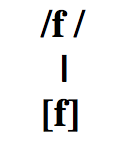

```{r setup, include=FALSE}
options(htmltools.dir.version = FALSE)
```

```{r xaringan-extra-all-the-things, echo=FALSE}
xaringanExtra::use_xaringan_extra(
  c("tile_view", "panelset", "editable", 
    "webcam", "animate", "tachyons")
)
```

exclude: true
class: title-slide-section-grey, middle

# Repaso

---
exclude: true
background-image: url(https://raw.githubusercontent.com/jvcasillas/media/master/teaching/gifs/partner.gif)
background-position: 95% 50%

# En grupos...

### ¿Qué sabéis de las siguientes clases de sonidos?

- Las **oclusivas** sordas
- Las **obstruyentes** sonoras

### Comentad... 

- los fonemas/alófonos relevantes
- los procesos fonológicos relevantes
- las diferencias entre el inglés y el español
- los retos que presentan para el no nativo

### El efecto 'McGurk'

- ¿Qué es?
- ¿Qué nos enseña acerca de la percepción del habla?

---
exclude: true
# El efecto 'McGurk'

<iframe width="560" height="315" src="https://www.youtube.com/embed/FefFfvriAwQ" frameborder="0" allowfullscreen></iframe>

---
exclude: true
# El efecto 'McGurk'

<iframe width="560" height="315" src="https://www.youtube.com/embed/PWGeUztTkRA" frameborder="0" allowfullscreen></iframe>

---
exclude: true
class: title-slide-section-grey, middle

# Práctica 

---
exclude: true
# A transcribir

1. No me digas ahora eso porque no lo entiendo
1. Los dos hermanos salieron a pasear al parque
1. Cuando Inés vino a cenar, le regalé dos flores
1. La pared azul antes era blanca
1. **No te pongas esos pantalones porque están húmedos**
1. **Justino, Antonio y Juan no son mis novios**
1. No voy al concierto contigo
1. Los triptongos me asustan mucho de vez en cuando
1. No contestes el teléfono si es para mí
1. Al final sí encontré lo que me dijiste
1. La cámara de gas no fue un buen invento de la humanidad

---
exclude: true
# A transcribir

1. Nomedigasahoraesoporquenoloentiendo
1. Losdoshermanossalieronapasearalparque
1. CuandoInésvinoacenar leregalédosflores
1. Laparedazulanteserablanca
1. Notepongasesospantalonesporqueestánhúmedos
1. Justino, AntonioyJuannosonmisnovios
1. Novoyalconciertocontigo
1. Lostriptongosmeasustanmuchodevezencuando
1. Nocontesteselteléfonosiesparamí
1. Alfinalsíencontréloquemedijiste
1. Lacámaradegasnofueunbueninventodelahumanidad

---
exclude: true
# Transcripción

1. /no.me.ˈdi.ga.sa.ˈo.ɾa.e.so.poɾ.ke.no.lo.en.ˈtien.do/  
   [no.me.ˈ**ð**i.**ɣ**a.sa.ˈo.ɾa.e.so.poɾ.ke.no.lo.en̪.ˈti̯en̪.**d**o]
2. /los.do.seɾ.ˈma.no.sa.lie.ˈɾo.na.pa.se.ˈa.ɾal.ˈpaɾ.ke/  
   [loz.**ð**o.seɾ.ˈma.no.sa.li̯e.ˈɾo.na.pa.se.ˈa.ɾal.ˈpaɾ.ke]
3. /kuan.doi.ˈnes.ˈbi.no.a.θe.ˈnaɾ.le.re.ga.ˈle.dos.ˈflo.ɾes/  
   [ku̯an̪.**d**oi̯.ˈnez.ˈ**β**i.no.a.θe.ˈnaɾ.le.re.**ɣ**a.ˈle.**ð**os.ˈflo.ɾes]
4. /la.pa.ˈɾe.da.ˈθu.lan.te.ˈse.ɾa.ˈblan.ka/  
   [la.pa.ˈɾe.**ð**a.ˈθu.lan̪.te.ˈse.ɾa.ˈ**β**laŋ.ka]
5. /no.te.ˈpon.ga.se.sos.pan.ta.ˈlo.nes.poɾ.ke:s.ˈta.ˈnu.me.dos/  
   [no.te.ˈpoŋ.**g**a.se.sos.pan̪.ta.ˈlo.nes.poɾ.ke:s.ˈta.ˈnu.me.**ð**os]
6. /xus.ˈti.no‖an.ˈto.nioi.ˈxu̯a.no.son.mis.ˈno.bios/  
   [xus.ˈti.no‖an̪.ˈto.ni̯oi̯.ˈxu̯a.no.som.mis.ˈno.**β**i̯os]

---

class: title-slide-section-grey, middle

# Las fricativas /f, x/

---
background-color: black
class: middle

<div style="float:right">
  
</div>

# /f/

---

# El fonema /f/

<div style="float:right">
  
</div>

- /f/: fricativa, labiodental, sorda

---

# El fonema /f/

### Es un fonema, hay pares mínimos

</br>

|  Principio de palabra |                                 |     |  Interior de palabra  |                                   |
| :-------------------- | :------------------------------ | :-- | :-------------------- | :-------------------------------- |
| **f**uente/**p**uente | /ˈ**f**uen.te/ /ˈ**p**uen.te/ |     | a**f**eite/a**c**eite | /a.ˈ**f**ei.te/ /a.ˈ**θ**ei.te/ |

<!-- <div align="center">
  
</div> -->

---

# El fonema /f/

### Sólo tiene 1 alófono

<div align="center">
  
</div>

---

# El fonema /f/

### Ortografía

- Correspondencia exclusiva
    - 'f' = /f/ siempre

### Pronunciación

- Igual que en inglés
- No presenta ningún problema para el no nativo

---
background-color: black
class: middle

<div style="float:right">
  
</div>

# /x/

---

# El fonema /x/

<div style="float:right">
  
</div>

- /x/: fricativa, velar, sorda

---

# El fonema /x/

### Es un fonema, hay pares mínimos

</br>

|  Principio de palabra |                           |     |  Interior de palabra  |                             |
| :-------------------- | :------------------------ | :-- | :-------------------- | :-------------------------- |
| **j**uez/**n**uez     | /ˈ**x**ueθ/ /ˈ**n**ueθ/ |     | ba**j**ar/ba**ñ**ar   | /ba.ˈ**x**aɾ/ /ba.ˈ**ɲ**aɾ/ |

---

# El fonema /x/

### Sólo tiene 1 alófono

<div align="center">
  
</div>

### Sin embargo, hay variación dialectal

- Se pronuncia con variados grados de fricción
  - Muy débil en latinoamérica: [h] como en 'hat'
  - Más fuerte en la península: [x<sup>h</sup>] o [χ] 

---

# El fonema /x/

<iframe width="1000" height="500" src="https://soundsofspeech.uiowa.edu/spanish" frameborder="0" allowfullscreen></iframe>

---

# El fonema /x/

### Problemas para el no nativo

- Casi ninguno
- La pronunciación [h] es común en muchas variedades del español
- Hay más problemas ortográficos

---

# El fonema /x/

### Ortografía

### Ante 'a', 'o', 'u' = 'j'

- pijama
- jota
- jugo

### Ante 'e', 'i' = 'j' o 'g'

- jefe - general
- jinete - gitano

---
exclude: true
class: title-slide-section-grey, middle

# Práctica

---
exclude: true
# A transcribir

1. No me digas ahora eso porque no lo entiendo
1. Los dos hermanos salieron a pasear al parque
1. Cuando Inés vino a cenar, le regalé dos flores
1. La pared azul antes era blanca
1. No te pongas esos pantalones porque están húmedos
1. Justino, Antonio y Juan no son mis novios
1. **No voy al concierto contigo**
1. **Los triptongos me asustan mucho de vez en cuando**
1. No contestes el teléfono si es para mí
1. Al final sí encontré lo que me dijiste
1. La cámara de gas no fue un buen invento de la humanidad

---
exclude: true
1. /no.me.ˈdi.ga.sa.ˈo.ɾa.e.so.poɾ.ke.no.lo.en.ˈtien.do/  
   [no.me.ˈ**ð**i.**ɣ**a.sa.ˈo.ɾa.e.so.poɾ.ke.no.lo.en̪.ˈti̯en̪.**d**o]
2. /los.do.seɾ.ˈma.no.sa.lie.ˈɾo.na.pa.se.ˈa.ɾal.ˈpaɾ.ke/  
   [loz.**ð**o.seɾ.ˈma.no.sa.li̯e.ˈɾo.na.pa.se.ˈa.ɾal.ˈpaɾ.ke]
3. /kuan.doi.ˈnes.ˈbi.no.a.θe.ˈnaɾ.le.re.ga.ˈle.dos.ˈflo.ɾes/  
   [ku̯an̪.**d**oi̯.ˈnez.ˈ**β**i.no.a.θe.ˈnaɾ.le.re.**ɣ**a.ˈle.**ð**os.ˈflo.ɾes]
4. /la.pa.ˈɾe.da.ˈθu.lan.te.ˈse.ɾa.ˈblan.ka/  
   [la.pa.ˈɾe.**ð**a.ˈθu.lan̪.te.ˈse.ɾa.ˈ**β**laŋ.ka]
5. /no.te.ˈpon.ga.se.sos.pan.ta.ˈlo.nes.poɾ.ke:s.ˈta.ˈnu.me.dos/  
   [no.te.ˈpoŋ.**g**a.se.sos.pan̪.ta.ˈlo.nes.poɾ.ke:s.ˈta.ˈnu.me.**ð**os]
6. /xus.ˈti.no.an.ˈto.nioi.ˈxua.no.son.mis.ˈno.bios/  
   [xus.ˈti.no‖an̪.ˈto.ni̯oi̯.ˈxu̯a.no.som.mis.ˈno.**β**i̯os]
7. /no.boi.al.kon.ˈθieɾ.to.kon.ˈti.go/  
   [no.**β**oi̯.al.kon̟.ˈθi̯eɾ.to.kon̪.ˈti.**ɣ**o]
8. /los.tɾip.ˈton.gos.me.a.ˈsus.tan.ˈmu.ʧo.de.be.θen.kuan.do/  
   [los.tɾip.ˈtoŋ.**g**oz.me.a.ˈsus.tam.ˈmu.ʧo.**ð**e.**β**e.θeŋ.ku̯an.**d**o]

---


exclude: true
class: title-slide-section-grey, middle

# Repaso

---
exclude: true
background-image: url(https://raw.githubusercontent.com/jvcasillas/media/master/teaching/gifs/partner.gif)
background-position: 95% 50%

# En grupos...

.pull-left[

Explícale a tu compañer@ los problemas a los que se enfrentan los angloparlantes con respecto a...

- las oclusivas sonoras del español (producción y percepción)
- la fricativa labiodental sorda
- la fricativa velar sorda (ortografía)

¿Cómo transcribirías esta frase para una variedad latinoaméricana? ¿y para una variedad peninsular?

- Tu hija quiere comprar zapatos nuevos.

]

---
exclude: true
background-image: url(https://raw.githubusercontent.com/jvcasillas/media/master/teaching/gifs/partner.gif)
background-position: 95% 50%

# En grupos...

.pull-left[

Explícale a tu compañer@ los problemas a los que se enfrentan los angloparlantes con respecto a...

- las oclusivas sonoras del español (producción y percepción)
- la fricativa labiodental sorda
- la fricativa velar sorda (ortografía)

¿Cómo transcribirías esta frase para una variedad latinoaméricana? ¿y para una variedad peninsular?

- Tu hija quiere comprar zapatos nuevos.  
**/tui.ha.ˈkie.ɾe.kom.ˈpɾaɾ.sa.ˈpa.tos.ˈnue.bos/**  
**[tu̯i.ha.ˈki̯e.ɾe.kom.ˈpɾaɾ.sa.ˈpa.toz.ˈnu̯e.βos]**  
.blue[/tui.χa.ˈki̯e.ɾe.kom.ˈpɾaɾ.θa.ˈpa.tos.ˈnue.bos/**]  
.blue[[tu̯i.χa.ˈki̯e.ɾe.kom.ˈpɾaɾ.θa.ˈpa.toz.ˈnu̯e.βos]**]

]

---
background-color: black
class: middle

<div style="float:right">
  
</div>

# /s/

---

# El fonema /s/ 

<div style="float:right">
  
</div>

### Descripción articulatoria

- /s/: fricativa, alveolar<sup>*</sup>, sorda

</br></br></br></br></br></br>

### \* el punto de articulación es **apico-alveolar** en el español peninsular estándar

---

# El fonema /s/

<iframe width="1000" height="500" src="https://soundsofspeech.uiowa.edu/spanish" frameborder="0" allowfullscreen></iframe>

---

# El fonema /s/ 

### Es un fonema, hay pares mínimos

</br>

|  Principio de palabra |                         |     |  Interior de palabra  |                           |
| :-------------------- | :---------------------- | :-- | :-------------------- | :------------------------ |
| **s**oy/**v**oy       | /ˈ**s**oi/ /ˈ**b**oi/ |     | pe**s**o/pe**l**o     | /ˈpe.**s**o/ /ˈpe.**l**o/ |

---

# El fonema /s/

### Tiene 2 alófonos

<div align="center">
  
</div>

- [s]: fricativa, alveolar<sup>\*</sup>, **sorda**
- [z]: fricativa, alveolar<sup>\*</sup>, **sonora**

---

# La sonorización

- El proceso por el cual una consonante sorda pasa a ser sonora 
- Se trata de un tipo de **asimilación** (asimilación regresiva) 
- Es decir, la consonante en cuestión asimila el rasgo [+sonoro] de la consonante que le sigue

---

# La regla

<div align="center">
  
</div>

---
background-image: url(./assets/img/huh2.jpg)
background-position: 95% 50%
background-size: 350px

# El fonema /s/

### Problemas para el no nativo

- En cuanto a la producción de [s] y [z], ninguno

### Se trata de problemas de... 

- distribución
- interferencia

### En inglés...

- 'z' = [z], pero sólo a veces en español 
- 's' = [z] entre vocales y después de una consonante sonora
    - 'housing'
    - 'abs'

---
background-image: url(./assets/img/happy2.jpg)
background-position: 95% 50%
background-size: 350px

# El fonema /s/

### Ortografía

- El grafema 'z' se pronuncia [s], [θ] o [z] en función de la variedad
- pero **SÓLO** como [z] si aparece antes de una consonante sonora

### Ejemplos

- desde --> /ˈdes.de/ → [ˈdez.ðe]
- rasgo --> /ˈras.go/ → [ˈraz.ɣo]

---

# Ejemplos

- estás negro
- es noble 
- es nuestro 

---

# Ejemplos

- estás negro → /es.ˈtas.ˈne.gɾo/ → [es.ˈtaz.ˈne.ɣɾo]
- es noble → /ˈes.ˈno.ble/ → [ˈez.ˈno.βle]
- es nuestro → /ˈes.ˈnues.tɾo/ → [ˈez.ˈnu̯es.tɾo]

---

# Ejemplos

### Entre vocales sólo hay sordas

.pull-left[

|       Bien       |       Mal        |
| :--------------- | :--------------- |
| vi[**s**]ita     | <sup>\*</sup>vi[z]ita     |
| mi[**s**] amigos | <sup>\*</sup>mi[z] amigos |

]

.pull-right[

<div>
  
</div>

]

---
exclude: true
# Fito y fitipaldis "Soldadito marinero"

.Large[

Él camina **d**e.blue[s]pacito que la.blue[s] pri.blue[s]a.blue[s] no .blue[s]on 
**b**uena.blue[s],  
en .blue[s]u **b**razo **d**o**b**la**d**ita con cui**d**a**d**o la chaqueta.  
Lue**g**o pa.blue[s]a por la calle **d**on**d**e lo.blue[s] cha**v**ale.blue[s] 
jue**g**an,  
él tam**b**ién qui.blue[s]o .blue[s]er niño pero le pilló la **g**uerra.  

.blue[S]ol**d**a**d**ito marinero conoci.blue[s]te a una .blue[s]irena  
**d**e e.blue[s]a.blue[s] que **d**icen te quiero .blue[s]i **v**en la cartera 
llena.  
E.blue[s]co**g**i.blue[s]te a la ma.blue[s] **g**uapa y a la meno.blue[s] 
**b**uena,  
.blue[s]in .blue[s]a**b**er como ha **v**eni**d**o te ha co**g**i**d**o la 
tormenta  

]

---
exclude: true
# Fito y fitipaldis "Soldadito marinero"

.Large[

Él camina **ð**e.blue[s]pacito que la.blue[s] pri.blue[s]a.blue[z] no .blue[s]on 
**b**uena.blue[s],  
en .blue[s]u **β**razo **ð**o**β**la**ð**ita con cui**ð**a**ð**o la chaqueta.  
Lue**ɣ**o pa.blue[s]a por la calle **ð**on**d**e lo.blue[s] cha**β**ale.blue[s] 
jue**ɣ**an,  
él tam**b**ién qui.blue[s]o .blue[s]er niño pero le pilló la **ɣ**uerra.  

.blue[S]ol**d**a**ð**ito marinero conoci.blue[s]te a una .blue[s]irena  
**d**e e.blue[s]a.blue[s] que **ð**icen te quiero .blue[s]i **β**en la cartera 
llena.  
E.blue[s]co**x**i.blue[s]te a la ma.blue[z] **ɣ**uapa y a la meno.blue[z] 
**β**uena,  
.blue[s]in .blue[s]a**β**er como ha **β**eni**ð**o te ha co**x**i**ð**o la 
tormenta  

]

---
exclude: true
# Fito y fitipaldis "Soldadito marinero"

.Large[

Él quería cruzar lo.blue[s] mare.blue[s] y ol**v**i**d**ar a .blue[s]u 
.blue[s]irena,  
la **v**er**d**a**d** no fue **d**ificil cuan**d**o conoció a Mariela,  
que tenia lo.blue[s] ojo.blue[s] **v**er**d**e.blue[s] y el ne**g**ocio entre 
la.blue[s] pierna.blue[s].  
¡Hay que **v**er que puntería no te arrima.blue[s] a una **b**uena!  

.blue[S]ol**d**a**d**ito marinero conoci.blue[s]te a una .blue[s]irena  
**d**e e.blue[s]a.blue[s] que **d**icen te quiero .blue[s]i **v**en la cartera 
llena  
E.blue[s]co**g**i.blue[s]te a la ma.blue[s] **g**uapa y a la meno.blue[s] 
**b**uena,  
.blue[s]in .blue[s]a**b**er como ha **v**eni**d**o te ha co**g**i**d**o la 
tormenta.  

**D**e.blue[s]pué.blue[s] **d**e un in**v**ierno malo, una mala prima**v**era,  
**d**ime porqué e.blue[s]ta.blue[s] **b**u.blue[s]can**d**o una lá**g**rima en 
la arena.  

]

---
exclude: true
# Fito y fitipaldis "Soldadito marinero"

.Large[

Él quería cruzar lo.blue[z] mare.blue[s] y ol**β**i**ð**ar a .blue[s]u 
.blue[s]irena,  
la **β**er**ð**a**ð** no fue **ð**ificil cuan**d**o conoció a Mariela,  
que tenia lo.blue[s] ojo.blue[z] **β**er**ð**e.blue[s] y el ne**ɣ**ocio entre 
la.blue[s] pierna.blue[s].  
¡Hay que **β**er que puntería no te arrima.blue[s] a una **β**uena!  

.blue[S]ol**d**a**ð**ito marinero conoci.blue[s]te a una .blue[s]irena  
**d**e e.blue[s]a.blue[s] que **ð**icen te quiero .blue[s]i **β**en la cartera 
llena  
E.blue[s]co**x**i.blue[s]te a la ma.blue[z] **ɣ**uapa y a la meno.blue[z] 
**β**uena,  
.blue[s]in .blue[s]a**β**er como ha **β**eni**ð**o te ha co**x**i**ð**o la 
tormenta.  

**D**e.blue[s]pué.blue[z] **ð**e un in**b**ierno malo, una mala prima**β**era,  
**d**ime por qué e.blue[s]ta.blue[z] **β**uscan**d**o una lá**ɣ**rima en la 
arena.  

]

---
exclude: true
background-color: black
class: middle

# Ejercicios

## .white[Enemigo \#3 (continuación)]

---
exclude: true
background-color: black

<div>
  
</div>

## La asimilación (parte 2)

---
exclude: true
# A transcribir (tarea)

1. No me digas ahora eso porque no lo entiendo
1. Los dos hermanos salieron a pasear al parque
1. Cuando Inés vino a cenar, le regalé dos flores
1. La pared azul antes era blanca
1. No te pongas esos pantalones porque están húmedos
1. Justino, Antonio y Juan no son mis novios
1. No voy al concierto contigo
1. Los triptongos me asustan mucho de vez en cuando
1. **No contestes el teléfono si es para mí**
1. **Al final sí encontré lo que me dijiste**
1. **La cámara de gas no fue un buen invento de la humanidad**


---
class: title-slide-final, left

# References

- Barrutia, Richard & Armin Schwegler (eds.) 1994. Fonética y fonología españolas: teoría y práctica.  New York: Wiley. [2nd edition] 

- Teschner, Richard V. 1996. Camino oral: fonética, fonología y práctica de los sonidos del español.  New York: McGraw-Hill. [Libro de texto y cassettes]. 

- Hualde, J.I. (2013). *Los sonidos del español*. Cambridge University Press.
