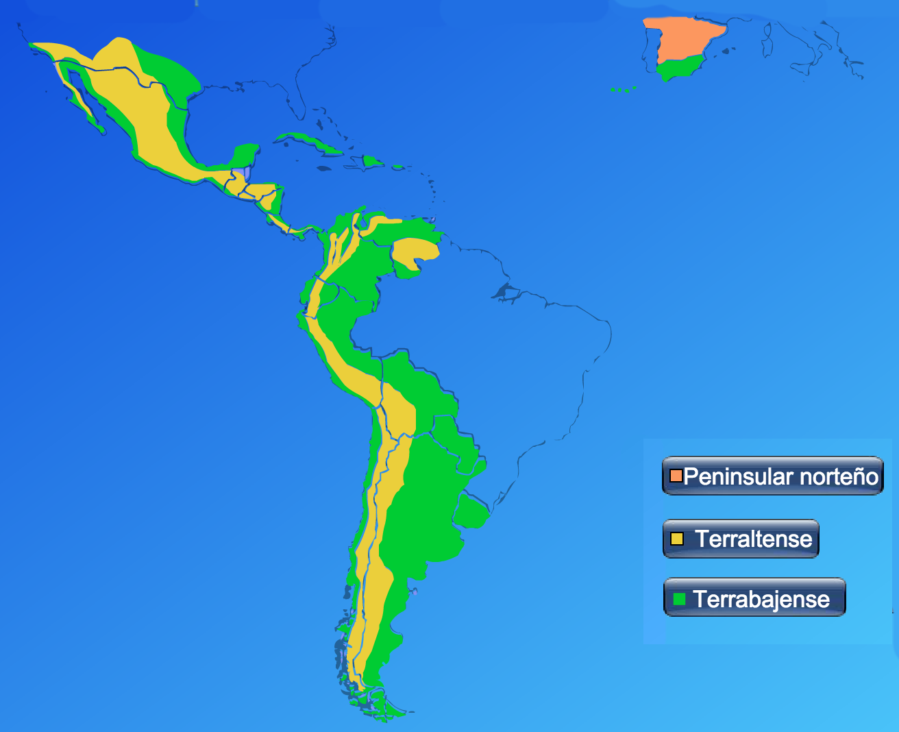
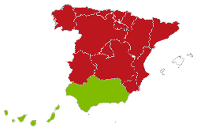
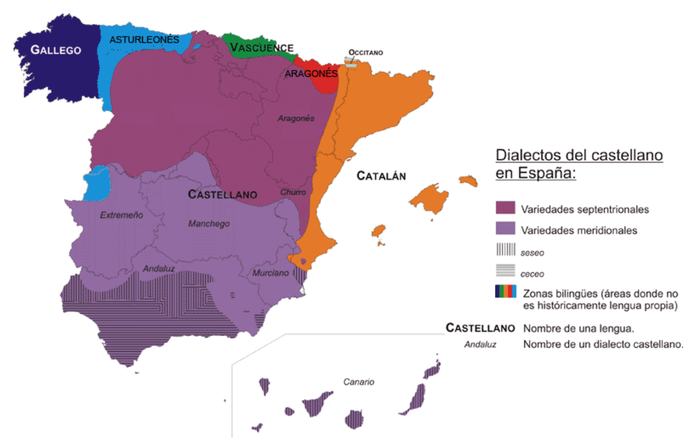
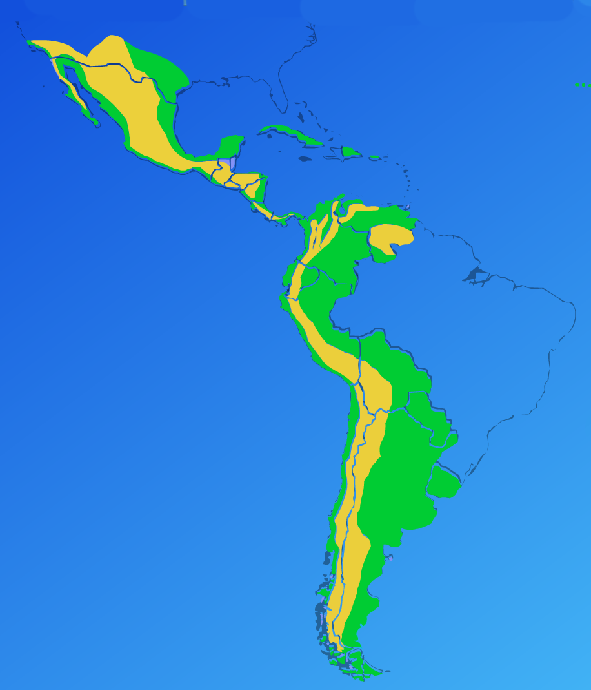

```{r setup, include=FALSE}
options(htmltools.dir.version = FALSE)
```

```{r xaringan-extra-all-the-things, echo=FALSE}
xaringanExtra::use_xaringan_extra(
  c("tile_view", "panelset", "editable", 
    "webcam", "animate", "tachyons")
)
```

class: title-slide-section-grey, middle

# Repaso

---

# Repaso

### Los procesos fonológicos

.Large[
- Cuéntale al vecino acerca de los tres procesos fonológicos que hemos visto en clase (i.e. cuáles son, cuándo ocurren, da ejemplos)
]

```{r, 'timer', echo=F}
countdown::countdown(minutes = 2, play_sound = T, top = 0)
```

--

<p></p>

.Large[
- Fricativización
- Sonorización
- Asimilación 
]

---
exclude: true
# Residuales

- Prueba 3

<p></p>

- Grabaciones 
  - mediante Praat, se entrega por dropbox
  - para el jueves (hoy) 

<p></p>

- Análisis de producción
  - ver handout
  - se entrega el día 9 (antes de las 12pm)
  - ¿preguntas?

<p></p>

- Prueba 4
  - 6 de mayo
  - último día de clase

---

# Repaso

### Las vibrantes

.Large[
- ¿Cuántos fonemas hay? ¿Cuántos alófonos hay? ¿De qué depende?
- ¿En posición no intervocálica? ¿Cuántos fonemas hay? ¿Cuántos alófonos hay?
- ¿Cuáles son las reglas para su distribución?
]

---

# Repaso - Las vibrantes

### En posición intervocálica

- 2 fonemas, 1 alófono cada uno
  - /r/ 'perro' /ˈpe.**r**o/
  - /ɾ/ 'pero' /ˈpe.<BLUE>ɾ</BLUE>o/

### Cualquier otro entorno

- 1 fonema: /r/
- 2 alófonos: [**r**] o [<BLUE>ɾ</BLUE>]
- Siempre es múltiple 
  - A principio de palabra: '**r**ico'
  - A principio de sílaba después de consonante: 'al**r**ededor', 'En**r**ique', 'Is**r**ael'
- Siempre el <BLUE>simple</BLUE> en un ataque complejo y en posición de coda es opcional
  - 't<BLUE>r</BLUE>ato', 'ha**r**to', 'calo**r**'

---

# Transcripciones

### Decidid si se trata de un vibrante <BLUE>simple</BLUE> o **múltiple**

.pull-left[
.Large[
- 'para'
- 'parra'
- 'Rita'
- 'En roma'
- 'parto'
- 'comer'
- 'al rato'
- 'trato'
]
]

--

.pull-right[
.Large[
- [ˈpa.<BLUE>ɾ</BLUE>a]
- [ˈpa.**r**a]
- [ˈ**r**i.ta]
- [en.ˈ**r**o.ma]
- [ˈa**r**.to] o [ˈa<BLUE>ɾ</BLUE>.to]
- [ko.me**r**] o [ko.me<BLUE>ɾ</BLUE>]
- [al.ˈ**r**a.to]
- [t<BLUE>ɾ</BLUE>a.to]
]
]

---

# Pregunta

.Large[
- ¿Por qué existen las diferencias dialectales? 
- ¿A qué se deben? 
- Identificad algunas de las variedades del español.
]

---


class: title-slide-section-grey, middle

# El español peninsular y americano

---
background-color: black

# Tres zonas importantes

---

# Tres zona importantes

.Large[
- La península ibérica
- Las tierras altas
- Las tierras bajas
]

---

<div align="center">
  
</div>

---

<iframe width="560" height="315" src="https://www.youtube.com/embed/VlK-neOypDM" frameborder="0" allowfullscreen></iframe>

---

# La península ibérica

<div style="float:right">
  
</div>

### Dos grandes zonas dialectales: 

.Large[
1. el centro y norte de España: el castellano peninsular 
2. el sur de España: el andaluz (volveremos a hablar de esto) 
]

### Características del castellano

.Large[
1. La uvularización de /x/
2. Distinción entre /θ/ y /s/
3. Distinción entre /ʎ/ y /ʝ/ 
4. la apicalización de /s/
5. la velarización de /s/
]

---

<div align="center">
  
</div>

---

# La uvularización de /x/

.Large[
- /x/ → [χ]
- 'jamón' /xa.ˈmon/ → [**x**a.ˈmon] vs. [<BLUE>χ</BLUE>a.ˈmon]
- 'Jose' /ˈxo.se/ → [ˈ**x**o.se] vs. [ˈ<BLUE>χ</BLUE>o.se] 
]

---

# La distinción entre /θ/ y /s/

.Large[
- Distinción: /θ/ ≠ /s/
- /s/ → 's'
- /θ/ → 'c' (delante de 'e'/ 'i'), 'z' 
]

</br>

.large[

| Fonema | Grafema | Palabra  | Transcripción fonémica | Transcripción fonética |
| :----- | :------ | :------- | :--------------------- | :--------------------- |
| /s/    | 's'     | 'sana'   | /ˈsa.na/               | [ˈsa.na]               |
| /θ/    | 'c'     | 'cera'   | /ˈθe.ɾa/               | [ˈθe.ɾa]               |
|        |         | 'cine'   | /ˈθi.ne/               | [ˈθi.ne]               |
| /θ/    | 'z'     | 'zapato' | /θa.ˈpa.to/            | [θa.ˈpa.to]            |

]

---

# Distinción entre /ʎ/ y /ʝ/

.Large[
- Distinción: /ʎ/ ≠ /ʝ/
- /ʎ/ → 'll'
- /ʝ/ → 'y'
]

</br>

.large[

| Fonema | Grafema |  Palabra   | Transcripción fonémica | Transcripción fonética |
| :----- | :------ | :--------- | :--------------------- | :--------------------- |
| /ʎ/    | 'll'    | 'se calló' | /se.ka.ˈʎo/            | [se.ka.ˈʎo]            |
| /ʝ/    | 'y'     | 'se cayó'  | /se.ka.ˈʝo/            | [se.ka.ˈʝo]            |

]

</br>

.Large[
- Esta distinción se mantiene en muy pocos sitios
]

---

# La apicalización de /s/

<div style="float:right">
<video controls>
  <source src="./assets/img/apicalizacion.ogg" type="video/ogg">
  <source src="./assets/img/apicalizacion.mov" type="video/mp4">
Your browser does not support the video tag.
</video>
</div>

.large[
- /s/ → Alveolar, **predorsal**
- /s̺/ → Alveolar, <BLUE>apical</BLUE>
]

### Ejemplos

.large[
- 'pasaje'  
[pa.ˈsa.xe] vs. [pa.ˈs̺a.xe]
- 'solo'  
[ˈso.lo] vs. [ˈs̺o.lo]
]

---

<iframe width="420" height="315" src="https://www.youtube.com/embed/gH3UaruldF8" frameborder="0" allowfullscreen></iframe>

---

# La velarización de /s/

.Large[
- /s/ → [χ] en posición de coda
- 'es que' [eχ.ke]
]

---

<iframe width="495" height="250" src="https://www.youtube.com/embed/tld871ixz1o" frameborder="0" allowfullscreen></iframe>

---


# Repasito

.Large[
- ¿Cuáles son las tres zonas importantes en la dialectología hispánica?

- ¿Qué significa *hacer distinción*? Dad ejemplos.

- Nombrad 2 diferencias dialectales con respecto a la /s/ castellana.
]

---

# Las tierras altas

<div style="float:right">
  
  
</div>

### La zona alteña comprende todas las tierras 'altas' del Nuevo Mundo, es decir, las que se encuentran a cierta altura sobre el nivel del mar:

.Large[
- casi todo México,
- Guatemala, 
- la altiplanicie de Colombia, 
- los altos occidentales de Venezuela,
- la gran mayoría del territorio de los países andinos (el Ecuador, el Perú, Bolivia y el norte montañoso de la Argentina). 
]

---

# Las tierras altas

<div style="float:right">
  
  
</div>

### Información básica

- El alteño representa el dialecto que trajeron los primeros colonizadores españoles
- La mayoría de ellos eran de Andalucía
- Comienza con el segundo viaje de Cristóbal Colón en 1493-1496.  

### Características generales

1. Consonantismo fuerte 
  - típicamente las consonantes en posición de coda no se pierden ni se alteran. 
2. Ausencia de distinción entre /ʝ/ y /ʎ/
3. El 'seseo'

---

# El seseo

### **Seseo**: neutralización de la distinción entre /θ/ y /s/:

.large[
- /s/ → 's', 'c' (delante de 'e'/ 'i'), 'z' 
]

</br>

.large[
| Fonema | Grafema | Palabra  | Transcripción fonémica | Transcripción fonética |
| :----- | :------ | :------- | :--------------------- | :--------------------- |
| /s/    | 's'     | 'sana'   | /ˈsa.na/               | [ˈsa.na]               |
|        | 'c'     | 'cera'   | /ˈse.ɾa/               | [ˈse.ɾa]               |
|        |         | 'cine'   | /ˈsi.ne/               | [ˈsi.ne]               |
|        | 'z'     | 'zapato' | /sa.ˈpa.to/            | [sa.ˈpa.to]            |
]

---


# Las tierras bajas

<div style="float:right">
  
  
</div>

### Información básica

.Large[
- El término 'tierras bajas' se refiere al nivel del mar

- Es el dialecto predominante en las zonas 'bajas' con respecto al nivel del mar en las Américas (y el sur de España) 

- Representa el andaluz que fue llevado por los colonizadores que llegaron más tarde a las Américas.

- Es un andaluz más evolucionado
]

---

# Las tierras bajas

<div style="float:right">
  
  
</div>

### Características generales

.large[
- el seseo

- el debilitamiento/pérdida de fricativas

- la glotización de /x/

- la aspiración/pérdida/geminación de /s/

- la velarización /n/

- la lateralizacion de /r/

- la fricativización velar de /r/

- el rehilamiento de /ʝ/
]

<!-- - la yodización, geminación, elisión -->

---

# El debilitamiento/pérdida de fricativas

.Large[
|             |                                |
| :---------- | :----------------------------: |
| 'escuchado' | [es.ku.ˈʧa.ðo] → [es.ku.ˈʧa.o] |
| 'es verdad' | [ez.βer.ˈðað]  → [ez.βer.ˈða]  |
| 'todo'      |      [to.ðo]       → [to]      |
]

---

# La /s/

.Large[
- La aspiración: proceso por el cual la /s/ se realiza como [h], típicamente en posición de coda
- La elisión: proceso por el cual un sonido (la /s/) se elide
- La geminación: proceso por el cual un sonido (/s/) se duplica entre sílabas 
]

### Ejemplos

.Large[
- Aspiración:  [ˈpu̯es.to] → [ˈpu̯eh.to] 
- Elisión:     [ˈpu̯eh.to] → [ˈpu̯e.to]  
- Geminación:  [ˈpu̯e.to] → [ˈpu̯et.to]  
]

<audio controls>
  <source src="./assets/img/puehto.ogg" type="audio/ogg">
  <source src="./assets/img/puehto.wav" type="audio/mpeg">
Your browser does not support the audio element.
</audio>

<audio controls>
  <source src="./assets/img/puetto.ogg" type="audio/ogg">
  <source src="./assets/img/puetto.wav" type="audio/mpeg">
Your browser does not support the audio element.
</audio>

---

# La velarización de /n/

.Large[
- /n/ → [ŋ]
- Ya sabemos que [ŋ] se da cuando /n/ se encuentra antes de una consonante velar.
  - ej. tengo [ˈteŋ.go]
- En algunas variedades /n/ se realiza como [ŋ] en posición de coda (final de sílaba)
]

</br>

.Large[
|  Palabra  |   Transcpción   |   Resultado    |
| :-------- | :-------------- | :------------- |
| en Bogotá | [em.bo.ɣo.ˈta]  | [eŋ.bo.ɣo.ˈta] |
| en Toledo | [en̪.to.ˈle.ðo] | [eŋ.to.ˈle.ðo] |
]

</br>

<audio controls>
  <source src="./assets/img/velarizacion.ogg" type="audio/ogg">
  <source src="./assets/img/velarizacion.wav" type="audio/mpeg">
Your browser does not support the audio element.
</audio>

---

# La lateralización de /r/

.Large[
- También conocida como “lambdaización”
- /r/ → [l]
- Ocurre en posicion de coda (final de sílaba)
]

### Ejemplos

.Large[
- Hace falta, mi amor 
- [ˈa.se.ˈfal.ta//mi̯a.moɾ] → [ˈa.se.ˈfal.ta//mi̯a.ˈmol]
]

</br>

<audio controls>
  <source src="./assets/img/lambdaizacion.ogg" type="audio/ogg">
  <source src="./assets/img/lambdaizacion.wav" type="audio/mpeg">
Your browser does not support the audio element.
</audio>

---

# La fricativización velar de /r/

.Large[

- /r/ → [x]

- Es uno de los ragos más destacados del español puertorriqueño ([ˈpu̯el̪.to.χi.ˈke.ɲo])

]

---

<iframe width="1600" height="500" src="http://dialects.its.uiowa.edu/main.html" frameborder="0" allowfullscreen></iframe>

.footnote[http://dialects.its.uiowa.edu/main.html]

---

<iframe width="420" height="315" src="https://www.youtube.com/embed/vgR9cOTRh7A" frameborder="0" allowfullscreen></iframe>

---

# El rehilamiento

.Large[
- [ʝ] fricativo palatal sonoro: la lluvia
- [dʒ] africado alveopalatal sonoro : las llaves
- [ʒ] fricativo alveopalatal sonoro : los caballos
- **[ʃ] fricativo alveopalatal sordo**: el llanto
]

</br>

<audio controls>
  <source src="./assets/img/refuerzoyod.ogg" type="audio/ogg">
  <source src="./assets/img/refuerzoyod.wav" type="audio/mpeg">
Your browser does not support the audio element.
</audio>

---

</br>

<div align="center">
<video controls>
  <source src="./assets/img/argentino.ogg" type="video/ogg">
  <source src="./assets/img/argentino.mov" type="video/mp4">
Your browser does not support the audio element.
</video>
</div>


---


# Repasito

### En grupos, discutid los siguientes fenómenos fonológicos (¿qué son? ¿dónde se dan? ejemplos...)

- el seseo

- el debilitamiento/pérdida de fricativas

- la glotización de /x/

- la aspiración/pérdida/geminación de /s/

- la velarización /n/

- la lateralizacion de /r/

- la fricativización velar de /r/

- el rehilamiento de /ʝ/

---
background-color: black

# El andaluz

---
background-image: url("./assets/img/andalucia.png")
background-size: 400px
background-position: 95% 50%

# El andaluz

.Large[

- el debilitamiento y pérdida de fricativas

- el seseo

- el ceceo

- la simplificación de grupos consonánticos

- el rotacismo de /l/

- la desafricación de /ʧ/

]

---

# El ceceo

.Large[

- Ceceo: solamente /θ/
- /θ/ →  's', 'c' (delante de 'e'/'i'), 'z'  
- Sólo ocurre en posición de ataque

]

</br>

.large[

| Fonema | Grafema | Palabra  | Transcripción fonémica | Transcripción fonética |
| :----- | :------ | :------- | :--------------------- | :--------------------- |
| /θ/    | 's'     | 'sana'   | /ˈθa.na/               | [ˈθa.na]               |
|        | 'c'     | 'cera'   | /ˈθe.ɾa/               | [ˈθe.ɾa]               |
|        |         | 'cine'   | /ˈθi.ne/               | [ˈθi.ne]               |
|        | 'z'     | 'zapato' | /θa.ˈpa.to/            | [θa.ˈpa.to]            |

]

---

</br>

<div align="center">
<video controls>
  <source src="./assets/img/ceceo.ogg" type="video/ogg">
  <source src="./assets/img/ceceo.mov" type="video/mp4">
Your browser does not support the audio element.
</video>
</div>

---

# Seseo, ceceo y distinción

### Para hablar del tema...

</br>

.Large[

|            |    /θ/ y /s/     | sólo /θ/ | sólo /s/ |
| :--------- | :--------------- | :------- | :------- |
| sustantivo | distinción       | ceceo    | seseo    |
| adjetivo   | distinguidor     | ceceante | seseante |
| verbo      | hacer distinción | cecear   | sesear   |

]

---

# Seseo, ceceo y distinción

### Ejemplos

</br>

.Large[

|           |    DISTINCIÓN   |      CECEO      |      SESEO      |
| :-------- | :-------------- | :-------------- | :-------------- |
| celoso    | [θe.ˈlo.so]     | [θe.ˈlo.θo]     | [se.ˈlo.so]     |
| sollozo   | [so.ˈʝo.θo]     | [θo.ˈʝo.θo]     | [so.ˈʝo.so]     |
| conocidos | [ko.no.ˈθi.ðos] | [ko.no.ˈθi.ðoh] | [ko.no.ˈsi.ðos] |
| cazado    | [ka.ˈθa.ðo]     | [ka.ˈθa.ðo]     | [ka.ˈsa.ðo]     |
| casado    | [ka.ˈsa.ðo]     | [ka.ˈθa.ðo]     | [ka.ˈsa.ðo]     |

]

---

# La simplificación de grupos consonánticos

.Large[

- El grupo consonántico se reduce para que la sílaba pueda aproximarse a la estructura silábica preferida.
- También ocurre en una secuencia de dos o más consonantes que se encuentran en diferentes sílabas

]

</br>

.Large[

|     Palabra      |     Transcripción      |     Resultado     |
| :--------------- | :--------------------- | :---------------- |
| co**ns**trucción | [ko**ns**.tɾuk.ˈsi̯on]  | [kos.tɾuk.ˈsi̯on]  |
| explicar         | [e**ks**.pli.ˈkaɾ]     | [es.pli.ˈkaɾ]     |
| gimnasio         | [xim.ˈna.si̯o]          | [xi.ˈna.si̯o]      |

]

---

# El rotacismo de /l/

<div style="float:right">
<video controls>
  <source src="./assets/img/farta.ogg" type="video/ogg">
  <source src="./assets/img/farta.mov" type="video/mp4">
Your browser does not support the video tag.
</video>
</div>

.Large[

- /l/ → [r]
- Ocurre en posicion de coda (final de sílaba)

]

### Ejemplos

.Large[

- Hace falta, mi amor 
- [ˈa.se.ˈfal.ta//mi̯a.ˈmor] → [ˈa.se.ˈfar.ta//mi̯a.ˈmor]

]

---

# La desafricación de /ʧ/

.Large[

- [ʧ]: africado, alveopalatal, sordo → [ʃ]

- [ʧ] sin la oclusión [t] = [ʃ]
  - 'muchacho' → /mu.ˈʧa.ʧo/  → [mu.ˈʃa.ʃo] 

]

---


class: title-slide-section-grey, middle

# La variación dialectal (resumen)

---

# La variación dialectal

### 3 zonas

.Large[
- La península
- La tierra alta
- La tierra baja
]

### Contexto fónico

.Large[
- En posición de coda (débil)
  - cv.cv
  - cv**c**.cv
- En posición de ataque (no débil)
]

---

# Variación en posición de coda (débil)

.Large[

- la simplificación de grupos consonánticos
- la /s/
  - la aspiración 
  - elisión 
  - geminación
  - velarización 
- la velarización de /n/
- la lateralización de /r/
- el rotacismo de /l/

]

---

# Variación en posición de ataque (no débil)

.Large[

- Debilitamiento y pérdida de fricativas
- Rehilamiento de /ʝ/
- Glotización de /x/
- Fricatización velar de /r/
- Desafricación de /ʧ/

]

---
background-image: url(https://raw.githubusercontent.com/jvcasillas/media/master/teaching/img/think.png)
background-size: 400px
background-position: 95% 50%

# Preguntas

.pull-left[
.large[

1. ¿Por qué existen las diferencias dialectales? ¿A qué se deben? Identifique 
algunas de las variedades del español.

2. ¿Por qué se estigmatizan algunos dialectos? ¿Crees que la estigmatización se 
da más con los geodialectos, sociolectos, etnolectos o con los idiolectos? 
¿Puedes dar algunos ejemplos? 

3. ¿Qué dialectos gozan de mayor prestigio? ¿Qué características hacen que un 
dialecto sea más o menos prestigioso?

]
]

---

<div align="center">
<video controls>
  <source src="../assets/videos/adel.ogg" type="video/ogg">
  <source src="../assets/videos/adel.mp4" type="video/mp4">
Your browser does not support the video tag.
</video>
</div>

---

# ¡Gracias!

<div align="center">
    
</div>

---
class: title-slide-section-grey, middle

# Práctica

---

# Transcribid

.Large[
- Un cubano canoso cuenta la caña con cuidado
- Concepción Núñez de Los Ángeles tiene un pato nombrado Chencho Núñez.
- Con que te vas inmediatamente a la cabaña para no tener que nadar. 
- El niño Angélico está enfermo. 
- Era un año antes de la independencia del país. 
- Un gringo me mandó un folleto. 
- Muchos de los meʝores estudiantes se esforzaron para poder hacerlo cuanto antes.  
]

---

# Transcribid

.Large[
- Uncubanocanosocuentalacañaconcuidado
- ConcepciónNúñezdeLosÁngelestieneunpatonombradoChenchoNúñez.
- Conquetevasinmediatamentealacabañaparanotenerquenadar. 
- ElniñoAngélicoestáenfermo. 
- Eraunañoantesdelaindependenciadelpaís. 
- Ungringomemandóunfolleto. 
- Muchosdelosmeʝoresestudiantesseesforzaronparapoderhacerlocuantoantes
]

---

# Transcribid

- /ˈuN.ku.ˈba.no.ka.ˈno.so.ˈkueN.ta.la.ˈka.ɲa.koN.Kui.ˈda.do/
- /koN.sep.ˈsio.ˈnu.ɲes.de.lo.ˈsaN.xe.les.ˈtie.ˈneuN.ˈpa.to.noN.ˈbɾa.do.ˈʧeN.ʧo.ˈnu.ɲes/
- /koN.ke.te.ˈba.siN.me.dia.ta.ˈmeN.te.a.la.ka.ˈba.ɲa.pa.ɾa.no.te.ˈneɾ.ke.na.ˈdaɾ/
- /el.ˈni.ɲo.aN.ˈxe.li.ko.es.ˈta.eN.ˈfeɾ.mo/
- /ˈe.ɾau.ˈna.ɲo.ˈaN.tes.de.laiN.de.peN.ˈdeN.sia.del.pa.ˈis/
- /uN.ˈgɾiN.go.me.maN.ˈdouN.fo.ˈʝe.to/
- /ˈmu.ʧos.de.los.me.ˈxo.ɾe.ses.tu.ˈdiaN.te.se:s.foɾ.ˈθa.ɾoN.pa.ɾa.po.ˈde.ɾa.ˈθeɾ.lo.kuan.to.an.tes/

---

# Transcribid

- /uN.ku.ˈba.no.ka.ˈno.so.ˈkueN.ta.la.ˈka.ɲa.koN.kui.ˈda.do/  
  [uŋ.ku.ˈβa.no.ka.ˈno.so.ˈku̯en̪.ta.la.ˈka.ɲa.koŋ.ku̯i.ˈða.ðo]
- /koN.sep.ˈsio.ˈnu.ɲes.de.lo.ˈsaN.xe.les.ˈtie.ˈneuN.ˈpa.to.noN.ˈbɾa.do.ˈʧeN.ʧo.ˈnu.ɲes/  
  [kon.sep.ˈsi̯o.ˈnu.ɲez.ðe.lo.ˈsaŋ.xe.les.ˈti̯e.ˈneu̯m.ˈpa.to.nom.ˈbɾa.ðo.ˈʧeɳ.ʧo.ˈnu.ɲes]
- /koN.ke.te.ˈba.siN.me.dia.ta.ˈmeN.te.a.la.ka.ˈba.ɲa.pa.ɾa.no.te.ˈneɾ.ke.na.ˈdaɾ/  
  [koŋ.ke.te.ˈβa.sim.me.ði̯a.ta.ˈmen̪.te.a.la.ka.ˈβa.ɲa.pa.ɾa.no.te.ˈneɾ.ke.na.ˈðaɾ]
- /el.ˈni.ɲo.aN.ˈxe.li.ko.es.ˈta.eN.ˈfeɾ.mo/  
  [el.ˈni.ɲo.aŋ.ˈxe.li.ko.es.ˈta.eɱ.ˈfeɾ.mo]
- /ˈe.ɾau.ˈna.ɲo.ˈaN.tes.de.laiN.de.peN.ˈdeN.sia.del.pa.ˈis/  
  [ˈe.ɾaú̯.ˈna.ɲo.ˈan̪.tez.ðe.lai̯n̪.de.pen̪.ˈden.si̯a.ð el.pa.ˈis]
- /uN.ˈgɾiN.go.me.maN.ˈdouN.fo.ˈje.to/  
  [uŋ.ˈgɾiŋ.go.me.man̪.ˈdou̯ɱ.fo.ˈʝe.to]
- /ˈmu.ʧos.de.los.me.ˈxo.ɾe.ses.tu.ˈdiaN.te.se:s.foɾ.ˈθa.ɾoN.pa.ɾa.po.ˈde.ɾa.ˈθeɾ.lo.kuan.to.an.tes/  
  [ˈmu.ʧoz.ðe.loz.me.ˈxo.ɾe.ses.tu.ˈði̯an̪.te.se:s.foɾ.ˈθa.ɾom.pa.ɾa.po.ˈðe.ɾa.ˈθeɾ.lo.ku̯an̪.to.an̪.tes]  
  
---
background-image: url(https://raw.githubusercontent.com/jvcasillas/media/master/teaching/img/think.png)
background-size: 400px
background-position: 95% 50%

# A pensar... 

.pull-left[

- Teniendo en cuenta lo que has leído este semestre y tu experiencia personal, ¿es importante/necesario trabajar la pronunciación? Justifica tu respuesta. 

- En cuanto a las sugerencias pedagógicas que hemos visto para posibles ejercicios de pronunciación ¿cuáles son los puntos fuertes? ¿Cuáles son los puntos débiles? ¿Qué cosas podrás usar en tus clases?

- Comenta si (o cómo) piensas incorporar ejercicios de pronunciación en tus clases. ¿Cómo vas a evaluar su eficacia? ¿Cómo vas a evaluar al alumno?

]


