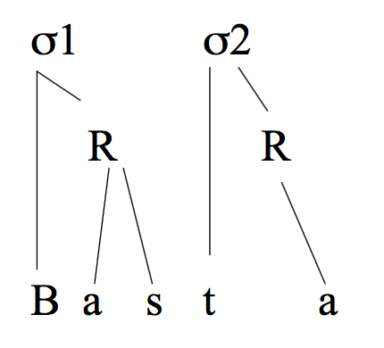
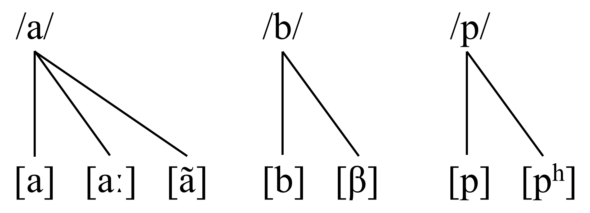

```{r setup, include=FALSE, cache=FALSE}
options(htmltools.dir.version = FALSE)
```

```{r xaringan-extra-all-the-things, echo=FALSE}
xaringanExtra::use_xaringan_extra(
  c("tile_view", "panelset", "editable", 
    "webcam", "animate", "tachyons")
)
```

class: inverse, center, middle

# La fonética/fonología

---

.pull-left[
## La fonética

La fonética se ocupa del estudio científico de los sonidos

- **fonética acústica**: características físicas de los sonidos

- **fonética articulatoria**: cómo se producen los sonidos

- **fonética auditiva**: estudia la percepción de los sonidos
]

.pull-right[
## La fonología

La fonología estudia cómo los sonidos se comportan en una lengua, cómo se usan para distinguir significados, su distribución en la lengua y sus relaciones (volveremos a considerar esta definición)
]

---

# La fonética

Elementos fisiológicos que participan en la producción de los sonidos:
**Aire espirado**

**Órganos articulatorios**:  
intervienen en la modificación de la corriente espiratoria

**Cavidad nasal u oral**: intervienen en la modificación de la corriente 
espiratoria

**Cuerdas vocales**: influyen en la sonoridad o sordez de un sonido

---

# Clases de sonidos y sus características principales:

.pull-left[

**Vocales**  

Salida ininterrumpida del aire

]

--

.pull-right[

**Consonantes**  

Órganos articulatorios obstaculizan la salida del aire

]

</br>

--

**Deslizadas**  

Características de las vocales:  

- Salida ininterrumpida del aire 
- Más breves que las vocales

--

Características de las consonantes:  

- No pueden constituir núcleo silábico

---
background-image: url(./libs/img/vocales1.png)
background-size: 400px
background-position: 95% 50%

# Vocales: Clasificación

Posición de la lengua

- Vertical
	- Altas: [i] p**i**so, [u] p**u**so
	- Baja: [a] c**a**m**a**
	- Medias: [e] p**e**na, [o] t**o**ma
- Horizontal
	- Anteriores: [i] p**i**so, [e] p**e**na
	- Posteriores: [u] p**u**so, [o] t**o**ma
	- Central: [a] c**a**m**a**

Posición/forma de los labios

- Redondeadas: [u], [o]
- No redondeadas: [a], [e], [i]

---
class: inverse, center, bottom
background-image: url(./libs/img/vocales2.png)
background-position: 50% 0%
background-size: contain

---
background-image: url(./libs/img/chart.png)
background-position: 95% 10%
background-size: 200px

# Consonantes: clasificación

## Punto de articulación

.pull-left[

| Clasificación |
| :-            |
|               |
| bilabial      |
| labiodental   |
| interdental   |
| dental        |
| alveolar      |
| alveopalatal  |
| palatal       |
| velar         |

]

.pull-right[

| Ejemplos        |
| :-              |
|                 |
| [p, b, m]       |
| [f]             |
| [θ]             |
| [t, d]          |
| [s, n, l, ɾ, r] |
| [tʃ]            |
| [ʝ, ʎ, ɲ]       |
| [k, g]          |

]

---
class: inverse, center, bottom
background-image: url(./libs/img/chart.png)
background-position: 50% 20%
background-size: contain


---

# Consonantes: clasificación

## Modo de articulación

.pull-left[

| Clasificación |
| :-            |
|               |
| oclusivos     |
| fricativos    |
| africados     |
| nasales       |
| laterales     |
| vibrantes     |

]

.pull-right[

| Sonidos            |
| :-                 |
|                    |
| [p, b, t, d, k, g] |
| [f, s, z, x, ʝ, w] |
| [tʃ, dʒ]           |
| [m, n, ñ]          |
| [l, ʎ]             |
| [ɾ, r]             |

]

---

# Consonantes: clasificación

## Sonoridad

Sonora: + vibración cuerdas vocales  
Sorda: - vibración cuerdas vocales

.pull-left[

| Sonoras |
| :-      |
|         |
| vocales |
| nasales | 
| laterales |
| vibrantes | 
| oclusivas: [b, d, g] |
| fricativas: [ʝ, w]    |

]

.pull-right[

| Sordas |
| :-     |
|        |
|  --    |
|  --    |
|  --    |
|  --    |
| [p, t, k] |
| [f, s, x, tʃ] |

]

---
class: inverse, center, middle

<iframe width="100%" height="515" src="https://www.youtube.com/embed/VbpvVPTe2TI" frameborder="0" allowfullscreen></iframe>

---
class: center, bottom
background-image: url(./libs/img/fonemas_edit.png)
background-size: contain

---
class: middle

<iframe width="100%" height="100%" src="//www.seeingspeech.ac.uk/ipa-charts/" frameborder="0" allowfullscreen></iframe>

.footnote[https://www.seeingspeech.ac.uk/ipa-charts/]

---

# Más terminología

**Obstruyentes**: oclusivos, fricativos, africados.

**Sonorantes**/**sonantes**: el resto

**Sibilantes**: [s]

---

<iframe width="100%" height="100%" src="https://jvcasillas.shinyapps.io/shiny_distinctiveFeatures/" frameborder="0" allowfullscreen></iframe>

.footnote[https://jvcasillas.shinyapps.io/shiny_distinctiveFeatures/]

---
class: inverse, center, middle

# La sílaba y el silabeo

---

# Estructura de sílaba

### Lo básico...

- El silabeo es cómo separamos las palabras por sílabas (silabificación)

- Cada sílaba *debe* tener un núcleo

- El núcleo puede ser o bien una vocal o bien un diptongo

- Agrupamos las consonantes alrededor del núcleo

- Una consonante que aparece antes del núcleo es un **arranque** (ataque)

- Una consonante que aparece después del núcleo es una **coda**

- La **rima** es el núcleo y (opcionalmente) una coda

---

<div align='left'>
  
</div>

--

|    | σ1          |     | σ2           |
| :- | :-          | :-  | :-           |
|    | arranque: b |     | arranque: t  |
|    | rima: as    |     | rima: a      |
|    | núcleo: a   |     | núcleo: a    |
|    | coda: s     |     | coda: no hay |
| &nbsp; &nbsp; &nbsp; | | | |
| | | &nbsp; &nbsp; &nbsp; &nbsp; &nbsp; &nbsp; | |

---
class: center

# Silabificación de consonantes intervocálicas

</br>

## VCV → V.CV, **nunca** \*VC.V

--

|      |     |                |
| :-   | :-: | :-             |
| ala  | →   | a.la, \*al.a   |
| bala | →   | ba.la, \*bal.a |

---

# Silabificación de grupos consonánticos de dos consonantes

### En el arranque (CCV o V. CCV)

Condiciones:  

- Máximo de dos consonantes
- C1 debe ser una oclusiva o /f/; C2 es una líquida
- Ejemplos

.pull-left[

CCV

**bl**an.co  
**fl**or  
**fr**en.te  
**tr**en  
pa.**dr**e

]

.pull-right[

V.CCV

a.**pr**en.der  
a.**br**a.zo  
a.**pl**au.dir

]

---

## En la coda y en el arranque (VC.CV):

- cuando no se cumplen las condiciones para V.CCV
- Ejemplos

|    |                |    |               |
| :- | :-             | :- | :-            |
|    | A**n**.**d**a  |    | \*a.**nd**a (\*nd-) |
|    | Sa**l**.**t**a |    | \*sa.**lt**a (\*lt-) |
|    | Ba**s**.**t**a |    | \*ba.**st**a (\*st-) |
|    |                |    | \*ba**st**.a         |
|    |                |    | (viola el principio de silabificación |
|    |                |    |  de  consonantes intervocálicas)      |
| &nbsp; &nbsp; &nbsp; &nbsp; | | | |
| | | &nbsp; &nbsp; &nbsp; &nbsp; &nbsp; &nbsp; | |


 


---

## Silabificación de grupos consonánticos de tres o más consonantes

- VC.CCV: si C2 y C3 son una oclusiva o /f/ y una líquida  
c**on**.**tr**aer, co**m.pl**icado, pe**r.pl**ejo

- VCC.CV: si C2 y C3 no pueden formar un grupo consonántico en el arranque por 
no ser oclusiva o /f/ + líquida  
i**ns**.**p**irar, pe**rs**.**p**ectiva, o**bs**.**t**inado

- La silabificación V.CCCV es imposible porque en español nunca se admite la 
presencia de tres consonantes en el arranque

- Con cuatro consonantes, la única posibilidad es VCC.CCV porque no se permiten 
en español más de dos consonantes en la coda  
o**bs**.**tr**ucción, i**ns**.**tr**ucción

---

## Resumen

| Tipos de sílabas en español |
| :-    | :-               |
|       |                  |
| V     | **a**.la         |
| CV    | **te**.**la**    |
| VC    | **an**.da        | 
| CVC   | **ban**.da       | 
| CCV   | **tra**.ba.jo    | 
| CCVC  | **tren**         | 
| CCVCC | **trans**.pi.rar | 

--

</br>

| Tipos de división silábica |      | 
| :-      | :-             |
|         |                |
| V.CV    | a.la           |
| V.CCV   | pa.dre         |
| VC.CV   | an.da (*a.nda) |
| VC.CCV  | con.traer      |
| VCC.CV  | ins.pi.rar     |
| VCC.CCV | obs.truc.ción  |

---
class: inverse, center, middle
exclude: false

# Resilabificación

---
exclude: false

# Resilabificación

## Silabificación de palabras aisladas...

dos  
a.mi.gos

com.pra.mos  
un  
a.bri.go

--
exclude: false

## Silabificación de frase...

do.**sa**.mi.gos

com.pra.**mo**.**su**.**na**.bri.go

---
class: inverse, center, middle
exclude: false

# Diptongos e hiatos  
# Procesos vocálicos

---
exclude: false

# Diptongos e hiatos. Procesos vocálicos

| Diptongos  |    | Triptongos     |    | Hiatos           |
| :-         | :- | :-             | :- | :-               |
| t**ie**.ne |    | b**uey**       |    | l**e**.**a**     | 
| p**ei**.ne |    | pa.ra.g**uay** |    | t**o**.**a**.lla |


--
exclude: false

### Componentes de un diptongo

t**ie**.ne [i̯e] = deslizada [i̯] + vocal [e]

p**ei**.ne [ei̯] = vocal [e] + deslizada [i̯]

--
exclude: false

#### Diptongos crecientes

Tiene, apiadarse, suave, puede, adiós, cuota

--
exclude: false

#### Diptongos decrecientes

Peine, amainar, pausa, deuda, voy

---
exclude: false

# Diptongos e hiatos. Procesos vocálicos

.pull-left[

| Sin diptongo | 
| :-           |
| (*vocal alta acentuada*) | 
| día [ˈdi.a]   |
| púa [ˈpu.a]   |
| río [ˈri.o]   |

]

.pull-right[

| Diptongo |
| :-       |
| (*vocal alta no acentuada*) |
| seria [ˈse.ri̯a] |
| suave [ˈsu̯a.βe] |
| rió   [ˈri̯o]    |

]

</br>

--
exclude: false

**Triptongos**  
buey [bu̯ei̯]  
deslizada [u̯] + vocal [e] + deslizada [i̯]

</br>

--
exclude: false

**Hiatos**  
CV.V (vocal + vocal)  
dí.a  
le.a  
mare.o  
le.í  

---
exclude: false

# Diptongos e hiatos. Procesos vocálicos

.pull-left[

| Diptongo          |
| :-                |
| vocal + deslizada |
| deslizada + vocal |

]

.pull-right[

| Hiato         |
| :-            |
| vocal + vocal |
|               |

]


<!-- day 2 -->

---
class: inverse, middle, center
background-image: url("./libs/img/moldesGalletas.jpg")
background-size: contain
exclude: false

# Fonemas y alófonos

---
background-image: url("./libs/img/fonemasAlofonos2.png")
background-size: 250px
background-position: 92% 10%
exclude: false

# Los fonemas como categorías abstractas

.left-column[

**Fonemas**:  
clases abstractas

</br></br>

<BLUE>Alófonos</BLUE>:  
realizaciones concretas

]

.right-column[

<div align='left'>
  
</div>

]

---
exclude: false

# El par mínimo

| Ortografía |    | Transcripción |    | Significado |
| :--------- | :- | :-----------: | :- | ----------: |
| Pata       |    | /ˈ**p**a.ta/  |    | 'leg'       |
| Bata       |    | /ˈ**b**a.ta/  |    | 'gown'      |
|            |    |               |    |             |
| Lapa       |    | /ˈla.**p**a/  |    | 'barnacle'  |
| Lava       |    | /ˈla.**b**a/  |    | 'lava'      |
|            |    |               |    |             |
| Toma       |    | /ˈ**t**o.ma/  |    | 'take'      |
| Doma       |    | /ˈ**d**o.ma/  |    | 'taming'    |
|            |    |               |    |             |
| Casa       |    | /'**k**a.sa/  |    | 'house'     |
| Gasa       |    | /'**g**a.sa/  |    | 'gauze'     |

---
class: inverse, center, middle
exclude: false

# Las oclusivas

---
background-image: url("./libs/img/ipo.png")
background-size: contain
exclude: false

---
exclude: false

# Los fonemas oclusivos sordos /p, t, k/

.left-column[

#### Descripción articulatoria

</br></br>

#### Ortografía

</br></br>

#### Alófonos

]

.right-column[

|             | Punto        |    | Modo     |    | Sonoridad |
| :---------- | :----------- | :- | :------- | :- | :-------- |
| /p/: &nbsp; | **bilabial** |    | oclusiva |    | sorda     |
| /t/: &nbsp; | **dental**   |    | oclusiva |    | sorda     |
| /k/: &nbsp; | **velar**    |    | oclusiva |    | sorda     |
|             |              | &nbsp; |      | &nbsp; |       |

| Fonema |    | Grafema        |    | Ejemplos          |
| :-     | :- | :-             | :- | :-                | 
| /p/    |    | 'p'            |    | <BLUE>p</BLUE>elo              |
| /t/    |    | 't'            |    | <BLUE>t</BLUE>ela              |
| /k/    |    | 'c', 'qu', 'k' |    | <BLUE>c</BLUE>asa, <BLUE>qu</BLUE>eso, <BLUE>k</BLUE>ilo |
|        | &nbsp; &nbsp; |     | &nbsp; &nbsp; |        |


| /p/     |    |  /t/   |    | /k/    |
| :-      | :- | :-     | :- | :-     |
|  &#124; |    | &#124; |    | &#124; | 
|  &#124; |    | &#124; |    | &#124; | 
|  &#124; |    | &#124; |    | &#124; | 
| [p]     |    | [t]    |    | [k]    |
| | &nbsp; &nbsp; | | &nbsp; &nbsp; | |

]

---
exclude: false

# Los fonemas oclusivos sonoros /b, d, g/

.left-column[

#### Descripción articulatoria

</br></br>

#### Ortografía

</br></br>

#### Alófonos

]

.right-column[

|             | Punto        |    | Modo     |    | Sonoridad |
| ----------: | :----------- | :- | :------- | :- | :-------- |
| /b/: &nbsp; | **bilabial** |    | oclusiva |    | sonora    |
| /d/: &nbsp; | **dental**   |    | oclusiva |    | sonora    |
| /g/: &nbsp; | **velar**    |    | oclusiva |    | sonora    |
|             |              | &nbsp; |      | &nbsp; |       | 

| Fonema |    | Grafema        |    | Ejemplos          |
| :-     | :- | :-             | :- | :-                | 
| /b/    |    | 'b', 'v'       |    | <BLUE>v</BLUE>aso, <BLUE>b</BLUE>aso        |
| /d/    |    | 'd'            |    | <BLUE>d</BLUE>ama              |
| /g/    |    | 'g', 'gu'      |    | <BLUE>g</BLUE>ato, <BLUE>gu</BLUE>erra      |
|        | &nbsp; &nbsp; |     | &nbsp; &nbsp; |        |


| /b/                           | /d/                           | /g/                           |
| :---------------------------- | :---------------------------- | :---------------------------- | 
| &#124; &nbsp; \               | &#124; &nbsp; \               | &#124; &nbsp; \               | 
| &#124; &nbsp; &nbsp; \        | &#124; &nbsp; &nbsp; \        | &#124; &nbsp; &nbsp; \        | 
| &#124; &nbsp; &nbsp; &nbsp; \ | &#124; &nbsp; &nbsp; &nbsp; \ | &#124; &nbsp; &nbsp; &nbsp; \ | 
| [b] &nbsp; &nbsp; [β] &nbsp;  | [d] &nbsp; &nbsp; [ð] &nbsp;  | [g] &nbsp; &nbsp; [ɣ] &nbsp;  |

]

---
exclude: false

# Los fonemas oclusivos sonoros /b, d, g/

#### Distribución de los alófonos de /b, d, g/

.pull-left[

|                       |     |                           |
| :-                    | :-: | :-                        |
| [**b**, **d**, **g**] | ⇨   | después de nasal;         |
|                       |     | después de pausa;         |
|                       |     | también después de /l/    |
|                       |     | en el caso de /d/         |

|                       |     |                                                   |
| :-                    | :-: | :-                                                |
| [<BLUE>β</BLUE>, <BLUE>ð</BLUE>, <BLUE>ɣ</BLUE>] | ⇨ | en el resto de los casos |

</br>

|      | Punto        | Modo        | Sonoridad |
| ---: | :----------- | :---------- | :-------- |
| [β]: | **bilabial** | aproximante | sonora    |
| [ð]: | **dental**   | aproximante | sonora    |
| [ɣ]: | **velar**    | aproximante | sonora    |


]

--
exclude: false

.pull-right[


|    | [b, d, g]  |    | [β, ð, ɣ]              |
| :- | :--------- | :- | :--------              |
|    | sam**b**a  |    | ca<BLUE>b</BLUE>o      |
|    | cuan**d**o |    | na<BLUE>d</BLUE>ie     |
|    | tan**g**o  |    | ha<BLUE>g</BLUE>o      |
|    | **v**ela   |    | una <BLUE>v</BLUE>ela  |
|    | **d**osis  |    | una <BLUE>d</BLUE>osis |
|    | **g**ata   |    | una <BLUE>g</BLUE>ata  |
|    | cal**d**o  |    | sal<BLUE>v</BLUE>o     |
|    |            |    | car<BLUE>d</BLUE>o     |
|    |            |    | sal<BLUE>g</BLUE>o     |
| &nbsp; &nbsp; &nbsp; &nbsp; &nbsp; &nbsp; &nbsp; | | | |
| | | &nbsp; &nbsp; &nbsp; &nbsp; &nbsp; &nbsp; &nbsp; | | 

]

---
exclude: false

# Las consonantes oclusivas del español

</br></br>

|    |            |    | sordas |    | sonoras |
| :- | :--------- | :- | :----: | :- | :-----: | 
|    | bilabiales |    |  [p]   |    | [b]     |
|    | dentales   |    |  [t]   |    | [d]     |
|    | velares    |    |  [k]   |    | [g]     | 
| &nbsp; &nbsp; &nbsp; &nbsp; &nbsp; &nbsp; &nbsp; &nbsp; &nbsp; &nbsp;| | | | |
| | | &nbsp; &nbsp; &nbsp; &nbsp; &nbsp; &nbsp; &nbsp; &nbsp; | | |
| | | | | &nbsp; &nbsp; &nbsp; &nbsp; &nbsp; &nbsp; &nbsp; &nbsp; |

---
class: inverse, middle, center
exclude: false

# Los fonemas fricativos:  

## /f/, /θ/, /s/, /ʝ/, /x/

---
background-image: url("./libs/img/fricativos.png")
background-size: 500px
exclude: false

---
background-image: url("./libs/img/phteven1.jpg")
background-size: 150px
background-position: 95% 5%
exclude: false


# El fonema fricativo: /f/

.left-column[

Descripción articulatoria  

</br>

Ortografía

</br></br>

Alófonos

]

.right-column[

|             | Punto       |    | Modo        |    | Sonoridad  |
| :---------- | :---------- | :- | :---------- | :- | :--------- |
| /f/: &nbsp; | labiodental |    | fricativa   |    | sorda      |
| &nbsp;      |          | &nbsp; &nbsp; |  | &nbsp; &nbsp; |    |
| &nbsp;      |             |    |             |    |            |

| Fonema |    | Grafema  |    | Ejemplos |
| :-     | :- | :-       | :- | :-       | 
| /f/    |    | 'f'      |    | <BLUE>f</BLUE>oca     |
|        | &nbsp; &nbsp; |    | |        |
|        | &nbsp; &nbsp; |    | |        |

| /f/             |
| :-              |
| &#124;          |
| &#124;          |
| &#124;          |
| [f]             |

]

.pull-right[
/f/ ⇨ [v] \_\_\_\_ C sonora  
fricativa labiodental sonora
]

---
exclude: false

# El fonema fricativo: /θ/

.left-column[
Descripción articulatoria  

&nbsp;

Ortografía

</br></br></br>

Alófonos
]

.right-column[

|             | Modo      |    | Punto       |    | Sonoridad |
| :---------- | :-------- | :- | :---------- | :- | :-------- |
| /θ/: &nbsp; | fricativa |    | interdental |    | sorda     |
|             |          | &nbsp; &nbsp; |  | &nbsp; &nbsp; | |
| &nbsp;      |           |    |             |    |           |

| Fonema |    | Grafema            |    | Ejemplo         |
| :-     | :- | :-                 | :- | :-              |
| /θ/    |    | 'c'(e,i), 'z' |    | <BLUE>c</BLUE>ena, en<BLUE>c</BLUE>ima, en<BLUE>z</BLUE>ima |
|        | &nbsp; &nbsp; |         | &nbsp; &nbsp; |      |
|        | &nbsp; &nbsp; |         | &nbsp; &nbsp; |      |
|        | &nbsp; &nbsp; |         | &nbsp; &nbsp; |      |

| /θ/    |
| :-     |
| &#124; |
| &#124; |
| [θ]    |

]

.pull-right[
/θ/ ⇨ [ð] \_\_\_\_ C sonora  
fricativa dental sonora
]

---
exclude: false

# El fonema fricativo: /s/

.left-column[
Descripción articulatoria  

&nbsp;

Ortografía

</br></br></br>

Alófonos
]

.right-column[

|             | Modo      |    | Punto       |    | Sonoridad |
| :---------- | :-------- | :- | :---------- | :- | :-------- |
| /s/: &nbsp; | fricativa |    | alveolar    |    | sorda     |
|             |          | &nbsp; &nbsp; |  | &nbsp; &nbsp; | |
| &nbsp;      |           |    |             |    |           |

| Fonema |    | Grafema            |    | Ejemplo                     |
| :-     | :- | :-                 | :- | :-                          |
| /s/    |    | 's', 'c'(e,i), 'z' |    | <BLUE>s</BLUE>aco, <BLUE>c</BLUE>erveza, <BLUE>c</BLUE>ima, <BLUE>z</BLUE>apato |
|        | &nbsp; &nbsp; |         | &nbsp; &nbsp; |                  |
|        | &nbsp; &nbsp; |         | &nbsp; &nbsp; |                  |
|        | &nbsp; &nbsp; |         | &nbsp; &nbsp; |                  |

| /s/        |            | 
| :-         | :-         |
| &#124; \   |            | 
| &#124; &nbsp; \ |       | 
| &#124; &nbsp; &nbsp; \ | | 
| [s] &nbsp; [z]  |       | 

]

---
exclude: false

# Distribución de alófonos

/s/ ⇨ [z] \_\_\_\_ C sonora  
[z]: fricativa alveolar sonora  

- de**s**de
- ra**s**go
- mi**s**mo
- a**s**no
- i**s**la
- pero tre[s] asas

### Realizaciones dialectales de /s/

[s&#826;]: fricativa ápico-alveolar sorda (Norte y centro de España)

[s]: fricativa dorso-alveolar sorda (Caribe, Argentina, sur de España)  
[h]: fricativa glotal sorda         

---
exclude: false

# Seseo, ceceo y distinción

- La mayoría de las variedades sólo tiene /s/ (seseo)

- En el centro/norte de España existe un contraste entre /s/ - /θ/ (distinción)

- En algunas zonas de Andalucía se pierde el contraste (sólo /θ/) en posición de 
ataque (ceceo)
	- se considera una [θ̪] detalizada
	- variación según formación, estilo

---
exclude: false

# El fonema fricativo: /ʝ/

.left-column[

Descripción articulatoria

</br>

Ortografía 

</br></br>

Alófonos

]

.right-column[

|             | Modo      |    | Punto       |    | Sonoridad |
| :---------- | :-------- | :- | :---------- | :- | :-------- |
| /ʝ/: &nbsp; | fricativa |    | palatal     |    | Sonora    |
|             |          | &nbsp; &nbsp; |  | &nbsp; &nbsp; | |
| &nbsp;      |           |    |             |    |           |

| Fonema |    | Grafema   |    | Ejemplo     |
| :-     | :- | :-        | :- | :-          |
| /ʝ/    |    | 'll', 'y' |    | <BLUE>y</BLUE>eso, <BLUE>ll</BLUE>ano |
| | &nbsp; &nbsp; | | &nbsp; &nbsp; |        |
| | &nbsp; &nbsp; | | &nbsp; &nbsp; |        |

| /ʝ/        |            | 
| :-         | :-         |
| &#124; \   |            | 
| &#124; &nbsp; \ |       | 
| &#124; &nbsp; &nbsp; \ | | 
| [ʝ] &nbsp; [ʤ]  |       | 

]

---
exclude: false

# El fonema fricativo: /ʝ/

/ʝ/ ⇨ [ʤ]: palatal africada sonora  
después de nasal, pausa y en posición enfática

</br>

| [ʤ]              |    | [ʝ]             |
| :-               | :- | :-              |
| Cónyuge          |    | cállate         |
| inyección        |    | papaya          |
| ¿Quién es? Yo.   |    | Cuando yo lo vi |
| Yogur, le repito |    | Fresas y yogur  |
| que pedí yogur   | &nbsp; &nbsp; |      |

---
exclude: false

# El fonema fricativo: /x/

.left-column[

Descripción articulatoria  

&nbsp;

Ortografía

</br></br>

Alófonos

]

.right-column[

|             | Modo      |    | Punto       |    | Sonoridad     |
| ----------: | :-------: | :- | :---------: | :- | :-----------: |
| /x/: &nbsp; | fricativa |    | velar       |    | sorda         |
| &nbsp;      |           |    |             |    |               |
| &nbsp;      |           |    |             |    |               |

| Fonema |    | Grafema            |    | Ejemplo                       |
| :-     | :- | :-                 | :- | :-                            |
| /x/    |    | 'j', 'g'(e,i), 'x' |    | <BLUE>j</BLUE>ota, <BLUE>g</BLUE>ente, <BLUE>g</BLUE>itano, me<BLUE>x</BLUE>icano |
| | &nbsp; &nbsp; | | &nbsp; &nbsp; |        |
| | &nbsp; &nbsp; | | &nbsp; &nbsp; |        |

| /x/        |
| :-         |
| &#124;     |
| &#124;     |
| [x]        |
]

.pull-right[
Variantes regionales:  
/h/: fricativa glotal sorda  
/χ/: fricativa uvular sorda
]


---
class: inverse, middle, center
exclude: false

# Los fonemas africados

---
exclude: false

# Los fonemas africados

.left-column[

Descripción articulatoria  

&nbsp;

Ortografía

</br></br>

Alófonos

]

.right-column[

|             | Modo      |    | Punto        |    | Sonoridad     |
| ----------: | :-------: | :- | :----------: | :- | :-----------: |
| /ʧ/: &nbsp; | africada  |    | alveopalatal |    | sorda         |
| &nbsp;      |           |    |              |    |               |
| &nbsp;      |           |    |              |    |               |

| Fonema |    | Grafema            |    | Ejemplo                       |
| :-     | :- | :-                 | :- | :-                            |
| /ʧ/    |    | 'ch' |    | <BLUE>ch</BLUE>ico, mu<BLUE>ch</BLUE>o      |
| | &nbsp; &nbsp; | | &nbsp; &nbsp; |        |
| | &nbsp; &nbsp; | | &nbsp; &nbsp; |        |

| /ʧ/        |
| :-         |
| &#124;     |
| &#124;     |
| [ʧ]        |
]

---
exclude: false

# Obstruyentes corono-dorsales

| Modo         | Alveopalatal     |
| :-           | ---------------: |
| africado     | [**ʧ**]          |
|              | [<BLUE>ʤ</BLUE>] |
| fricativo    | [**ʃ**]          |
|              | [<BLUE>ʒ</BLUE>] |

- [ʃ] y [ʒ] son variantes regionales

---
class: inverse, middle, center
background-image: url("./libs/img/nasales2.png")
background-size: 500px
exclude: false

</br></br></br></br></br></br>
# Los fonemas nasales

---
background-image: url("./libs/img/nasales1.jpg")
background-size: 200px
background-position: 95% 10%
exclude: false

# Los fonemas nasales

.left-column[

Descripción articulatoria  

</br></br></br>

Ortografía

]

.right-column[

|      | Modo   |    | Punto        |    | Sonoridad |
| :--- | :----: | :- | :----------: | :- | :-------: |
| /m/: | nasal  |    | **bilabial** |    | sonora    |
| /n/: | nasal  |    | **alveolar** |    | sonora    |
| /ɲ/: | nasal  |    | **palatal**  |    | sonora    |
| &nbsp; |      |    |              |    |           |
| &nbsp; |      |    |              |    |           |

| Fonema |    | Grafema |    | Ejemplo           |
| :-     | :- | :-      | :- | :-                |
| /m/    |    | 'm'     |    | ca<BLUE>m</BLUE>a |
| /n/    |    | 'n'     |    | ca<BLUE>n</BLUE>a |
| /ɲ/    |    | 'ñ'     |    | ca<BLUE>ñ</BLUE>a |
|        | &nbsp; |     | &nbsp; |               |

]

---
exclude: false

# Alófonos nasales (resultado de asimilación)

| Punto        |        | Alófono |         |          |    |             |
| :----------- | :----- | :------ | :--     | :------- | :- | :---------- |
| Bilabial     |        | [m]     |         | cambia   |    | un balón    |
| Labiodental  |        | [ɱ]     |         | enfermo  |    | un fósforo  |
| Interdental  |        | [n̠]     |         | encerado |    | un cielo    |
| Dental       |        | [n̪]     |         | cuando   |    | un dedo     |
| Alveolar     |        | [n]     |         | pensar   |    | un santo    |
| Alveopalatal |        | [ɳ]<sup>1</sup> | | pincho   |    | un chorizo  |
| Palatal      |        | [ɲ]<sup>2</sup> | | inyectar |    | un yogur    |
| Velar        |        | [ŋ]     |         | tango    |    | un grano    |
|              | &nbsp; |         | &nbsp;  |       | &nbsp; |            |

.footnote[
\[1\]: ń  
\[2\]: n<sup>j</sup>  
]

---
exclude: false

# Las nasales

|    Fonema   |    |        Alófono        |    |    Punto     |    |     Ejemplo     |    |                           |
| :---------- | :- | :-------------------- | :- | :----------- | :- | :-------------- | :- | :------------------------ |
| /m/ inicial |    | [m] + vocal           |    | bilabial     |    | "Cama"          |    | [ˈka.ma]                  |
| /n/ inicial |    | [n] + vocal           |    | alveolar     |    | "Cana"          |    | [ˈka.na]                  |
| /ɲ/ inicial |    | [ɲ] + vocal           |    | palatal      |    | "Caña"          |    | [ˈka.ɲa]                  |
|             | &nbsp; |                   | &nbsp; |          | &nbsp; |             | &nbsp; |                       |
|             |    | [m] + /p,b/           |    | bilabial     |    | "un barco"      |    | [u**m**.ˈ**b**aɾ.ko]      |
|             |    | [ɱ] + /f/             |    | labiodental  |    | "en Finlandia"  |    | [e**ɱ**.**f**in.ˈlan̪.di̯a] |
|             |    | [n̠] + /θ/             |    | interdental  |    | "un cielo"      |    | [un̠.ˈθi̯e.lo]              |
| /N/ final   |    | [n̪] + /t,d/           |    | dental       |    | "en Finlandia"  |    | [eɱ.fin.ˈla**n̪**.**d**i̯a] |
| de sílaba   |    | [n] + /s,l,r/         |    | alveolar     |    | "ansiedad"      |    | [a**n**.**s**i̯e.ˈðað]     |
|             |    | [ɳ] + /ʃ/             |    | alveopalatal |    | "ancho"         |    | [ˈa**ɳ**.**ʃ**o]          |
|             |    | [ɲ] + /ʝ/             |    | palatal      |    | "inyección"     |    | [i**ɲ**.**ʝ**ek.ˈθi̯on]    |
|             |    | [ŋ] + /k,g,x/         |    | velar        |    | "tengo"         |    | [ˈte**ŋ**.**g**o]         |
|             | &nbsp; |                   | &nbsp; |          | &nbsp; |             | &nbsp; |                       |

---
class: inverse, middle, center
exclude: false

# Los fonemas laterales

---
background-image: url("./libs/img/laterals1.gif")
background-size: 200px
background-position: 95% 10%
exclude: false

# Los fonemas laterales

.left-column[

Descripción articulatoria  

</br></br>

Ortografía

]

.right-column[

|      | Modo    |    | Punto        |    | Sonoridad |
| :--- | :----:  | :- | :----------: | :- | :-------: |
| /l/: | lateral |    | **alveolar** |    | sonora    |
| /ʎ/: | lateral |    | **palatal**  |    | sonora    |
| &nbsp; |       |    |              |    |           |
| &nbsp; |       |    |              |    |           |

| Fonema |    | Grafema |    | Ejemplo                                 |
| :-     | :- | :-      | :- | :-                                      |
| /l/    |    | 'l'     |    | <BLUE>l</BLUE>ana, ma<BLUE>l</BLUE>a    |
| /ʎ/    |    | 'll'    |    | <BLUE>ll</BLUE>ama, ca<BLUE>ll</BLUE>a  |
|        | &nbsp; |     | &nbsp; |               |

]

---
exclude: false

# Alófonos laterales

| Punto        |        | Alófono |         |          |
| :----------- | :----- | :------ | :--     | :------- |
| Interdental  |        | [l̠]     |         | el cielo |
| Dental       |        | [l̪]     |         | el dedo  |
| Alveolar     |        | [l]     |         | el sapo  |
| Alveopalatal |        | [ɭ]     |         | el chico |
| Palatal      |        | [ʎ]<sup>1</sup> | | el ñandú |
|              | &nbsp; |         | &nbsp;  |          |

.footnote[
[1] l<sup>ʝ</sup>
]

---
exclude: false

# Alófonos laterales


|   Fonema    |    | Alófono       |    | Punto        |    |  Ejemplo   |    |                       |
| :---------- | :- | :------------ | :- | :----------- | :- | :--------- | :- | :-------------------- |
| /l/ inicial |    | [l]           |    | alveolar     |    | "lupa"     |    | [ˈlu.pa]              |
|             |    | &nbsp; |      | &nbsp; |          | &nbsp; |        |    |                       |
|             |    | [l̠] + /θ/     |    | interdental  |    | "el cielo" |    | [e**l̠**.ˈ**θ**i̯e.lo]  |
| /L/ final   |    | [l̪] + /t,d/   |    | dental       |    | "el dedo"  |    | [e**l̪**.ˈ**d**e.ðo]   |
| de sílaba   |    | [l] + /s,l,r/ |    | alveolar     |    | "el cielo" |    | [e**l**.ˈ**s**ie.lo]  |
|             |    | [ɭ] + /ʃ/     |    | alveopalatal |    | "al chico" |    | [a**ɭ**.ˈ**ʃ**i.ko]   |
|             |    | [ʎ] + /ʝ/     |    | palatal      |    | "el yate"  |    | [e**ʎ**.ˈ**ɲ**an̪.ˈdu] |
|             | &nbsp; |           | &nbsp; |          | &nbsp; |        | &nbsp; |                   |


---
class: inverse, middle, center
exclude: false

# Los fonemas vibrantes

---
exclude: false

# Los fonemas vibrantes

.left-column[
Descripción articulatoria  

</br></br>

Ortografía
]

.right-column[

|      | Modo              |    | Punto    |    | Sonoridad |
| :--- | :---------------- | :- | :------: | :- | :-------: |
| /ɾ/: | vibrante simple   |    | alveolar |    | sonora    |
| /r/: | vibrante múltiple |    | alveolar |    | sonora    |
| &nbsp; |                 |    |          |    |           |
| &nbsp; |                 |    |          |    |           |

| Fonema |    | Grafema   |    | Ejemplo                               |
| :-     | :- | :-        | :- | :-                                    |
| /ɾ/    |    | 'r'       |    | pa<BLUE>r</BLUE>a, P<BLUE>r</BLUE>aga |
| /r/    |    | 'r', 'rr' |    | <BLUE>r</BLUE>ama, pa<BLUE>rr</BLUE>a |
|        | &nbsp; |       | &nbsp; |               |

/ɾ/ y /r/ son fonemas en posición intervocálica

| /ɾ/  |          |        | /r/   |          |
| :-   | :-       | :-     | :-    | :-       |
| pero | [ˈpe.ɾo] |        | perro | [ˈpe.ro] |
| caro | [ˈka.ɾo] |        | carro | [ˈka.ro] |
| coro | [ˈko.ɾo] | &nbsp; | corro | [ˈko.ro] |

]

---
exclude: false

## Alófonos vibrantes

En posición inicial de palabra la articulación de la vibrante es siempre 
múltiple

| [r]    |
| :-     |
| **r**aro   |
| **r**isa   |
| **r**ecién |
| **r**ubor  |
| **r**otar  |

--
exclude: false

La vibrante múltiple aparece también en posición inicial de sílaba cuando va 
precedida de otra consonante (marcamos la división silábica con puntos)

| [r]            |
| :-             |
| En.**r**i.que  |
| al.**r**ededor |
| hon.**r**a     |

---
exclude: false

## Alófonos vibrantes

Cuando la vibrante va precedida de consonante que pertenece a la misma sílaba, 
el alófono correspondiente es el simple

| [ɾ]     |
| :-      |
| t**r**en    |
| g**r**an.de |
| b**r**o.ma  |
| p**r**i.mer |

--
exclude: false

En posición final de sílaba o de palabra existe variación libre. Esto quiere 
decir que el hablante pronuncia a veces la simple y a veces la múltiple

| [ɾ]/[r]     |
| :-          |
| ca**r**.ta  |
| mue**r**.te |
| te.ne**r**  |
| se**r**     |

La tendencia general; es a pronunciar [ɾ]; sin embargo, [r] es frecuente por 
motivos de énfasis: ¡Quiero come[r]!

---
exclude: false

## Las consonantes vibrantes del español </br> Fonemas, alófonos y su distribución


|    | V\_V   |        |    | Otros entornos |
| :- | :-     | :-     | :- | :-             |
|    | /ɾ/    | /r/    |    | /r/            |
|    | &#124; | &#124; |    | &#124; \       |
|    | &#124; | &#124; |    | &#124; &nbsp; \ |
|    | [ɾ]    | [r]    | &nbsp; &nbsp; &nbsp; &nbsp; | [ɾ] &nbsp; [r] |
| &nbsp; &nbsp; &nbsp; &nbsp; &nbsp; &nbsp; | | | | |

[ɾ]: 
- a comienzo de sílaba
- detrás de otra consonante de la misma sílaba (.C___)

[r]:  
- posición inicial de palabra (#\_); 
- a comienzo de sílaba después de consonante (C.\_); 
- posición final de sílaba o palabra (énfasis)


---
class: inverse, middle, center
exclude: false

# Procesos fonológicos

---
exclude: false

# Procesos fonológicos

|    | Modo                   |    | Punto                  |    | Sonoridad      |
| :- | :-                     | :- | :-                     | :- | :-             |
|    | Espirantización de las |    | Asimilación de nasales |    | Asimilación de | 
|    | oclusivas sonoras      |    | y laterales            |    | sonoridad      |
| &nbsp;&nbsp;&nbsp; | | &nbsp;&nbsp;&nbsp; | | &nbsp;&nbsp;&nbsp; |              |
|    | /b, d, g/              |    | /n/, /l/               |    | /s/, /θ/, /f/  |

---
class: inverse, middle, center
exclude: false

# La acentuación

---
exclude: false

# La acentuación (acento prosódico)

- Diferencia entre acento ortográfico (tilde) y acento prosódico

--
exclude: false

- Todas las palabras léxicas (nombres, adjetivos, verbos, adverbios) llevan 
acento prosódico en español

--
exclude: false

<p></p>

- Las palabras gramaticales (artículos, pronombres objeto, etc) no llevan 
acento prosódico; se apoyan en otra palabra para obtenerlo (clíticos)
  - **la** casa
  - dí**melo**

<p></p>

--
exclude: false

- Las sílabas acentuadas se llaman <BLUE>tónicas</BLUE> y las no acentuadas <BLUE>átonas</BLUE>

--
exclude: false

- El acento prosódico en español no puede ir más a la izquierda de la 
antepenúltima sílaba:  
casa, salón, régimen, \*albáricoque, \*álbaricoque

--
exclude: false

- El acento prosódico es fonémico:  
Número, numero, numeró

--
exclude: false

- El español es una lengua de ritmo silábico, no acentual como el inglés. 
Esto quiere decir que todas las sílabas tienen la misma duración 
independientemente de si son tónicas o átonas.

---
exclude: false

# Práctica

### Transcribir fonológica y fonéticamente

1. Ayer por la tarde fuimos a la tienda a comprar ropa.
2. Raquel estuvo esperando todo el día en el mismo banco. 
3. El alfabeto fonético internacional es conveniente.
4. Quítate el abrigo y ponlo encima de la mesa. 
5. Aprende a transcribir o vas a suspender la clase. 

<p></p>
--
exclude: false

1. /a.ˈʝeɾ.poɾ.la.ˈtaɾ.de.ˈfui.mo.sa.la.ˈtieN.da.a.kom.ˈpɾa.ˈro.pa/  
[a.ˈʝeɾ.poɾ.la.ˈtaɾ.ðe.ˈfu̯i.mo.sa.la.ˈti̯en̪.da.a.kom.ˈpɾa.ˈro.pa] 
2. /ra.ˈke.les.ˈtu.bo.es.pe.ˈɾaN.do.to.do.eL.ˈdi.a.e.nel.ˈmis.mo.ˈbaN.ko/  
[ra.ˈke.les.ˈtu.βo.es.pe.ˈɾan̪.do.to.ðo.el̪.ˈdi.a.e.nel.ˈmiz.mo.ˈβaŋ.ko] 
3. /e.lal.fa.ˈbe.to.fo.ˈne.ti.koiN.teɾ.na.θio.ˈna.ˈles.koN.be.ˈnieN.te/  
[e.lal.fa.ˈβe.to.fo.ˈne.ti.koi̯n̪.teɾ.na.θi̯o.ˈna.ˈles.kom.be.ˈni̯en̪.te] 
4. /ˈki.ta.te.e.la.ˈbɾi.goi.ˈpoN.lo.eN.ˈθi.ma.de.la.ˈme.sa/  
[ˈki.ta.te.e.la.ˈβɾi.ɣoi̯.ˈpon̪.lo.en̪.ˈθi.ma.ðe.la.ˈme.sa]
5. /a.ˈpɾeN.de.a.tɾans.kɾi.ˈbi.ɾo.ˈba.sa.sus.peN.ˈdeɾ.la.ˈkla.se/  
[a.ˈpɾen̪.de.a.tɾans.kɾi.ˈβi.ɾo.ˈβa.sa.sus.pen̪.ˈdeɾ.la.ˈkla.se]

