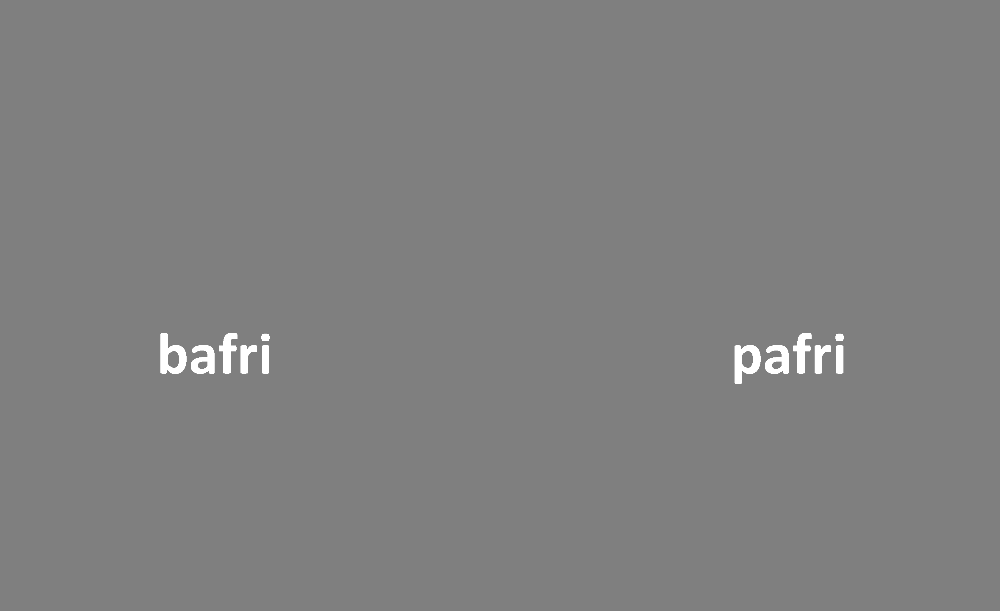
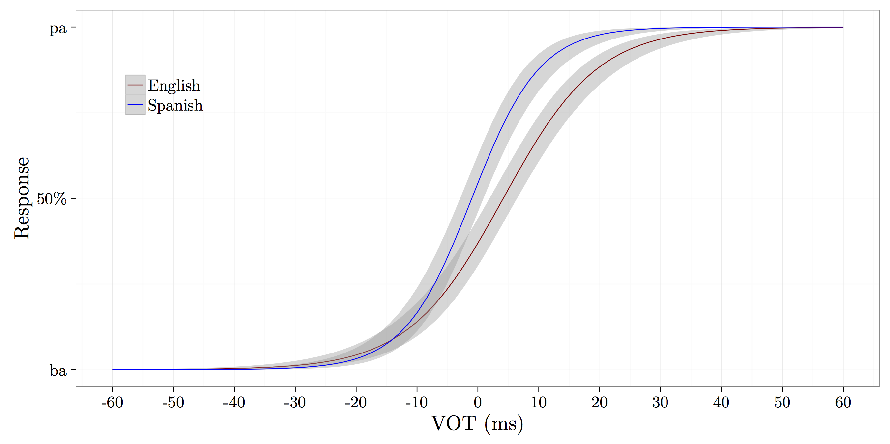

```{r setup, include=FALSE, cache=FALSE}
options(htmltools.dir.version = FALSE)
knitr::opts_chunk$set(echo = F, message=F, warnings=F, fig.retina=2)
```

```{r xaringan-extra-all-the-things, echo=FALSE}
xaringanExtra::use_xaringan_extra(
  c("tile_view", "panelset", "editable", 
    "webcam", "animate", "tachyons")
)
```


# La percepción del habla

### Problemas

- ¿Cómo diferenciamos entre el habla y el ruido?
- ¿Cómo extraemos información relevante de una señal pobre?
- La ausencia de la invarianza

--

### Teorías

- Motor theory
- Direct realist theory
- General auditory and learning approaches

--

### Hallazgos/temas de interés

- Coarticulación
- Percepción categórica
- Interfaz producción/percepción

---

# Problemas

### ¿Cómo diferenciamos entre el habla y el ruido?

### ¿Cómo extraemos información relevante de una señal pobre?

### El input es importante en la adquisición de L1/L2

### ¿Cómo asociamos las unidades lingüísticas con la parte correspondiente de la señal pese a la ausencia de la invarianza?

---
background-image: url(./libs/img/liberman.jpg)
background-position: 105% 50%
background-size: contain

# MT

- Primera teoría importante, surge en los 60 (Haskins)
- Investigador principal: Liberman
--

- 2 hallazgos fundamentales
	- Coarticulación
	- Percepción categórica
	- Idea principal: "linguistic units are coarticulated  
	in production and yet perceived categorically"
--

- 3 aserciones
	- "primitives" son articulatorios ("intended gestures")
	- "Speech is special"
		- la señal codifica la estructura del lenguaje
		- los seres humanos tenemos "algo" (speech  
		module) para descodificar la señal
		- ese "algo" se ocupa de la percepción y la  
		producción
--

- Evidencia
	- percepción "duplex"
	- se procesa el habla en base a cómo se produjo  
	(McGurk effect, comunicación háptica)

---
class: center, middle
background-color: black

<iframe width="560" height="315" src="https://www.youtube.com/embed/2k8fHR9jKVM" frameborder="0" allow="accelerometer; autoplay; clipboard-write; encrypted-media; gyroscope; picture-in-picture" allowfullscreen></iframe>

---
class: center, middle
background-color: black

<iframe width="560" height="315" src="https://www.youtube.com/embed/jtsfidRq2tw" frameborder="0" allow="accelerometer; autoplay; clipboard-write; encrypted-media; gyroscope; picture-in-picture" allowfullscreen></iframe>

---
background-image: url(https://haskinslabs.org/sites/default/files/pictures/picture-143-1462561734.jpg)
background-position: 100% 50%
background-size: contain

# DRT

- Nace de Naïve Realism, basada en MT (Haskins)
- Direct realism (Aristóteles) vs. Indirect realism (Descartes)
--

- Investigadora principal: Fowler
- Similar a MT: "primitives" son articulatorios
- Diferente de MT: 
	- la unidades de percepción son los gestos  
	("intended gesture" vs. "gesture")
	- el habla no es especial (ningún decoder)
--

- algo de parsimonia con otros tipos de percepción  
(e.g., visual)
- Evidencia: véase MT

---
background-image: url(./libs/img/diehl.jpeg)
background-position: 105% 50%
background-size: contain

# GA

- No es una teoría sino "general framework within  
which particular theoretical claims may be  
formulated and tested"
--

- Investigador principal: ?
--

- Surge como alternativa a MT, DRT
- Evidencia en contra de MT, DRT se tiene como  
evidencia a favor de GA
- Rechaza la idea de que "el habla es especial"
--

- Las unidades lingüísticas se asocian a la parte  
corresondiente de la señal mediante el sistema  
auditivo básico y procesos cognitivos (mecanismos  
de aprendizaje)

.pull-left[
.content-box-blue[
"...listeners are able to recover linguistic units via the acoustic signal by utilizing the ‘multiple imperfect acoustic cues’ coupled with sensitivity to the statistical properties present in speech" (Diehl et al., 2004, p. 154).
]
]

---

### Evidencia en contra de MT

- El efecto de la percepción "duplex" puede recrearse usando sonidos que no tienen nada que ver con el habla (e.g. con un portazo)

- Ciertos efectos se recrean en los animales (pájaros, monos, chinchillas)

--

### Evidencia en contra de DRT

- Podemos manipular el tracto vocálico de muchas maneras para generar señales acústicas parecidas 

---
class: inverse, middle, center

# La percepción categórica

---

# La percepción del habla

- ¿Cómo diferenciamos entre el habla y el ruido?

- ¿Cómo extraemos la información relevante de una señal pobre?

---

# La ausencia de invarianza

- Los sonidos del habla nunca se pronuncian de la misma forma

- Si digo **taco** [ˈta.ko] 10 veces, nunca es acústicamente igual 

- ¿Cómo somos capaces de relacionar el sonido con el concepto de un fonema?

---

# La percepción categórica

- "Equal sized physical differences are not equal sized psychologically."

- No percibimos los continuos como continuos...

- Las diferencias dentro de la misma categoría se disminuyen 

- Las diferencias entre categorías se aumentan

---
background-image: url("./libs/img/colors.png")
background-size: contain 

---
background-image: url("./libs/img/pc1.png")
background-size: contain 

---
background-image: url("./libs/img/pc2.png")
background-size: contain 

---

# La percepción categórica

### ¿Cómo estudiamos la percepción categórica?

- 2AFC (identificación)

- AX (discriminación)

---
background-image: url("./libs/img/bapa1.png")
background-size: contain

---
background-image: url("./libs/img/bapa2.png")
background-size: contain

---
background-image: url("./libs/img/bapa3.png")
background-size: contain

---
background-image: url("./libs/img/bapa4.png")
background-size: contain

---
background-image: url("./libs/img/bapa5.png")
background-size: contain

---
background-image: url("./libs/img/bapa6.png")
background-size: contain

---
background-image: url("./libs/img/bapa7.png")
background-size: contain

---
background-image: url("./libs/img/pc3.png")
background-size: contain

---

# La percepción categórica

- "Equal sized physical differences are not equal sized psychologically."

- No percibimos los continuos como continuos...

- Las diferencias dentro de la misma categoría se disminuyen 

- Las diferencias entre categorías se aumentan

.footnote[AX [download](https://www.spanphon.jvcasillas.com/slides/16_percepcion/libs/discriminationAX.zip)]


---
background-color: black

```{r, 'get-data'}
library(tidyverse)
library(here)
library(fs)
library(ggdark)

data <- dir_ls(path = here("../categorical_perception/data2022"), regexp = "\\.csv$") %>%
  map_dfr(read_csv, id = "source") %>% 
  transmute(id = participant, 
    response = key_resp_2afc.keys, rt_2afc = key_resp_2afc.rt, 
    stim = sound_bda_2afc, sound1, sound2, is_correct = key_resp_2.corr, 
    rt_ax = key_resp_2.rt) %>%
  mutate(
    stim = case_when(
      stim == "bda6.wav" ~ 6, 
      stim == "bda5.wav" ~ 5,
      stim == "bda4.wav" ~ 4, 
      stim == "bda3.wav" ~ 3, 
      stim == "bda2.wav" ~ 2, 
      stim == "bda1.wav" ~ 1, 
      stim == "bda0.wav" ~ 0), 
    pair_hard = case_when(
      sound1 == "bda0.wav" & sound2 == "bda1.wav" ~ "0_1", 
      sound1 == "bda1.wav" & sound2 == "bda0.wav" ~ "0_1", 
      sound1 == "bda1.wav" & sound2 == "bda2.wav" ~ "1_2", 
      sound1 == "bda2.wav" & sound2 == "bda1.wav" ~ "1_2",
      sound1 == "bda2.wav" & sound2 == "bda3.wav" ~ "2_3", 
      sound1 == "bda3.wav" & sound2 == "bda2.wav" ~ "2_3",
      sound1 == "bda3.wav" & sound2 == "bda4.wav" ~ "3_4", 
      sound1 == "bda4.wav" & sound2 == "bda3.wav" ~ "3_4",
      sound1 == "bda4.wav" & sound2 == "bda5.wav" ~ "4_5", 
      sound1 == "bda5.wav" & sound2 == "bda4.wav" ~ "4_5",
      sound1 == "bda5.wav" & sound2 == "bda6.wav" ~ "5_6", 
      sound1 == "bda6.wav" & sound2 == "bda5.wav" ~ "5_6",
      TRUE ~ "same"), 
    pair_medium = case_when(
      sound1 == "bda0.wav" & sound2 == "bda2.wav" ~ "0_2", 
      sound1 == "bda2.wav" & sound2 == "bda0.wav" ~ "0_2", 
      sound1 == "bda1.wav" & sound2 == "bda3.wav" ~ "1_3", 
      sound1 == "bda3.wav" & sound2 == "bda1.wav" ~ "1_3",
      sound1 == "bda2.wav" & sound2 == "bda4.wav" ~ "2_4", 
      sound1 == "bda4.wav" & sound2 == "bda2.wav" ~ "2_4",
      sound1 == "bda3.wav" & sound2 == "bda5.wav" ~ "3_5", 
      sound1 == "bda5.wav" & sound2 == "bda3.wav" ~ "3_5",
      sound1 == "bda4.wav" & sound2 == "bda6.wav" ~ "4_6", 
      sound1 == "bda6.wav" & sound2 == "bda4.wav" ~ "4_6",
      TRUE ~ "same"), 
    pair_easy = case_when(
      sound1 == "bda0.wav" & sound2 == "bda3.wav" ~ "0_3", 
      sound1 == "bda3.wav" & sound2 == "bda0.wav" ~ "0_3", 
      sound1 == "bda1.wav" & sound2 == "bda4.wav" ~ "1_4", 
      sound1 == "bda4.wav" & sound2 == "bda1.wav" ~ "1_4",
      sound1 == "bda2.wav" & sound2 == "bda5.wav" ~ "2_5", 
      sound1 == "bda5.wav" & sound2 == "bda2.wav" ~ "2_5",
      sound1 == "bda3.wav" & sound2 == "bda6.wav" ~ "3_6", 
      sound1 == "bda6.wav" & sound2 == "bda3.wav" ~ "3_6",
      TRUE ~ "same"), 
    exp = if_else(is.na(response), "ax", "2afc"), 
    pair_type = case_when(
      pair_hard == "same" & pair_medium == "same" ~ "easy", 
      pair_hard == "same" & pair_easy   == "same" ~ "medium", 
      pair_medium == "same" & pair_easy == "same" ~ "hard"), 
    pair_status = if_else(pair_hard == "same" & pair_medium == "same" & pair_easy == "same", "same", "different")) 
```

```{r, '2afc-plot', out.width="100%", fig.height=4}
data %>% 
  filter(exp == "2afc") %>% 
  ggplot(., aes(x = stim, y = response)) + 
    geom_hline(yintercept = 0.5, lty = 3) + 
    geom_smooth(method = "glm", method.args = list(family = "binomial"), 
      formula = "y ~ x") + 
    scale_x_continuous(breaks = 0:6, 
      labels = c("0\nba", "1", "2", "3", "4", "5", "6\nda")) + 
    labs(y = "p(ba)", x = "Continuum step") + 
    dark_theme_bw(base_family = "Times")
  
```

---
background-color: black

```{r, 'ax-pair-type-plot', out.width="100%", fig.height=4}
data %>% 
  filter(exp == "ax") %>% 
  mutate(pair_type = fct_relevel(pair_type, "easy", "medium")) %>% 
  ggplot(., aes(x = pair_status, y = is_correct, color = pair_type)) + 
    geom_hline(yintercept = 0.5, lty = 3) + 
    stat_summary(fun.data = mean_se, geom = "pointrange", pch = 21, 
      fill = "white", size = 1.25, position = position_dodge(0.4)) +
    scale_y_continuous(labels = scales::percent) + 
    scale_color_viridis_d(option = "B", begin = 0.4) + 
    labs(y = "% correct", x = "Pair type") + 
    dark_theme_bw(base_family = "Times")
```

---
background-color: black

```{r, 'ax-hard-plot', out.width="100%", fig.height=4}
data %>% 
  filter(exp == "ax", pair_status == "different", pair_type == "hard") %>% 
  ggplot(., aes(x = pair_hard, y = is_correct, color = pair_type)) + 
    geom_hline(yintercept = 0.5, lty = 3) + 
    stat_summary(fun.data = mean_se, geom = "pointrange", show.legend = F, 
      pch = 21, fill = "white", size = 1.25) + 
    scale_y_continuous(labels = scales::percent) + 
    scale_color_viridis_d(option = "B", begin = 0.6) + 
    labs(y = "% correct", x = "Continuum pair") + 
    dark_theme_bw(base_family = "Times")
```

---
background-color: black

```{r, 'ax-medium-plot', out.width="100%", fig.height=4}
data %>% 
  filter(exp == "ax", pair_status == "different", pair_type == "medium") %>% 
  ggplot(., aes(x = pair_medium, y = is_correct, color = pair_type)) + 
    geom_hline(yintercept = 0.5, lty = 3) + 
    stat_summary(fun.data = mean_se, geom = "pointrange", show.legend = F, 
      pch = 21, fill = "white", size = 1.25) + 
    scale_y_continuous(labels = scales::percent) + 
    scale_color_viridis_d(option = "B", begin = 0.4) + 
    labs(y = "% correct", x = "Continuum pair") + 
    dark_theme_bw(base_family = "Times")
```

---
background-color: black

```{r, 'ax-easy-plot', out.width="100%", fig.height=4}
data %>% 
  filter(exp == "ax", pair_status == "different", pair_type == "easy") %>% 
  ggplot(., aes(x = pair_easy, y = is_correct, color = pair_type)) + 
    geom_hline(yintercept = 0.5, lty = 3) + 
    stat_summary(fun.data = mean_se, geom = "pointrange", show.legend = F, 
      pch = 21, fill = "white", size = 1.25) + 
    scale_y_continuous(labels = scales::percent) + 
    scale_color_viridis_d(option = "B", begin = 0.8) + 
    labs(y = "% correct", x = "Continuum pair") + 
    dark_theme_bw(base_family = "Times")
```

---
background-color: black

```{r, 'ax-rt-pair-type-plot', out.width="100%", fig.height=4}
data %>% 
  filter(exp == "ax") %>% 
  mutate(pair_type = fct_relevel(pair_type, "easy", "medium")) %>% 
  ggplot(., aes(x = pair_status, y = rt_ax, color = pair_type)) + 
    stat_summary(fun.data = mean_se, geom = "pointrange", pch = 21, 
      fill = "white", size = 1.25, position = position_dodge(0.4)) +
    scale_color_viridis_d(option = "B", begin = 0.4) + 
    labs(y = "RT", x = "Pair type") + 
    dark_theme_bw(base_family = "Times")
```

---
background-color: black

```{r, 'ax-rt-hard-plot', out.width="100%", fig.height=4}
data %>% 
  filter(exp == "ax", pair_status == "different", pair_type == "hard") %>% 
  ggplot(., aes(x = pair_hard, y = rt_ax, color = pair_type)) + 
    stat_summary(fun.data = mean_se, geom = "pointrange", show.legend = F, 
      pch = 21, fill = "white", size = 1.25) + 
    scale_color_viridis_d(option = "B", begin = 0.6) + 
    labs(y = "RT", x = "Continuum pair") + 
    dark_theme_bw(base_family = "Times")
```

---
background-color: black

```{r, 'ax-rt-medium-plot', out.width="100%", fig.height=4}
data %>% 
  filter(exp == "ax", pair_status == "different", pair_type == "medium") %>% 
  ggplot(., aes(x = pair_medium, y = rt_ax, color = pair_type)) + 
    stat_summary(fun.data = mean_se, geom = "pointrange", show.legend = F, 
      pch = 21, fill = "white", size = 1.25) + 
    scale_color_viridis_d(option = "B", begin = 0.4) + 
    labs(y = "RT", x = "Continuum pair") + 
    dark_theme_bw(base_family = "Times")
```

---
background-color: black

```{r, 'ax-rt-easy-plot', out.width="100%", fig.height=4}
data %>% 
  filter(exp == "ax", pair_status == "different", pair_type == "easy") %>% 
  ggplot(., aes(x = pair_easy, y = rt_ax, color = pair_type)) + 
    stat_summary(fun.data = mean_se, geom = "pointrange", show.legend = F, 
      pch = 21, fill = "white", size = 1.25) + 
    scale_color_viridis_d(option = "B", begin = 0.8) + 
    labs(y = "RT", x = "Continuum pair") + 
    dark_theme_bw(base_family = "Times")
```


---
exclude: true
class: inverse, middle, center

# La percepción categórica y el bilingüismo

### **Pallier et al. (1997)**

---
exclude: true

# La percepción categórica

### Pallier et al. (1997)

- Bilingües secuenciales tempranos: español/catalán, catalán/español

- El catalán cuenta con un contraste vocálico que no existe en español (/e/-/ɛ/)

---
exclude: true

# La percepción categórica

### Pallier et al. (1997)

<p></p>
<div align="center">
   
  
</div>

---
exclude: true

# La percepción categórica

### Pallier et al. (1997)

- Bilingües secuenciales tempranos: español/catalán, catalán/español

- El catalán cuenta con un contraste vocálico que no existe en español (/e/-/ɛ/)


### Identificación (2AFC)

- "¿Escuchaste [ˈ**pe**.**ɾa**] (Peter) o [ˈ<BLUE>pɛ</BLUE>.<BLUE>ɾa</BLUE>] (pera)?"

### Discriminación

- "¿Son iguales o son diferentes?"

---
exclude: true
background-image: url("./libs/img/pallier1.png")
background-size: contain

---
exclude: true
background-image: url("./libs/img/pallier2.png")
background-size: contain

---
exclude: true

# La percepción categórica

### Pallier et al. (1997)

### Conclusión

- Los bilingües tempranos español/catalán no perciben el contraste entre las vocales /e/-/ɛ/ de manera categórica

- Estar expuesto a una edad temprana (durante el periodo sensible) no parece ser suficiente

---
exclude: true
class: inverse, middle, center

# La percepción categórica y el bilingüismo

###**Language-specific stop perception in highly proficient Heritage Speakers**

---
exclude: true

# La percepción categórica 

### Bilingual Language Modes (Grosjean, 1998)

>[...] state of activation of the bilingual's languages and language processing 
>mechanisms at a given point in time (Grosjean, 2002)

- Activation of languages increases/decreases as a function of communicative setting
  - Bilingual mode: both languages activated
  - Unilingual mode: one language activated
- Some bilinguals can reduce cross-language interactions in a unilingual setting (Antoniou et al. 2010; Magloire and Green 1999)
- **Do highly proficient HSs inhibit cross-language interaction effects a unilingual setting?**

---
exclude: true
background-image: url("./libs/img/sp_en_stops.png")
background-size: contain

---
exclude: true

# Method

### Participants

- 9 highly proficient Spanish/English bilinguals
  - 6 females
  - 3 males
- Young adults: ages 20-26 
- Bilingual Language Profile (BLP) questionnaire (-10.16)

---
exclude: true

## Method

### Materials

- Female simultaneous bilingual speaker
  - ba/pa productions
  - 'fri' [fɾi] and [fɹi] productions
  - append lead voicing for /ba/, aspiration for /pa/ (Gonzales & Lotto, 2013)
- Two 13-step continua (-60ms to 60ms, 10ms increments)
  - 'Spanish' ba[fɾi]-pa[fɾi]
  - 'English' ba[fɹi]-pa[fɹi]

---
exclude: true

## Method 

### Procedure

<div style="float:right">
  </img>  
  </br></br>
  </img>
</div>

- Participants completed two 2AFC identification tasks
    - Session 1: Spanish - ba[fɾi]-pa[fɾi]
        - All instructions, materials in Spanish
        - All correspondence with investigator in Spanish
    - Session 2: English (24 hrs later) - ba[fɹi]-pa[fɹi]
        - All instructions, materials in English
        - All correspondence with investigator in English

---
exclude: true

<div align="center">
  
</div>

</br>
>- Overall probability of selecting /pa/ decreases by 38% when hearing English stimuli

---
exclude: true

# Summary of findings

- Higher proportion of 'pafri' responses in Spanish session

- HSs shifted their perceptual boundary to accommodate English stimuli in session 2

---
exclude: true

# Discussion

- HSs maintain separate phonetic systems, shift between them according to the language context
- No (less) cross-language activation in unilingual settings

---
exclude: true
class: inverse, center, middle

# Dealing with results

---
exclude: true

# Dealing with results

- Specify the output format
- Import results directly into stats program

```{r echo=TRUE, eval=FALSE}
library(knitr)
read_chunk('./assets/scripts/analysis.R')
```
---
exclude: true

# Create some data

```{r}

# Generate data
var1  <- c(0, 0, 0, 0, 1, 1, 1)
var2  <- c(0, 0, 0, 1, 1, 1, 1)
var3  <- c(0, 0, 1, 0, 1, 1, 1)
var4  <- c(0, 0, 0, 1, 0, 1, 1)
var5  <- c(1, 0, 1, 0, 1, 1, 1)
var6  <- c(0, 0, 0, 1, 1, 1, 1)
var7  <- c(0, 0, 0, 0, 1, 1, 0)
var8  <- c(0, 0, 0, 0, 0, 1, 1)
var9  <- c(0, 1, 0, 1, 1, 0, 1)
var10 <- c(0, 0, 0, 1, 1, 1, 1)
resp <- rep(c(var1, var2, var3, var4, var5, var6, var7, var8, var9, var10), times = 10)

partN  <- 1:100
subjId <- rep(paste0('subj', partN), each = 7)
my_df  <- data.frame(subjId, 
                     stim = rep(1:7, times = 100), 
                     response = resp)
```

---
exclude: true

```{r}
str(my_df)
```

.pull-left[

```{r}
head(my_df)
```

]

.pull-right[

```{r}
tail(my_df)
```

]

---
exclude: true

```{r, fig.retina=2, fig.width=13, fig.height=6, warning=F, message=F}
library(tidyverse)

ggplot(my_df, aes(x = stim, y = response)) + 
  geom_jitter(alpha = 0.1, height = 0.05, width = 0.5, color = 'red') + 
  geom_smooth(method = "glm", method.args = list(family = "binomial")) + 
  theme_minimal(base_size = 16, base_family = 'Times')
```

---
exclude: true

```{r, fig.retina=2, fig.width=13, fig.height=6}
my_glm <- glm(response ~ stim, data = my_df, family = "binomial")

ggplot(my_df, aes(x = stim, y = response)) + 
  stat_summary(fun.data = 'mean_cl_boot', geom = 'pointrange') + 
  stat_summary(aes(y = fitted(my_glm)), fun = 'mean', geom = 'line') + 
  theme_minimal(base_size = 16, base_family = 'Times')
```

---
exclude: true

```{r, fig.retina=2, fig.width=13, fig.height=6, warning=F, message=F}
library(lme4)
my_glmer <- glmer(response ~ stim + (1|subjId), data = my_df, family = 'binomial')

ggplot(my_df, aes(x = stim, y = response)) + 
  stat_summary(fun.data = 'mean_cl_boot', geom = 'pointrange') + 
  stat_summary(aes(y = fitted(my_glmer)), fun = 'mean', geom = 'line') + 
  theme_minimal(base_size = 16, base_family = 'Times')
```


---
exclude: true

# Conclusión

<div style="float:right">
  
  
</div>

- Ahora sabéis lo básico de psychopy2
  - Podéis utilizarlo para crear experimentos psycolingüísticos
  - Tenéis acceso a la plantillas que podéis modificar

</br>

- La percepción categórica
  - "Equal sized physical differences are not equal sized psychologically."
  - No percibimos los continuos como continuos...


---
exclude: true

## More resources

- http://www.jvcasillas.com/teaching/psychopy/
- http://www.psychopy.org/ 
- http://code.google.com/p/psychopy/ 
- http://www.youtube.com/watch?v=VV6qhuQgsiI

---
exclude: true

## References

- <font size="5">Gray, J. & Pasmanter, N. (2013). [github][github]</font>
- <font size="5">Lejuez, C. W., Aklin, W. M., Zvolensky, M. J., & Pedulla, C. M. (2003). Evaluation of the Balloon Analogue Risk Task (BART) as a predictor of adolescent real-world risk-taking behaviours. Journal of adolescence, 26(4), 475-479. </font>
- <font size="5">McGuire, G. (2010, in progress) A Brief Primer on Experimental Designs in Speech Perception Research. http://people.ucsc.edu/~gmcguir1/ </font>
- <font size="5">Simonet, M. (2012). El diseño de experimentos para el estudio de la percepción del habla. *Laboratory Approaches to Romance Phonology Conference*. El Colegio de México, México D.F.</font>


[github]: https://github.com/psychopy/psychopy/tree/master/psychopy/demos/builder/mental_rotation


