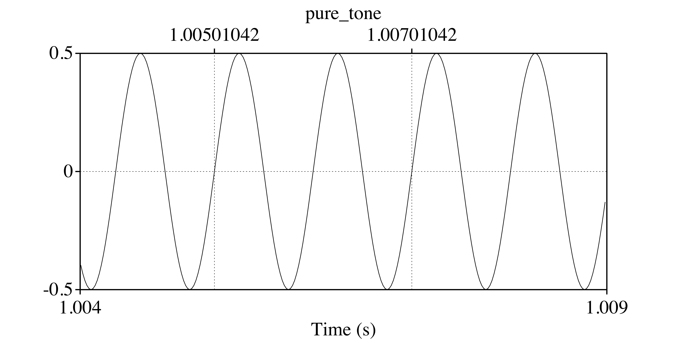

```{r setup, include=FALSE, cache=FALSE}
options(htmltools.dir.version = FALSE)
```

```{r xaringan-extra-all-the-things, echo=FALSE}
xaringanExtra::use_xaringan_extra(
  c("tile_view", "panelset", "editable", 
    "webcam", "animate", "tachyons")
)
```

background-image: url("./libs/img/cadena_hablada.png")
background-size: contain

---
background-image: url("./libs/img/cadena_hablada2.png")
background-size: contain

---

# La señal acústica

- Utilizamos los articuladores (activos, pasivos) para manipular el aire que expiramos 
- Estas manipulaciones afectan la estructura de la onda sonora 
  - la energía 
  - la frecuencia (la frecuencia fundamental, F0) 
  - los formantes 
  
- Podemos estudiar la estructura de la onda sonora en el ordenador con programas como Praat.

---

# Praat

http://www.fon.hum.uva.nl/praat/

<div align="center">
  
</div>

---
background-image: url("./libs/img/dospatas1.png")
background-size: contain

---
background-image: url("./libs/img/dospatas2.png")
background-size: contain

---
background-image: url("./libs/img/dospatas3.png")
background-size: contain

---
background-image: url("./libs/img/dospatas4.png")
background-size: contain

---
background-image: url("./libs/img/dospatas1.png")
background-size: 550px
background-position: 70% 70%

# Conceptos básicos

.left-column[
- **tiempo**:
- **sonido**:
- **onda sonora**:
- **onda sinusoide**:
- **onda compleja**:
- **presión/amplitud**:
- **frecuencia**:
- **formante**:
]

.right-column[
- Existen algunos conceptos que debemos conocer.
]

---
background-image: url("./libs/img/iii.png")
background-size: 550px
background-position: 70% 70%

# Conceptos básicos

.left-column[
- **tiempo**:
- sonido:
- onda sonora:
- onda sinusoide:
- onda compleja:
- presión/amplitud:
- frecuencia:
- formante:
]

.right-column[
- Magnitud física que permite ordenar la secuencia de los sucesos (y medirlos).
]

---

# Conceptos básicos

.left-column[
- tiempo:
- **sonido**:
- onda sonora:
- onda sinusoide:
- onda compleja:
- presión/amplitud:
- frecuencia:
- formante:
]

.right-column[
- Se refiere a la energía que pasa por el aire (u otro medio) que puede oírse.
- Físicamente es una onda longitudinal que vibra, causando compresión y 
rarefacción de las partículas del aire (moléculas).
]

---

# Conceptos básicos

.left-column[
- tiempo:
- sonido:
- **onda sonora**:
- onda sinusoide:
- onda compleja:
- presión/amplitud:
- frecuencia:
- formante:
]

.right-column[
- Energía acústica compuesta por rápidos cambios en la presión del aire.
- Estos cambios se propagan como olas en un estanque y se transmiten entre una 
fuente de sonido y un receptor.
]

---
background-image: url("./libs/img/pressure1.png")
background-size: contain

---
background-image: url("./libs/img/pressure2.png")
background-size: contain

---
background-image: url("./libs/img/pressure3.png")
background-size: contain

---
background-image: url("./libs/img/pressure4.png")
background-size: contain

---
background-image: url("./libs/img/pressure5.gif")
background-size: contain

---
background-image: url("./libs/img/pressure6.gif")
background-size: contain

---
background-image: url("./libs/img/pressure7.gif")
background-size: contain

---

# Conceptos básicos

.left-column[
- tiempo:
- sonido:
- onda sonora:
- **onda sinusoide**:
- onda compleja:
- presión/amplitud:
- frecuencia:
- formante:
]

.right-column[
<div align="center">
  

</br>

<audio controls>
  <source src="./libs/img/pure_tone.ogg" type="audio/ogg">
  <source src="./libs/img/pure_tone.wav" type="audio/mpeg">
Your browser does not support the audio element.
</audio>

</div>

- Una onda simple cuya oscilación se repite (es periódica). 
- Sólo tiene un pico.

]

---
background-image: url("./libs/img/periodicity2a.png")
background-size: contain

---
background-image: url("./libs/img/periodicity2b.png")
background-size: contain

???

- 5 tipos de señales
- tono puro (sinusoide), 
- señal periódica, 
- señal quasi-periódica, 
- ruido, 
- impulso

---
background-image: url("./libs/img/periodicity3.png")
background-size: contain

---
background-image: url("./libs/img/periodicity3.png")
background-size: 400px
background-position: 70% 10%

# Conceptos básicos

.left-column[
- tiempo:
- sonido:
- onda sonora:
- onda sinusoide:
- **onda compleja**:
- presión/amplitud:
- frecuencia:
- formante:
]

.right-column[
</br></br></br></br>
- Podemos pensar que una onda compleja es la suma de una serie de ondas 
sinusoides, por lo que tiene muchos picos.
- Nuestra habla consiste en ondas complejas, periódicas y aperiódicas.
- La corriente del aire que sale de los pulmones está modificada por las cuerdas 
vocales y el tracto vocálico
- El tipo de modificación determina si la onda es periódica o aperiódica (ej. [o] vs. [s])

<div align="center">
<audio controls>
  <source src="./libs/img/noise.ogg" type="audio/ogg">
  <source src="./libs/img/noise.wav" type="audio/mpeg">
Your browser does not support the audio element.
</audio>
</div>

]

---

# Conceptos básicos

.left-column[
- tiempo:
- sonido: 
- onda sonora:
- onda sinusoide:
- onda compleja:
- **presión**/**amplitud**:
- frecuencia:
- formante:
]

.right-column[

<div align="center">
  
</div>
- La onda sonora percibida por el oido humano consiste en fluctuaciones en la 
presión atmosférica.
- Muestra la cantidad de energía o intensidad a cada momento.

]

---
background-image: url("./libs/img/amplitude1.png")
background-size: contain
background-position: 50% 20%
class: bottom

- La amplitud es el desplazamiento vertical de la onda sonora con respecto a la 
presión normal del aire (la línea 0). 
- Un aumento de presión se corresponde con un aumento de energía/intensidad (por 
encima de la línea 0).
- Una disminución de presión se corresponde con una disminución de energía/intensidad 
(por debajo de la línea 0).

---
background-image: url("./libs/img/amplitude3.gif")
background-size: contain

---
class: center, middle

<iframe width="560" height="315" src="https://www.youtube.com/embed/INqfM1kdfUc" frameborder="0" allowfullscreen></iframe>

---

# Conceptos básicos

.left-column[
- tiempo:
- sonido: 
- onda sonora:
- onda sinusoide:
- onda compleja:
- presión/amplitud:
- **frecuencia**:
- formante:
]

.right-column[
<div align="center">
  
</div>
- El número de repeticiones o ciclos por unidad de tiempo de una onda periódica.
- Se mide en ciclos por segundo (*hertz*, hercios, Hz). 
]

---
background-image: url("./libs/img/frequency2.png")
background-size: contain

---
class: middle

.pull-left[
- <BLUE>La frecuencia fundamental</BLUE> (F0, tono) representa la frecuencia 
básica a la que vibran las cuerdas vocales en la producción de los sonidos sonoros. 

- Es la frecuencia más baja con que se repite una onda periódica. 

- El valor de F0 determina el tono percibido de una sílaba.
]

.pull-right[

<iframe width="560" height="315" src="https://www.youtube.com/embed/YUcW1s2GTmM" frameborder="0" allowfullscreen></iframe>

]
---

# Conceptos básicos

.left-column[
- tiempo:
- sonido: 
- onda sonora:
- onda sinusoide:
- onda compleja:
- presión/amplitud:
- frequencia:
- **formante**:
]

.right-column[
- La concentración de energía en ciertas frecuencias.
- Cada formante es un haz de armónicos.

]

---
background-image: url("./libs/img/dospatas1.png")
background-size: 900px
background-position: 50% 10%
class: bottom

- Esta concentración se ve en un espectrograma como una banda más oscura.

---
background-image: url("./libs/img/sourceFilter.png")
background-size: contain

---
background-image: url("./libs/img/spectrum.png")
background-size: contain

---
class: middle

<div align="center">
  
</div>

---
background-image: url("./libs/img/formants1.png")
background-size: 700px
background-position: 15% 80%
class: middle

<div align="right">
  
</div>

---
class: middle

.pull-left[

- Los dos primeros formantes (F1, F2) sirven para ubicar las vocales en cuanto a 
la anterioridad (F2, el eje horizontal) y la altura (F1, el eje vertical).

- Cuanto mayor el valor de F2, más anterior la vocal

- Cuanto mayor el valor de F1, más baja la vocal
]

.pull-right[

```{r, echo=F, output='hide', fig.retina=2, fig.width=8, fig.height=6, message=F, warning=F}
library(lingStuff)
library(untidydata)
library(tidyverse)
spanish_vowels %>% 
  separate(col = label, into = c("id", "gender", "vowel"), sep = "-") %>% 
  vowel_plot(data = ., vowel = 'vowel', f1 = 'f1', f2 = 'f2')
```

]

---

# F0 vs. formantes

- **F0**: La frecuencia más baja con que se repite una onda periódica.
  - Se relaciona con el tono.
  - Cuanto mayor es la F0, más alto es el tono que se percibe

- **Formante**: concentración de energía en una banda de frecuencias (las partes más oscuras del espectrograma)

¿Cómo podemos distinguir entre los dos?

---
class: inverse, center, middle

<iframe width="100%" height="100%" src="https://mrcoles.com/piano/">

---
background-image: url(./libs/img/ma.png)
background-size: contain

---

# F0 y formantes

<iframe width="560" height="315" src="https://www.youtube.com/embed/FV9VF3ljVa8" frameborder="0" allowfullscreen></iframe>

---

# Más formantes

<iframe width="560" height="315" src="https://www.youtube.com/embed/jl4zGRSYqkE" frameborder="0" allowfullscreen></iframe>

---
class: title-slide-section-grey, middle

# Microphones, pre-amps, recorders

### Recording 101

---

# What you need

.left-column[

- microphone

- pre-amp

- recorder

- sound booth

- presentation software

]

.right-column[

]

---
background-image: url("./libs/img/mic2.jpg")
background-position: 85% 30%
background-size: 200px

# What you need

.left-column[

- **microphone**

- pre-amp

- recorder

- sound booth

- presentation software

]

.right-column[

#### Condenser microphones

- Have electronics
- Require phantom power
- Expensive
- Fragile
- Sensitive to environment

#### Dynamic microphones

- Less expensive
- More durable, rugged
- Work well in isolation
- Better in field

]

---
background-image: url("./libs/img/preamp.jpg")
background-position: 55% 70%
background-size: 300px

# What you need

.left-column[

- microphone

- **pre-amp**

- recorder

- sound booth

- presentation software

]

.right-column[

- Optional (depends on mic)
- What it does
  - can provide phantom power
  - can clean, boost or equalize signal

]

---
background-image: url("./libs/img/recorder.jpg")
background-position: 55% 70%
background-size: 300px

# What you need

.left-column[

- microphone

- pre-amp

- **recorder**

- sound booth

- presentation software

]

.right-column[

- Microphone/pre-amp digitizes the signal
- A recorder is necessary to capture/save the signal 
- Options
  - External (fostex, zoom)
  - Computer (praat)

]

---
background-image: url("./libs/img/booth.jpg")
background-position: 85% 30%
background-size: 300px

# What you need

.left-column[

- microphone

- pre-amp

- recorder

- **sound booth**

- presentation software

]

.right-column[

- Optional (?)
- Depends on nature of the project
- Many sizes and shapes


]

---

# What you need

.left-column[

- microphone

- pre-amp

- recorder

- sound booth

- **presentation software**

]

.right-column[

- Paper
- PPT 
- Specific programs (praat, psychopy)

]

---
background-image: url("./libs/img/setup.png")
background-position: 75% 30%
background-size: 700px

# Demo

- Mic set-up
- Recording
- Saving
- Data storage


