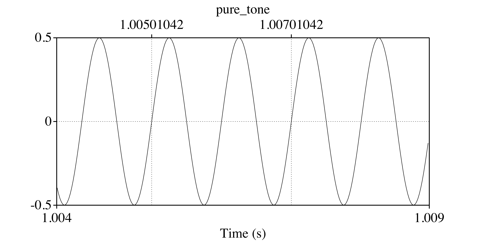
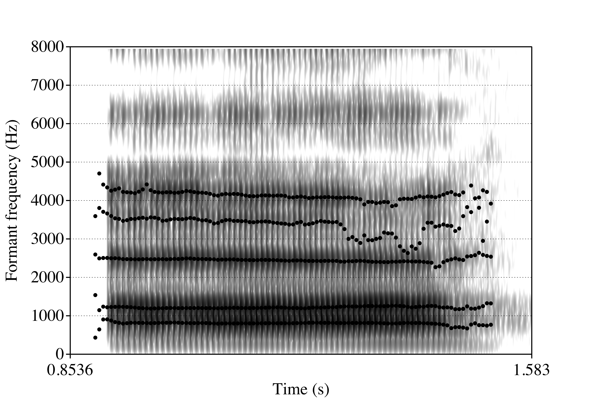
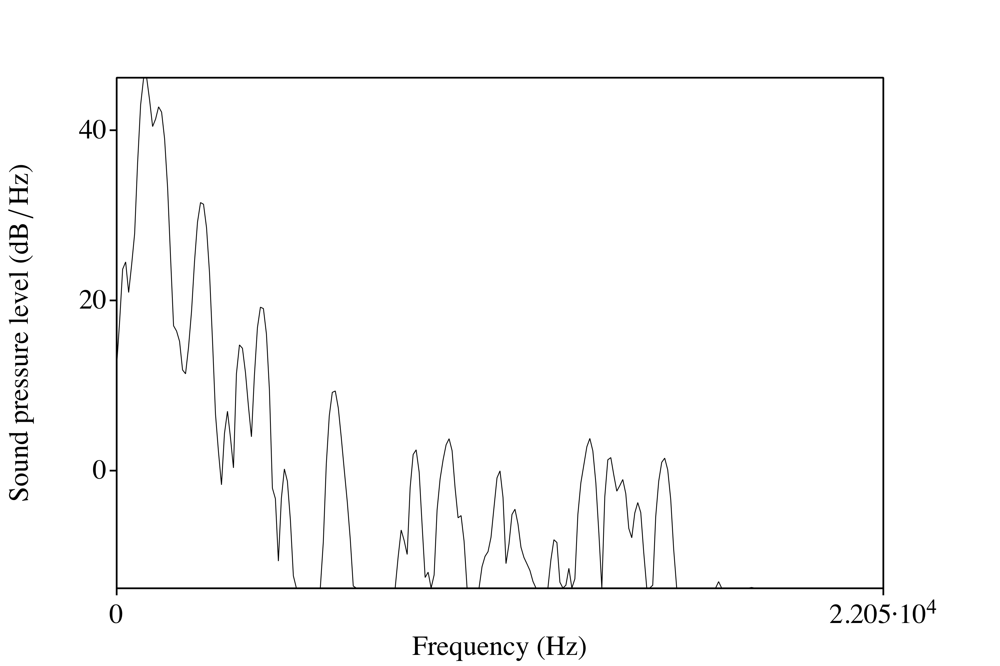
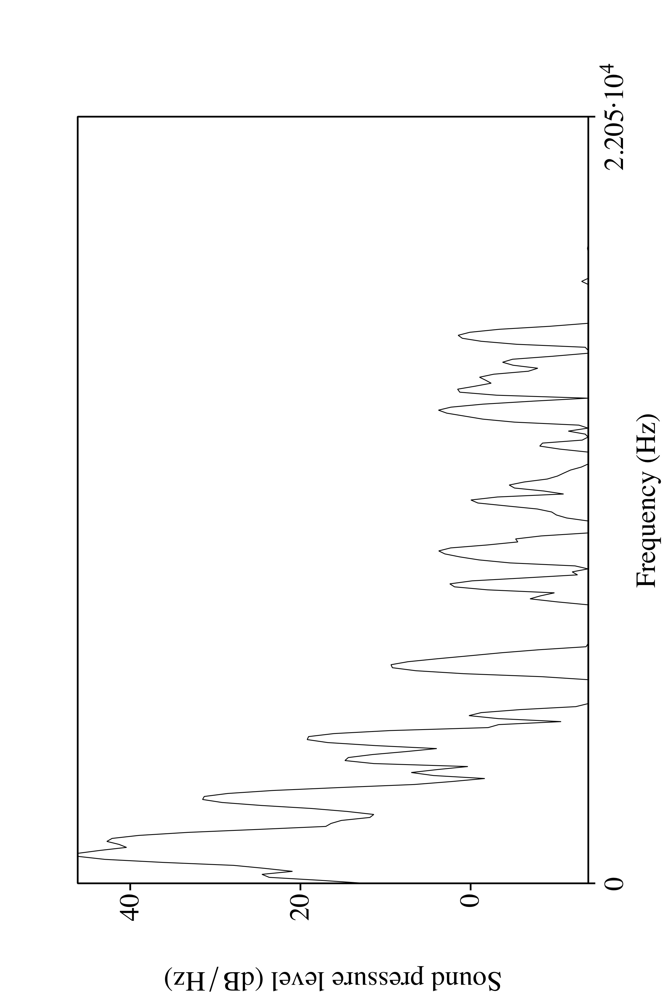

```{r setup, include=FALSE, cache=FALSE}
options(htmltools.dir.version = FALSE)
```

```{r xaringan-extra-all-the-things, echo=FALSE}
xaringanExtra::use_xaringan_extra(
  c("tile_view", "panelset", "editable", 
    "webcam", "animate", "tachyons")
)
```

# Vocoides

### Onda sinusoide

<div align="center">
  

</br>

<audio controls>
  <source src="./libs/img/pure_tone.ogg" type="audio/ogg">
  <source src="./libs/img/pure_tone.wav" type="audio/mpeg">
Your browser does not support the audio element.
</audio>

</div>

- Una onda simple cuya oscilación se repite (es periódica). 
- Sólo tiene un pico.

---
background-image: url("./libs/img/periodicity2a.png")
background-size: contain

---
background-image: url("./libs/img/periodicity2b.png")
background-size: contain

???

- 5 tipos de señales
- tono puro (sinusoide), 
- señal periódica, 
- señal quasi-periódica, 
- ruido, 
- impulso

---
background-image: url("./libs/img/periodicity3.png")
background-size: contain

---
background-image: url("./libs/img/periodicity3.png")
background-size: 400px
background-position: 50% 30%

# Vocoides

### Onda compleja

</br></br></br></br></br></br>
- Podemos pensar que una onda compleja es la suma de una serie de ondas 
sinusoides, por lo que tiene muchos picos.
- Nuestra habla consiste en ondas complejas, periódicas y aperiódicas.
- La corriente del aire que sale de los pulmones está modificada por las 
cuerdas vocales y el tracto vocálico
- El tipo de modificación determina si la onda es periódica o aperiódica (ej. [o] vs. [s])

<div align="center">
<audio controls>
  <source src="./libs/img/noise.ogg" type="audio/ogg">
  <source src="./libs/img/noise.wav" type="audio/mpeg">
Your browser does not support the audio element.
</audio>
</div>

---
background-image: url(./libs/img/frequency1.png)
background-size: 600px
background-position: 90% 50%

# Vocoides

### Frecuencia

- El número de repeticiones o ciclos<br>por unidad de tiempo de una onda<br> periódica.

- Se mide en ciclos por segundo<br>(*hertz*, hercios, Hz). 

---
background-image: url("./libs/img/frequency2.png")
background-size: contain

---

# Vocoides

### Formante

- La concentración de energía en ciertas frecuencias.

- Cada formante es un haz de armónicos.

---
background-image: url("./libs/img/dospatas1.png")
background-size: 900px
background-position: 50% 10%
class: bottom

- Esta concentración se ve en un espectrograma como una banda más oscura.

---
background-image: url("./libs/img/sourceFilter.png")
background-size: contain

---
background-image: url("./libs/img/spectrum.png")
background-size: contain

---
class: middle

<div align="center">
  
</div>

---
background-image: url("./libs/img/formants1.png")
background-size: 700px
background-position: 15% 80%
class: middle

<div align="right">
  
</div>

---
class: middle

```{r, echo=F, fig.retina=2, fig.width=12, fig.height=5, message=F, warning=F, fig.align='center'}
library(lingStuff)
library(untidydata)
library(tidyverse)
clean_vowels <- spanish_vowels %>% 
  separate(col = label, into = c("id", "gender", "vowel"), sep = "-")

vowel_means <- clean_vowels %>% 
  group_by(gender, vowel) %>% 
  summarize(f1 = mean(f1), f2 = mean(f2))

clean_vowels %>% 
  ggplot(., aes(x = f2, y = f1)) + 
    facet_grid(. ~ gender) + 
    stat_ellipse(aes(color = vowel), type = "norm", show.legend = FALSE, 
                 geom = "polygon", alpha = 0.1) +
    geom_point(pch = 21, 
               aes(color = vowel, fill = after_scale(alpha(color, 0.4)))) + 
    geom_text(data = vowel_means, aes(label = vowel), size = 7) + 
    scale_y_reverse() + 
    scale_x_reverse() + 
    labs(x = "F2", y = "F1") + 
    theme_minimal(base_size = 20)
```

.pull-left[

- Los dos primeros formantes (F1, F2) sirven para ubicar las vocales en cuanto 
a la anterioridad (F2, el eje horizontal) y la altura (F1, el eje vertical).

]

.pull-right[

- Cuanto mayor el valor de F2, más anterior la vocal

- Cuanto mayor el valor de F1, más baja la vocal

]

---

# F0 vs. formantes

- **F0**: La frecuencia más baja con que se repite una onda periódica.
  - Se relaciona con el tono.
  - Cuanto mayor es la F0, más alto es el tono que se percibe

<p></p>

- **Formante**: concentración de energía en una banda de frecuencias (las partes más oscuras del espectrograma)

.center[
.blue[¿Cómo se distingue entre los dos?]
]

---
exclude: true
class: title-slide-section-grey, middle

# Description of Spanish Vowels and Guidelines for teaching them

### **Eugenio Martínez Celdrán and Wendy Elvira-García**

---
exclude: true

# Celdrán and Elvira-García (2019)

### Quick summary

- Descriptive overview of Spanish vowels

- Difficulties L2 learners encounter

- Strategies for teaching Spanish vowels (articulatory phonetics approach) 
for all levels

---
exclude: true

# Celdrán and Elvira-García (2019)

### Descriptive overview

- In Spanish only vowels can serve as a syllable nucleus

- "Simple" 5 vowel system

- Spanish vowels are tense and short

- No phonological processes (in standard Spanish), but some dialectal variation (e.g., vowel harmony in Eastern Andalusian Spanish)

- Nasalization not phonemic like other romance languages

- Stressed syllables have longer vowels (mainly in nucleus of prosodic phrase), intensity negligible (lies)

---
exclude: true

# Celdrán and Elvira-García (2019)

### Difficulties for L2 learners

- Spanish vowels are (1) tense and (2) short, diphthongization is uncommon

- Difficulties arise in Speakers of other languages with larger/smaller vocalic systems that differ regarding (1) and (2)

<p></p>

- American English
  - vowel reduction in atonic syllables (casa > [casə])
  - /u/ fronting in some varieties
  - perception/production difficulties with acoustically overlapping categories and falling diphthongs
  - lengthening and diphthongization of stressed and final vowels

---
exclude: true

# Celdrán and Elvira-García (2019)

### Teaching Spanish vowels

- Rarely included in textbooks, activities

- Should teach according to learners level (how?)

<p></p>

- Exercises: Three stages
  1. Awakening of vowel awareness (recording and assessment of sim./diff.)
  2. Perceptual tasks (minimal pairs, spontaneous speech)
  3. Production tasks (assessment, visualization, games)

---
exclude: true

background-image: url(./libs/img/celdran1.png)
background-size: contain


