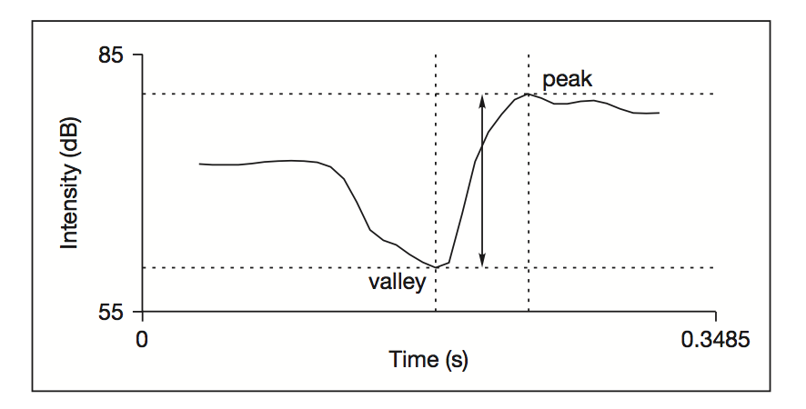

```{r setup, include=FALSE, cache=FALSE}
options(htmltools.dir.version = FALSE)
```

```{r xaringan-extra-all-the-things, echo=FALSE}
xaringanExtra::use_xaringan_extra(
  c("tile_view", "panelset", "editable", 
    "webcam", "animate", "tachyons")
)
```

class: inverse, center, middle

# Las consonantes obstruyentes

---

# Las consonantes obstruyentes

#### ¿Qué son? 

- Oclusivas
- Fricativas
- Africadas

#### ¿Cuáles son las del español?

- Oclusivas: [p, t, k, b, d, g]
- Fricativas: [f, v, θ, s, z, ʃ, ʒ, ʝ, x, χ, h]
- Africadas: [tʃ, dʒ]

#### Características

- Se produce una obstrucción que impide el flujo de aire
- Se contrastan con las sonorantes (vocoides, nasales, líquidas y aproximantes)
- Suelen venir de dos en dos (sordas/sonoras)

---
class: inverse, center, middle

# Las fricativas

---

# Las fricativas

#### En general

- Son más largas con respecto a las oclusivas
- La barra de voz sirve para distinguir entre sordas y sonoras
- Se puede distinguir entre sibilantes/estridentes (i.e. [s, ʃ]) y no-sibilantes (i.e. [f, v, θ])
  - Sibilantes: producidas con un flujo de aire fuerte que desemboca contra los dientes
  - No-sibilantes: producidas con un flujo de aire débil

#### En el oscilograma

- Se ven como ruido
- Cuentan con una onda aperiódica
- Parecen "peludas"

#### En el espectrograma

- El ruido se ve como oscuridad
- La distribución de su energía varía según el punto de articulación 


---
class: inverse, center, middle

# Las africadas

---

# Las africadas

<div style="float:right">
  
  </br>
  
</div>

#### En general

- El punto de articulación comienza siendo alveolar
- Se marca una exposión y luego una transición
- La transición cambia el punto de articulación (alveopalatal) y el modo (fricativo)

#### En el oscilograma

- En posición inicial son difíciles de ver (la fase de oclusión)
- La fricativa se ve como cualquier otra (aperiódica, peluda)

#### En el espectrograma

- Se ve claramente la fase oclusiva y la fase de fricción

---
class: middle

<div align="center">
  
  
</div>


---
class: inverse, center, middle

# Las oclusivas

---

# Las oclusivas

- Representan la consonante más común croslingüísticamente

- /k/ es la más frecuente

- Son más comunes en posición de ataque

- En posición de coda suele haber menos contrastes (sobre todo en posición final de palabra)

---

# Las oclusivas (cont.)

.pull-left[

### Descripción artículatoria

|           | |   Modo   | |  Punto   | | Sonoridad |
| :-------- | | :------- | | :------- | | :-------- |
| /p/       | | oclusivo | | bilabial | | sordo     |
| /b/       | | oclusivo | | bilabial | | sonoro    |
| .white[.] | |          | |          | |           |
| /t/       | | oclusivo | | dental   | | sordo     |
| /d/       | | oclusivo | | dental   | | sonoro    |
| .white[.] | |          | |          | |           |
| /k/       | | oclusivo | | velar    | | sordo     |
| /g/       | | oclusivo | | velar    | | sonoro    |
| | &nbsp; &nbsp; &nbsp; | | &nbsp; &nbsp; &nbsp; | | &nbsp; &nbsp; &nbsp; | |

- Existe un contraste de sonoridad en tres puntos de articulación distintos

]

--

.pull-right[

### Descripción acústica

- Se detiene el flujo de aire mediante una constricción
- Se aumenta la presión detrás de la constricción
- Se libera el flujo de aire (*release*) y los articuladores continúan al próximo gesto, 
lo cual tiene dos consecuencias acústicas:
  1. frecuencia de la explosión: un pico estrecho/alto en un amplio rango de frecuencias 
  2. una transición formántica: rápido movimiento/cambio formántico 
- Las sonoras tienen "voice bar", las sordas no lo tienen

]

???

"thin and tall pencil-like spike where the burst of 
noise has shot up and down the frequency range"

---
class: middle

<div style="float:left">
  
  
</div>

---
background-image: url(./libs/img/ptk.png)
background-size: contain

---
background-image: url(./libs/img/bdg.png)
background-size: contain

---

# POA

### Frecuencias de la explosión (*burst frequency*)

- Varía según la longitud del tracto vocálico
  - Bilabial: frecuencia baja (500-1,500 Hz)
  - Dental/alveolar: frecuencia mediana (2,500-4,000 Hz)
  - Velar: entre bilabial y alveolar (1,500-2,500 Hz)

### Transiciones formánticas

- F1/F2 antes y después de la oclusiva pueden indicar el punto 
de articulación
- Representan las consecuencias acústicas del movimiento de los articuladores
- Son breves (50 ms)
- Se nota más en las oclusivas sonoras

---
background-image: url("./libs/img/formant_transitions.jpg")
background-size: contain

---
background-image: url("./libs/img/formant_transitions_consonants1.jpg")
background-size: contain

---
background-image: url("./libs/img/formant_transitions_consonants2.png")
background-size: contain

---
background-image: url("./libs/img/formant_transitions_vowels1.png")
background-size: contain

---
background-image: url("./libs/img/formant_transitions_vowels2.png")
background-size: contain

.footnote[Liberman and Harris, 1957; Liberman et al., 1967]

---

# Contraste de sonoridad

### Voice onset time (VOT)

- La sonoridad de las oclusivas tiene un correlato 'acústico': VOT

- Se refiere a la duración del intervalo de tiempo que ocurre entre la explosión 
de la oclusiva y el comienzo de la fonación.

- Se mide en milisegundos.

- En general hay tres tipos:
	1. lead VOT (negativo)
	2. short-lag VOT (positivo)
	3. long-lag VOT (positivo)

- La realación entre VOT y el estatus fonológico de una oclusiva depende de la 
lengua en cuestión 

---
background-image: url("./libs/img/vot_oscillograms.png")
background-size: contain

---
background-image: url("./libs/img/sp_en_stops.png")
background-size: contain

---

# Las oclusivas sonoras

.pull-left[

- Se someten a un proceso de espirantización en posición no homorgánica

| /b/                           | /d/                           | /g/                           |
| :---------------------------- | :---------------------------- | :---------------------------- | 
| &#124; &nbsp; \               | &#124; &nbsp; \               | &#124; &nbsp; \               | 
| &#124; &nbsp; &nbsp; \        | &#124; &nbsp; &nbsp; \        | &#124; &nbsp; &nbsp; \        | 
| &#124; &nbsp; &nbsp; &nbsp; \ | &#124; &nbsp; &nbsp; &nbsp; \ | &#124; &nbsp; &nbsp; &nbsp; \ | 
| [b] &nbsp; &nbsp; [β] &nbsp;  | [d] &nbsp; &nbsp; [ð] &nbsp;  | [g] &nbsp; &nbsp; [ɣ] &nbsp;  |

]

--

.pull-right[

|                       |     |                           |
| :-                    | :-: | :-                        |
| [**b**, **d**, **g**] | ⇨   | después de nasal;         |
|                       |     | después de pausa;         |
|                       |     | también después de /l/    |
|                       |     | en el caso de /d/         |

|                       |     |                                                   |
| :-                    | :-: | :-                                                |
| [<BLUE>β</BLUE>, <BLUE>ð</BLUE>, <BLUE>ɣ</BLUE>] | ⇨ | en el resto de los casos |

</br>

|      | Punto        | Modo        | Sonoridad |
| ---: | :----------- | :---------- | :-------- |
| [β]: | **bilabial** | aproximante | sonora    |
| [ð]: | **dental**   | aproximante | sonora    |
| [ɣ]: | **velar**    | aproximante | sonora    |

]

---

# Correlatos acústicos 

.pull-left[

### Ratio de intensidad<sup>1</sup>

- Se mide la intensidad (dB)...
  - del valle de la aproximante 
  - del pico de la vocal siguiente
- valle / pico = ratio de intensidad
- Un valor cerca de 1 se interpreta como una realización más vocálica (aproximante)
- Un valor cerca de 0 se interpreta como una realización más polisiva

]

--

.pull-right[

<div align="center">
  
</div>

]

.footnote[
<sup>1</sup> Simonet, Hualde & Nadeu (2011)
]

---

# Scripts

- [intensityRatio.praat](https://www.jvcasillas.com/585_02_s2020/programming/praat/intensityRatio.praat)
- [spectralMoments.praat](https://www.jvcasillas.com/585_02_s2020/programming/praat/spectralMoments.praat)


---


```{r, echo=FALSE, fig.retina=2, fig.width=14, fig.align='center', message=FALSE, warning=F}
library(tidyverse)

vot_data <- tribble(
  ~'participante', ~'phon', ~'vot_es', ~'vot_in', 
   'joseph',       'p',      11,        94,
   'joseph',       't',      14,        84,
   'joseph',       'k',      23,        104,
   'juanjo',       'p',      16,       47,
   'juanjo',       't',      11,       66,
   'juanjo',       'k',      25,       42,
   'patrick',      'p',      13,       48,
   'patrick',      't',      24,       58,
   'patrick',      'k',      33,       80,
   'kyle',         'p',      32,       41,
   'kyle',         't',      25,       81,
   'kyle',         'k',      33,       38,
   'jennifer',     'p',      6,       33,
   'jennifer',     't',      2,       26,
   'jennifer',     'k',      20,       31,
   'jessica',      'p',      15,       65,
   'jessica',      't',      11,       76,
   'jessica',      'k',      23,       71,
   'nicole',       'p',      6,       15,
   'nicole',       't',      10,       29,
   'nicole',       'k',      6,       40,
   'laura',        'p',      9,       NA,
   'laura',        't',      12,       NA,
   'laura',        'k',      14,       NA,
   'ezequiel',     'p',      12,       51,
   'ezequiel',     't',      10,       72,
   'ezequiel',     'k',      20,       69
   ) %>% 
  gather(., lang, vot, -participante, -phon)

vot_data %>% 
  filter(phon == "p") %>% 
  ggplot(., aes(x = lang, y = vot, fill = lang)) + 
    geom_point(size = 3, pch = 21) + 
    #ggrepel::geom_text_repel(aes(label = participante), size = 6, 
    #                         position = position_nudge(x = -0.1)) + 
    stat_summary(fun.data = mean_cl_boot, geom = "pointrange", pch = 21, 
                 size = 2, stroke = 1, position = position_nudge(x = 0.15)) + 
    scale_fill_brewer(palette = "Set1", guide = F) + 
    scale_x_discrete(labels = c("Español", "Inglés")) + 
    labs(title = "Oclusivas sordas", 
      subtitle = "VOT de /p/ en inglés y español", 
      y = "VOT (ms)", x = "Lengua", caption = "Promedio +/- 95% CI") + 
    coord_flip() + 
    theme_minimal(base_size = 20, base_family = 'Times')

```

???

```r
vot_data %>% 
  filter(phon == "p") %>% 
  ggplot(., aes(x = lang, y = vot, fill = lang)) + 
    geom_point(size = 3, pch = 21) + 
    #ggrepel::geom_text_repel(aes(label = participante), size = 6, 
    #                         position = position_nudge(x = -0.1)) + 
    stat_summary(fun.data = mean_cl_boot, geom = "pointrange", pch = 21, 
                 size = 2, stroke = 1, position = position_nudge(x = 0.15)) + 
    scale_fill_brewer(palette = "Set1", guide = F) + 
    scale_x_discrete(labels = c("Español", "Inglés")) + 
    labs(title = "Oclusivas sordas", 
      subtitle = "VOT de /p/ en inglés y español", 
      y = "VOT (ms)", x = "Lengua", caption = "Promedio +/- 95% CI") + 
    coord_flip() + 
    theme_minimal(base_size = 20, base_family = 'Times')
```

---
class: middle

```{r, echo=FALSE, fig.retina=2, fig.width=14, fig.align='center', message=FALSE, warning=F}
vot_data %>% 
  filter(phon == "t") %>% 
  ggplot(., aes(x = lang, y = vot, fill = lang)) + 
    geom_point(size = 3, pch = 21) + 
    #ggrepel::geom_text_repel(aes(label = participante), size = 6, 
    #                         position = position_nudge(x = -0.1)) + 
    stat_summary(fun.data = mean_cl_boot, geom = "pointrange", pch = 21, 
                 size = 2, stroke = 1, position = position_nudge(x = 0.15)) + 
    scale_fill_brewer(palette = "Set1", guide = F) + 
    scale_x_discrete(labels = c("Español", "Inglés")) + 
    labs(title = "Oclusivas sordas", 
      subtitle = "VOT de /t/ en inglés y español", 
      y = "VOT (ms)", x = "Lengua", caption = "Promedio +/- 95% CI") + 
    coord_flip() + 
    theme_minimal(base_size = 20, base_family = 'Times')

```

???

```r
vot_data %>% 
  filter(phon == "t") %>% 
  ggplot(., aes(x = lang, y = vot, fill = lang)) + 
    geom_point(size = 3, pch = 21) + 
    #ggrepel::geom_text_repel(aes(label = participante), size = 6, 
    #                         position = position_nudge(x = -0.1)) + 
    stat_summary(fun.data = mean_cl_boot, geom = "pointrange", pch = 21, 
                 size = 2, stroke = 1, position = position_nudge(x = 0.15)) + 
    scale_fill_brewer(palette = "Set1", guide = F) + 
    scale_x_discrete(labels = c("Español", "Inglés")) + 
    labs(title = "Oclusivas sordas", 
      subtitle = "VOT de /t/ en inglés y español", 
      y = "VOT (ms)", x = "Lengua", caption = "Promedio +/- 95% CI") + 
    coord_flip() + 
    theme_minimal(base_size = 20, base_family = 'Times')
```

---
class: middle

```{r, echo=FALSE, fig.retina=2, fig.width=14, fig.align='center', message=FALSE, warning=F}
vot_data %>% 
  filter(phon == "k") %>% 
  ggplot(., aes(x = lang, y = vot, fill = lang)) + 
    geom_point(size = 3, pch = 21) + 
    #ggrepel::geom_text_repel(aes(label = participante), size = 6, 
    #                         position = position_nudge(x = -0.1)) + 
    stat_summary(fun.data = mean_cl_boot, geom = "pointrange", pch = 21, 
                 size = 2, stroke = 1, position = position_nudge(x = 0.15)) + 
    scale_fill_brewer(palette = "Set1", guide = F) + 
    scale_x_discrete(labels = c("Español", "Inglés")) + 
    labs(title = "Oclusivas sordas", 
      subtitle = "VOT de /k/ en inglés y español", 
      y = "VOT (ms)", x = "Lengua", caption = "Promedio +/- 95% CI") + 
    coord_flip() + 
    theme_minimal(base_size = 20, base_family = 'Times')

```

???

```r
vot_data %>% 
  filter(phon == "k") %>% 
  ggplot(., aes(x = lang, y = vot, fill = lang)) + 
    geom_point(size = 3, pch = 21) + 
    #ggrepel::geom_text_repel(aes(label = participante), size = 6, 
    #                         position = position_nudge(x = -0.1)) + 
    stat_summary(fun.data = mean_cl_boot, geom = "pointrange", pch = 21, 
                 size = 2, stroke = 1, position = position_nudge(x = 0.15)) + 
    scale_fill_brewer(palette = "Set1", guide = F) + 
    scale_x_discrete(labels = c("Español", "Inglés")) + 
    labs(title = "Oclusivas sordas", 
      subtitle = "VOT de /k/ en inglés y español", 
      y = "VOT (ms)", x = "Lengua", caption = "Promedio +/- 95% CI") + 
    coord_flip() + 
    theme_minimal(base_size = 20, base_family = 'Times')
```

---
class: middle

```{r, echo=FALSE, fig.retina=2, fig.width=14, fig.align='center', message=FALSE, warning=F}

vot_data %>% 
  mutate(phon = forcats::fct_relevel(phon, "p", "t")) %>% 
  ggplot(., aes(x = lang, y = vot, fill = lang)) + 
    facet_grid(. ~ phon) + 
    geom_point(size = 3, pch = 21) + 
    #ggrepel::geom_text_repel(aes(label = participante), size = 6, 
    #                         position = position_nudge(x = -0.1)) + 
    stat_summary(fun.data = mean_cl_boot, geom = "pointrange", pch = 21, 
                 size = 2, stroke = 1, position = position_nudge(x = 0.15)) + 
    scale_fill_brewer(palette = "Set1", guide = F) + 
    scale_x_discrete(labels = c("Español", "Inglés")) + 
    labs(title = "Oclusivas sordas", 
      subtitle = "VOT de /p, t, k/ en inglés y español", 
      y = "VOT (ms)", x = "Lengua", caption = "Promedio +/- 95% CI") + 
    coord_flip() + 
    theme_minimal(base_size = 20, base_family = 'Times')
```

???

```r
vot_data %>% 
  mutate(phon = forcats::fct_relevel(phon, "p", "t")) %>% 
  ggplot(., aes(x = lang, y = vot, fill = lang)) + 
    facet_grid(. ~ phon) + 
    geom_point(size = 3, pch = 21) + 
    #ggrepel::geom_text_repel(aes(label = participante), size = 6, 
    #                         position = position_nudge(x = -0.1)) + 
    stat_summary(fun.data = mean_cl_boot, geom = "pointrange", pch = 21, 
                 size = 2, stroke = 1, position = position_nudge(x = 0.15)) + 
    scale_fill_brewer(palette = "Set1", guide = F) + 
    scale_x_discrete(labels = c("Español", "Inglés")) + 
    labs(title = "Oclusivas sordas", 
      subtitle = "VOT de /p, t, k/ en inglés y español", 
      y = "VOT (ms)", x = "Lengua", caption = "Promedio +/- 95% CI") + 
    coord_flip() + 
    theme_minimal(base_size = 20, base_family = 'Times')
 ```

---

```{r, echo=F, fig.retina=2, fig.width=11.5, fig.height=6.5, fig.align='center', message=F, warning=F}

vot_means <- vot_data %>% group_by(lang) %>% summarize(vot = mean(vot))

sigmoid_text <- tibble(
  vot = c(pull(vot_means[1, 2]), pull(vot_means[2, 2])), y = c(-0.03, 0.03), 
  lang = c("Español", "Inglés")
)

vot_data %>% 
  ggplot(., aes(x = vot, fill = lang)) + 
    geom_vline(xintercept = 0, lty = 3, color = "grey70") + 
    geom_hline(yintercept = 0, lty = 3) + 
    geom_density(data = filter(vot_data, lang == "vot_in"), show.legend = F) + 
    geom_density(data = filter(vot_data, lang == "vot_es"), show.legend = F, 
                 aes(x = vot, y = -(..density..))) + 
    scale_fill_brewer(name = NULL, palette = "Set1") + 
    scale_color_brewer(name = NULL, palette = "Set1") + 
    coord_cartesian(xlim = c(-140, 140), ylim = c(-0.06, 0.04)) + 
    labs(x = "VOT (ms)", y = NULL) + 
    scale_y_continuous(labels = NULL) + 
    scale_x_continuous(
      breaks = seq(-140, 140, 10), 
      labels = c("-140", " ", " ", " ", " ", " ", " ", " ", " ", " ", " ", 
                 " ", " ", " ", "0", " ", " ", " ", " ", " ", " ", " ", " ", 
                 " ", " ", " ", " ", " ", "140")) + 
    geom_text(data = sigmoid_text, 
              aes(x = vot, y = y, label = lang, fill = lang), 
              hjust = 0, show.legend = F, size = 7, family = "Times") +
    theme_minimal(base_size = 22, base_family = 'Times') + 
    theme(panel.grid.major = element_line(colour = 'grey90', size = 0.15),
          panel.grid.minor = element_blank())
```

???

```r
vot_means <- vot_data %>% group_by(lang) %>% summarize(vot = mean(vot))

sigmoid_text <- tibble(
  vot = c(pull(vot_means[1, 2]), pull(vot_means[2, 2])), y = c(-0.03, 0.03), 
  lang = c("Español", "Inglés")
)

vot_data %>% 
  ggplot(., aes(x = vot, fill = lang)) + 
    geom_vline(xintercept = 0, lty = 3, color = "grey70") + 
    geom_hline(yintercept = 0, lty = 3) + 
    geom_density(data = filter(vot_data, lang == "vot_in"), show.legend = F) + 
    geom_density(data = filter(vot_data, lang == "vot_es"), show.legend = F, 
                 aes(x = vot, y = -(..density..))) + 
    scale_fill_brewer(name = NULL, palette = "Set1") + 
    scale_color_brewer(name = NULL, palette = "Set1") + 
    coord_cartesian(xlim = c(-140, 140), ylim = c(-0.06, 0.04)) + 
    labs(x = "VOT (ms)", y = NULL) + 
    scale_y_continuous(labels = NULL) + 
    scale_x_continuous(
      breaks = seq(-140, 140, 10), 
      labels = c("-140", " ", " ", " ", " ", " ", " ", " ", " ", " ", " ", 
                 " ", " ", " ", "0", " ", " ", " ", " ", " ", " ", " ", " ", 
                 " ", " ", " ", " ", " ", "140")) + 
    geom_text(data = sigmoid_text, 
              aes(x = vot, y = y, label = lang, fill = lang), 
              hjust = 0, show.legend = F, size = 7, family = "Times") +
    theme_minimal(base_size = 22, base_family = 'Times') + 
    theme(panel.grid.major = element_line(colour = 'grey90', size = 0.15),
          panel.grid.minor = element_blank())
```
